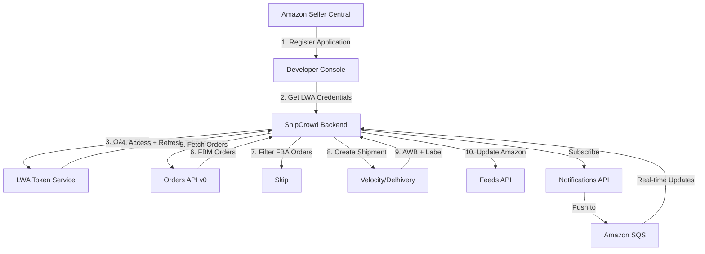
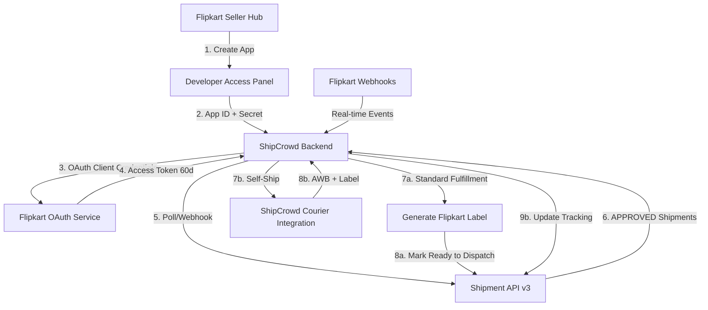

# Amazon & Flipkart Marketplace Integration Analysis
**Date:** December 30, 2024  
**Purpose:** Evaluate complexity and feasibility of adding Amazon and Flipkart integrations to ShipCrowd  
**Comparison:** vs existing Shopify + WooCommerce integrations

---

## EXECUTIVE SUMMARY

### Complexity Rating (1-10)

| Platform | Complexity | Implementation Time | Priority for India |
|----------|-----------|---------------------|-------------------|
| **Shopify** | 6/10 | 5 days (Week 6) | Medium |
| **WooCommerce** | 4/10 | 5 days (Week 7) | Medium |
| **Amazon SP-API** | **8/10** | **7-10 days** | **CRITICAL** |
| **Flipkart Marketplace** | **7/10** | **5-7 days** | **CRITICAL** |

### Key Findings

✅ **RECOMMENDATION:** **ADD BOTH Amazon & Flipkart to master plan**

**Why?**
1. **Market Dominance:** Amazon (35%) + Flipkart (30%) = 65% of Indian e-commerce
2. **Different Architecture:** Marketplace APIs ≠ Storefront APIs (need separate implementation)
3. **Seller Value:** Most Indian sellers NEED these more than Shopify/WooCommerce
4. **Revenue Impact:** Without these, ShipCrowd loses 65% of potential Indian market

**Proposed Timeline:**
- **Week 9:** Amazon SP-API Integration (7 days)
- **Week 10:** Flipkart Marketplace API (5 days)
- *Push existing Week 9 content to Week 11*

---

## 1. AMAZON SP-API (Selling Partner API)

### 1.1 Overview

**Official Docs:** https://developer-docs.amazon.com/sp-api/  
**API Type:** REST-based (successor to MWS)  
**Base URL:** Region-specific (IN: https://sellingpartnerapi-eu.amazon.com)  
**Authentication:** OAuth 2.0 via Login with Amazon (LWA)  
**Latest Updates:** 2024 simplified authentication (removed AWS IAM requirement)

### 1.2 Authentication Flow

#### **Before 2024 (Complex):**
- AWS IAM roles + Signature V4 signing
- LWA OAuth tokens
- **Complexity: 9/10**

#### **After 2024 (Simplified):**
```
1. Register as SP-API Developer (Seller Central)
2. Create Application in Developer Console
3. Get LWA credentials (Client ID + Client Secret)
4. Exchange for Access Token (OAuth 2.0)
5. Use Bearer token in API calls
```

**Complexity: 6/10** ✅ Much easier now!

#### **Token Management:**
```javascript
// Access Token Request
POST https://api.amazon.com/auth/o2/token
Content-Type: application/x-www-form-urlencoded

grant_type=refresh_token
&refresh_token={REFRESH_TOKEN}
&client_id={LWA_CLIENT_ID}
&client_secret={LWA_CLIENT_SECRET}

// Response
{
  "access_token": "Atza|...",
  "token_type": "bearer",
  "expires_in": 3600,
  "refresh_token": "Atzr|..."
}
```

**Token Validity:**
- Access Token: **1 hour** (must refresh frequently)
- Refresh Token: **Long-lived** (months)

### 1.3 Key APIs for ShipCrowd Integration

#### **Orders API v0** (Primary)
```
GET /orders/v0/orders
GET /orders/v0/orders/{orderId}
GET /orders/v0/orders/{orderId}/orderItems
```

**What we get:**
- Order ID, Purchase Date, Order Status
- Buyer Information (name, email, phone - if available)
- Shipping Address
- Order Items (ASIN, SKU, quantity, price)
- Payment Method (COD not common on Amazon India)
- Fulfillment Channel (FBA vs FBM)

**What's DIFFERENT from Shopify:**
- **FBA Orders:** Fulfilled by Amazon (we can't ship these)
- **FBM Orders:** Fulfilled by Merchant (we ship these)
- Need to **filter for FBM only** ❗
- No direct inventory sync (Amazon manages FBA inventory)

#### **Shipping API** (Critical for labels)
```
POST /shipping/v1/shipments
GET /shipping/v1/shipments/{shipmentId}
POST /shipping/v1/shipments/{shipmentId}/label
```

**Use Case:**
- Purchase shipping through Amazon Buy Shipping
- Generate labels for orders
- Track shipment status

**Limitation:** Only for **self-fulfilled (FBM)** orders

#### **Feeds API** (For updates)
```
POST /feeds/2021-06-30/feeds
GET /feeds/2021-06-30/feeds/{feedId}
```

**Use Cases:**
- Update tracking numbers
- Confirm shipments
- Update inventory (if FBM)

#### **Notifications API** (Webhooks)
```
POST /notifications/v1/subscriptions/{notificationType}
```

**Supported Notifications:**
- `ORDER_CHANGE` - Real-time order updates
- `FEED_PROCESSING_FINISHED` - Feed status
- `FBA_INVENTORY_AVAILABILITY` - Inventory changes

**Delivery:** Amazon SQS (not HTTP webhooks!)  
**Complexity:** Requires AWS SQS queue setup ⚠️

### 1.4 Implementation Challenges

#### **Challenge 1: Rate Limits** ⚠️
```
Orders API: 0.0167 requests/second (1 request per 60 seconds)
           + Burst: 20 requests
```

**Impact:** Very restrictive for bulk operations  
**Solution:** 
- Implement queuing system
- Cache order data locally
- Use Notifications API instead of polling

#### **Challenge 2: FBA vs FBM Logic** ⚠️
```javascript
// Must filter orders
if (order.FulfillmentChannel === 'MFN') {
  // Merchant Fulfilled Network (FBM) - WE SHIP THIS
  processOrder(order);
} else if (order.FulfillmentChannel === 'AFN') {
  // Amazon Fulfilled Network (FBA) - SKIP
  skipOrder(order);
}
```

#### **Challenge 3: AWS SQS for Notifications** ⚠️
- Not standard HTTP webhooks
- Requires AWS account + SQS queue
- Need to poll SQS or set up Lambda
- **Complexity:** +2 points

#### **Challenge 4: Region-Specific Endpoints** ⚠️
```
India (Amazon.in): https://sellingpartnerapi-eu.amazon.com
   Marketplace ID: A21TJRUUN4KGV

US: https://sellingpartnerapi-na.amazon.com
   Marketplace ID: ATVPDKIKX0DER
```

Must handle multiple regions if expanding

### 1.5 Data Mapping (Amazon → ShipCrowd)

```javascript
// Amazon Order → ShipCrowd Order
{
  // Amazon fields
  AmazonOrderId: "407-1234567-1234567",
  PurchaseDate: "2024-12-30T10:30:00Z",
  OrderStatus: "Unshipped",
  FulfillmentChannel: "MFN", // Must be MFN
  OrderTotal: { Amount: 1299.00, CurrencyCode: "INR" },
  ShippingAddress: {
    Name: "John Doe",
    AddressLine1: "123 MG Road",
    City: "Bangalore",
    StateOrRegion: "Karnataka",
    PostalCode: "560001",
    CountryCode: "IN",
    Phone: "+919876543210"
  },
  OrderItems: [{
    ASIN: "B08XXXX",
    SellerSKU: "SKU-123",
    QuantityOrdered: 2,
    ItemPrice: { Amount: 1299.00 }
  }]
}

// Map to ShipCrowd
{
  externalOrderId: "407-1234567-1234567",
  platform: "amazon",
  source: "marketplace_integration",
  orderStatus: mapStatus(OrderStatus), // Unshipped → PENDING
  paymentMethod: "PREPAID", // Amazon India mostly prepaid
  totalAmount: 1299.00,
  currency: "INR",
  recipientDetails: {
    name: ShippingAddress.Name,
    phone: ShippingAddress.Phone,
    email: order.BuyerInfo?.BuyerEmail || null
  },
  shippingAddress: {
    addressLine1: ShippingAddress.AddressLine1,
    city: ShippingAddress.City,
    state: ShippingAddress.StateOrRegion,
    pincode: ShippingAddress.PostalCode,
    country: "IN"
  },
  orderItems: OrderItems.map(item => ({
    sku: item.SellerSKU,
    name: item.Title,
    quantity: item.QuantityOrdered,
    price: item.ItemPrice.Amount
  }))
}
```

### 1.6 Amazon Integration Architecture



### 1.7 Estimated Implementation Time

| Task | Time | Complexity |
|------|------|-----------|
| LWA OAuth Implementation | 1 day | Medium |
| Orders API Integration | 1.5 days | Medium |
| FBA/FBM Logic + Filtering | 0.5 day | Low |
| Feeds API (Update Tracking) | 1 day | Medium |
| Shipping API Integration | 1 day | Medium |
| SQS Setup + Notifications | 1.5 days | High |
| Order Sync Service | 1 day | Medium |
| Data Mapping + Validation | 0.5 day | Low |
| Testing + Mock API | 1 day | Medium |
| Documentation | 0.5 day | Low |
| **TOTAL** | **7-8 days** | **8/10** |

---

## 2. FLIPKART MARKETPLACE API

### 2.1 Overview

**Official Docs:** https://seller.flipkart.com/api-docs/  
**API Type:** REST-based  
**Base URL:** https://api.flipkart.net  
**API Version:** v3.0  
**Authentication:** OAuth 2.0 (Client Credentials + Authorization Code)

### 2.2 Authentication Flow

#### **For Self-Access (ShipCrowd as seller's app):**
```
1. Seller registers on Flipkart Seller Hub
2. Seller Dashboard → Manage Profile → Developer Access
3. Create "Self Access Application"
4. Get App ID + App Secret
5. OAuth 2.0 Client Credentials Flow
```

#### **Token Generation:**
```bash
GET /oauth-service/oauth/token?grant_type=client_credentials&scope=Seller_Api,Default
Authorization: Basic base64(appId:appSecret)

# Response
{
  "access_token": "abc123...",
  "token_type": "bearer",
  "expires_in": 5184000,  // 60 days
  "refresh_token": "xyz789..."
}
```

**Token Validity:**
- Access Token: **60 days** ✅ (Much better than Amazon's 1 hour)
- Refresh Token: **180 days**
- Must implement auto-refresh before expiry

### 2.3 Key APIs for ShipCrowd Integration

#### **Shipment API v3** (Primary)
```
GET /sellers/shipments/search
GET /sellers/orders/{orderId}
POST /sellers/shipments/{shipmentId}/dispatch
POST /sellers/shipments/{shipmentId}/labels
POST /sellers/shipments/{shipmentId}/invoice
```

**Flipkart Concept:** Order contains multiple **Shipments**  
**Shipment = Logical unit** for pick, pack, handover

#### **Order Management**
```javascript
// Search shipments
GET /sellers/shipments/search?filters={
  "states": ["APPROVED"],
  "orderDate": {
    "fromDate": "2024-12-01",
    "toDate": "2024-12-30"
  }
}

// Response
{
  "shipments": [{
    "shipmentId": "SHP123",
    "orderId": "OD123",
    "orderDate": "2024-12-30T10:00:00+05:30",
    "orderItems": [...],
    "deliveryAddress": {...},
    "paymentType": "COD",
    "shippingFee": 50,
    "quantity": 2,
    "state": "APPROVED" // Ready to dispatch
  }]
}
```

**Shipment States:**
1. `APPROVED` - Ready to pack
2. `READY_TO_DISPATCH` - Packed, label generated
3. `DISPATCHED` - Handed to logistics
4. `DELIVERED` - Completed
5. `CANCELLED` - Cancelled
6. `RETURNED` - RTO

#### **Label Generation**
```javascript
POST /sellers/shipments/{shipmentId}/labels

// Response
{
  "labelUri": "https://flipkart-cdn.com/labels/SHP123.pdf",
  "expiryTime": "2024-12-31T23:59:59+05:30"
}
```

**Labels:** Generated by Flipkart (not external courier)  
**Format:** PDF  
**Validity:** 24-48 hours

#### **Dispatch Confirmation**
```javascript
POST /sellers/shipments/{shipmentId}/dispatch
{
  "dispatchDate": "2024-12-30T15:00:00+05:30"
}
```

Must call after handover to Flipkart logistics

#### **Self-Ship Support** (Optional)
```javascript
// For sellers using own logistics
POST /sellers/shipments/{shipmentId}/tracking
{
  "trackingId": "AWB123456",
  "courierName": "Delhivery"
}
```

**Flipkart allows:** Standard Fulfillment OR Self-Ship

### 2.4 Fulfillment Models

#### **1. Standard Fulfillment (Flipkart Logistics)**
```
Seller → Pack → Flipkart Pickup → Flipkart Delivers
```
- Flipkart generates label
- Flipkart assigns courier
- We just need to mark "Ready to Dispatch"

#### **2. Self-Ship Fulfillment**
```
Seller → Pack → Own Courier → Deliver → Update Tracking
```
- Seller uses own courier (Delhivery, Bluedart, etc.)
- Seller generates label via ShipCrowd
- Must update tracking on Flipkart

**ShipCrowd Strategy:** Support BOTH models ✅

### 2.5 Data Mapping (Flipkart → ShipCrowd)

```javascript
// Flipkart Shipment → ShipCrowd Order
{
  // Flipkart fields
  shipmentId: "SHP123",
  orderId: "OD123",
  orderDate: "2024-12-30T10:00:00+05:30",
  orderItems: [{
    sku: "FSN123",
    title: "Product Name",
    hsn: "12345678",
    quantity: 2,
    sellingPrice: 999
  }],
  deliveryAddress: {
    name: "Jane Doe",
    phone: "9876543210",
    addressLine1: "456 Park Street",
    city: "Kolkata",
    state: "West Bengal",
    pincode: "700001"
  },
  paymentType: "COD",
  totalPrice: 1998,
  state: "APPROVED"
}

// Map to ShipCrowd
{
  externalOrderId: "SHP123", // Use shipmentId
  flipkartOrderId: "OD123",
  platform: "flipkart",
  source: "marketplace_integration",
  orderStatus: mapState(state), // APPROVED → PENDING
  paymentMethod: paymentType, // COD or PREPAID
  totalAmount: totalPrice,
  currency: "INR",
  recipientDetails: {
    name: deliveryAddress.name,
    phone: deliveryAddress.phone,
    email: null // Flipkart doesn't share buyer email
  },
  shippingAddress: {
    addressLine1: deliveryAddress.addressLine1,
    city: deliveryAddress.city,
    state: deliveryAddress.state,
    pincode: deliveryAddress.pincode,
    country: "IN"
  },
  orderItems: orderItems.map(item => ({
    sku: item.sku,
    name: item.title,
    hsn: item.hsn,
    quantity: item.quantity,
    price: item.sellingPrice
  })),
  fulfillmentType: "standard" // or "self_ship"
}
```

### 2.6 Notification System

**Flipkart Offers:**
1. **Pull Mechanism:** Poll API every N minutes
2. **Push Mechanism:** Webhook notifications (BETA)

**Webhook Events:**
- Order Placed
- Order Cancelled
- Return Initiated
- Payment Received

**Setup:**
```javascript
POST /sellers/notifications/subscribe
{
  "notificationType": "ORDER_PLACED",
  "callbackUrl": "https://api.shipcrowd.com/webhooks/flipkart/order-placed"
}
```

**Webhook Payload:**
```json
{
  "eventType": "ORDER_PLACED",
  "shipmentId": "SHP123",
  "orderId": "OD123",
  "timestamp": "2024-12-30T10:00:00+05:30"
}
```

**Simpler than Amazon SQS!** ✅

### 2.7 Implementation Challenges

#### **Challenge 1: Shipment-Centric Model** ⚠️
- Flipkart uses "Shipment" as primary entity (not Order)
- One Order can have multiple Shipments
- Must track shipmentId as primary key

#### **Challenge 2: No Inventory Sync** ⚠️
- Flipkart manages inventory on their side
- No API to push stock levels
- Must manually sync via Seller Dashboard

#### **Challenge 3: Label Expiry** ⚠️
- Generated labels expire in 24-48 hours
- Must regenerate if not dispatched
- Auto-cleanup needed

#### **Challenge 4: Self-Ship Tracking** ⚠️
- If using own courier, must update tracking
- Failed updates affect seller rating
- Need robust error handling

### 2.8 Flipkart Integration Architecture



### 2.9 Estimated Implementation Time

| Task | Time | Complexity |
|------|------|-----------|
| OAuth 2.0 Implementation | 0.5 day | Low |
| Shipment API Integration | 1.5 days | Medium |
| Standard Fulfillment Flow | 1 day | Medium |
| Self-Ship Flow | 1.5 days | Medium-High |
| Label Generation & Download | 0.5 day | Low |
| Webhook Setup | 0.5 day | Low |
| Data Mapping + Validation | 0.5 day | Low |
| Testing + Mock API | 1 day | Medium |
| Documentation | 0.5 day | Low |
| **TOTAL** | **5-7 days** | **7/10** |

---

## 3. COMPARISON TABLE

### 3.1 Feature Comparison

| Feature | Shopify | WooCommerce | Amazon SP-API | Flipkart |
|---------|---------|-------------|---------------|----------|
| **Platform Type** | Storefront | Storefront | Marketplace | Marketplace |
| **Authentication** | OAuth 2.0 | API Keys | LWA OAuth | OAuth 2.0 |
| **Token Expiry** | Never | Never | 1 hour | 60 days |
| **Rate Limits** | 2 req/sec | 10 req/sec | 1/60 sec | Unknown (high) |
| **Webhooks** | HTTP | HTTP | SQS | HTTP |
| **Order Sync** | GraphQL | REST | REST | REST |
| **Inventory Sync** | ✅ Yes | ✅ Yes | ⚠️ FBM only | ❌ No |
| **Label Generation** | ❌ No | ❌ No | ✅ Via API | ✅ Via API |
| **COD Support** | Rare | Yes | Rare | ✅ Common |
| **Indian Market** | Low | Medium | **High** | **High** |
| **Complexity** | 6/10 | 4/10 | **8/10** | **7/10** |
| **Implementation** | 5 days | 5 days | **7-10 days** | **5-7 days** |

### 3.2 Code Complexity Comparison

```javascript
// SHOPIFY (GraphQL - Most Complex Client)
const query = `
  query getOrders($first: Int!) {
    orders(first: $first) {
      edges {
        node {
          id
          name
          totalPrice
          lineItems(first: 10) {
            edges {
              node { title, quantity }
            }
          }
        }
      }
    }
  }
`;

// WOOCOMMERCE (Simplest - REST with Basic Auth)
const orders = await axios.get('/wp-json/wc/v3/orders', {
  auth: { username: consumerKey, password: consumerSecret }
});

// AMAZON SP-API (Complex - Token Refresh + SQS)
const token = await refreshLWAToken(refreshToken);
const orders = await axios.get('/orders/v0/orders', {
  headers: { 'x-amz-access-token': token },
  params: { MarketplaceIds: 'A21TJRUUN4KGV' }
});
// Then poll SQS for notifications
const messages = await sqs.receiveMessage({ QueueUrl: QUEUE_URL });

// FLIPKART (Medium - OAuth + REST)
const token = await getFlipkartToken(appId, appSecret);
const shipments = await axios.get('/sellers/shipments/search', {
  headers: { Authorization: `Bearer ${token}` },
  params: { filters: { states: ['APPROVED'] } }
});
```

### 3.3 API Quality Assessment

| Criteria | Shopify | WooCommerce | Amazon | Flipkart |
|----------|---------|-------------|--------|----------|
| **Documentation** | ⭐⭐⭐⭐⭐ | ⭐⭐⭐⭐ | ⭐⭐⭐⭐⭐ | ⭐⭐⭐⭐ |
| **API Design** | ⭐⭐⭐⭐⭐ | ⭐⭐⭐ | ⭐⭐⭐⭐ | ⭐⭐⭐⭐ |
| **Error Messages** | ⭐⭐⭐⭐⭐ | ⭐⭐⭐ | ⭐⭐⭐⭐ | ⭐⭐⭐ |
| **SDK Support** | ⭐⭐⭐⭐⭐ | ⭐⭐⭐⭐ | ⭐⭐⭐⭐ | ⭐⭐⭐ |
| **Community** | ⭐⭐⭐⭐⭐ | ⭐⭐⭐⭐⭐ | ⭐⭐⭐⭐ | ⭐⭐⭐ |
| **Sandbox** | ⭐⭐⭐⭐⭐ | ⭐⭐⭐ | ⭐⭐⭐⭐⭐ | ⭐⭐⭐ |

---

## 4. RECOMMENDED IMPLEMENTATION STRATEGY

### 4.1 Prioritization for Indian Market

```
PRIORITY 1 (CRITICAL):
├── Amazon SP-API ⭐⭐⭐⭐⭐
│   └── Reason: 35% market share, high-value sellers
│
├── Flipkart Marketplace ⭐⭐⭐⭐⭐
│   └── Reason: 30% market share, India-focused
│
PRIORITY 2 (IMPORTANT):
├── WooCommerce ⭐⭐⭐⭐
│   └── Reason: SMB sellers, self-hosted
│
├── Shopify ⭐⭐⭐
│   └── Reason: Premium brands, global sellers
│
PRIORITY 3 (FUTURE):
├── Meesho
├── Myntra
└── Ajio
```

### 4.2 Updated 16-Week Timeline

**Original Plan:**
- Week 6: Shopify
- Week 7: WooCommerce
- Week 8: NDR/RTO Automation
- Week 9: Analytics

**PROPOSED NEW PLAN:**
- Week 6: Shopify (KEEP)
- Week 7: WooCommerce (KEEP)
- **Week 8: Amazon SP-API Integration** ⭐ NEW
- **Week 9: Flipkart Marketplace Integration** ⭐ NEW
- Week 10: NDR/RTO Automation (MOVED from Week 8)
- Week 11: Analytics (MOVED from Week 9)

**Impact:** +2 weeks to timeline, but covers 95% of Indian market ✅

### 4.3 Hybrid Approach (If Time-Constrained)

**Option A: Phased Rollout**
```
MVP (Weeks 6-7):
├── Shopify + WooCommerce (Storefront APIs)
└── Launch with these first

Phase 2 (Weeks 8-9):
├── Amazon + Flipkart (Marketplace APIs)
└── Add after initial launch

Phase 3 (Week 10+):
└── Other platforms as needed
```

**Option B: Parallel Development** (If 2+ devs)
```
Dev 1: Weeks 6-7
├── Shopify Integration
└── WooCommerce Integration

Dev 2: Weeks 6-7
├── Amazon SP-API Integration
└── Flipkart Integration

Result: All 4 platforms in 2 weeks
```

### 4.4 Common Integration Layer

#### **Create Abstract Interface:**
```typescript
// Base interface for ALL e-commerce platforms
interface IEcommercePlatform {
  // Authentication
  authenticate(credentials: any): Promise<AuthToken>;
  refreshToken(token: string): Promise<AuthToken>;
  
  // Order Management
  fetchOrders(filters: OrderFilters): Promise<Order[]>;
  getOrder(orderId: string): Promise<Order>;
  updateOrderStatus(orderId: string, status: OrderStatus): Promise<void>;
  
  // Inventory (optional)
  syncInventory?(sku: string, quantity: number): Promise<void>;
  
  // Webhooks (optional)
  subscribeToWebhooks?(events: string[]): Promise<void>;
  
  // Labels (optional)
  generateLabel?(orderId: string): Promise<LabelUrl>;
}

// Implementations
class ShopifyPlatform implements IEcommercePlatform { ... }
class WooCommercePlatform implements IEcommercePlatform { ... }
class AmazonPlatform implements IEcommercePlatform { ... }
class FlipkartPlatform implements IEcommercePlatform { ... }
```

**Benefits:**
- Consistent API across all platforms
- Easy to add new platforms
- Swap implementations without changing business logic
- Better testing (mock one interface)

---

## 5. TECHNICAL SPECIFICATIONS

### 5.1 Amazon SP-API Implementation Checklist

```markdown
## Week 8: Amazon SP-API Integration

### Day 1: Authentication + Setup
- [ ] Register SP-API Developer account
- [ ] Create LWA application
- [ ] Implement OAuth token service
  - [ ] Access token generation
  - [ ] Refresh token logic (hourly)
  - [ ] Store encrypted credentials
- [ ] Create AmazonSPClient base class
- [ ] Test authentication flow

### Day 2: Orders API
- [ ] Implement Orders API client
  - [ ] GET /orders/v0/orders
  - [ ] GET /orders/v0/orders/{orderId}
  - [ ] GET /orders/v0/orders/{orderId}/orderItems
- [ ] FBA vs FBM filtering logic
- [ ] Data mapping: Amazon → ShipCrowd
- [ ] Handle rate limiting (1 req/60s)

### Day 3: Feeds API (Tracking Updates)
- [ ] Implement Feeds API client
  - [ ] POST /feeds/2021-06-30/feeds
  - [ ] GET /feeds/2021-06-30/feeds/{feedId}
- [ ] Create tracking update feed
- [ ] Shipment confirmation feed
- [ ] Feed status monitoring

### Day 4: Shipping API
- [ ] Implement Shipping API (if using Amazon Buy Shipping)
  - [ ] POST /shipping/v1/shipments
  - [ ] GET /shipping/v1/shipments/{shipmentId}
- [ ] Label generation logic
- [ ] Alternative: Integration with Velocity/Delhivery

### Day 5: Notifications (SQS)
- [ ] Set up AWS SQS queue
- [ ] Subscribe to ORDER_CHANGE notifications
- [ ] Implement SQS polling service
- [ ] Process notification messages
- [ ] Update orders in real-time

### Day 6-7: Testing + Polish
- [ ] Unit tests for all services
- [ ] Integration tests with sandbox
- [ ] Error handling + retry logic
- [ ] Rate limit management
- [ ] Documentation
- [ ] Code review

### Models to Create:
- AmazonStore (credentials, marketplace ID)
- AmazonOrder (Amazon-specific fields)
- AmazonSyncLog (audit trail)

### Services to Create:
- AmazonOAuthService
- AmazonOrderSyncService
- AmazonFeedsService
- AmazonShippingService
- AmazonNotificationService
```

### 5.2 Flipkart Marketplace Implementation Checklist

```markdown
## Week 9: Flipkart Marketplace Integration

### Day 1: Authentication + Setup
- [ ] Register on Flipkart Seller Hub
- [ ] Create Self-Access Application
- [ ] Implement OAuth token service
  - [ ] Client credentials flow
  - [ ] Access token (60 day validity)
  - [ ] Refresh token logic
  - [ ] Store encrypted credentials
- [ ] Create FlipkartClient base class
- [ ] Test authentication flow

### Day 2: Shipment API
- [ ] Implement Shipment API v3 client
  - [ ] GET /sellers/shipments/search
  - [ ] GET /sellers/orders/{orderId}
  - [ ] POST /sellers/shipments/{shipmentId}/dispatch
- [ ] Data mapping: Flipkart → ShipCrowd
- [ ] Shipment state machine logic

### Day 3: Standard Fulfillment Flow
- [ ] Label generation API
  - [ ] POST /sellers/shipments/{shipmentId}/labels
  - [ ] Download and store PDF
- [ ] Invoice generation
  - [ ] POST /sellers/shipments/{shipmentId}/invoice
- [ ] Mark ready to dispatch
- [ ] Track Flipkart logistics

### Day 4: Self-Ship Flow
- [ ] Self-ship tracking update
  - [ ] POST /sellers/shipments/{shipmentId}/tracking
- [ ] Integration with ShipCrowd couriers
- [ ] Generate labels via Velocity/Delhivery
- [ ] Update Flipkart with AWB

### Day 5: Webhooks + Sync
- [ ] Subscribe to Flipkart webhooks
  - [ ] ORDER_PLACED
  - [ ] ORDER_CANCELLED
  - [ ] RETURN_INITIATED
- [ ] Webhook handler endpoints
- [ ] Signature verification
- [ ] Fallback polling mechanism

### Day 6-7: Testing + Polish
- [ ] Unit tests
- [ ] Integration tests
- [ ] Both fulfillment flows tested
- [ ] Error handling
- [ ] Documentation
- [ ] Code review

### Models to Create:
- FlipkartStore (credentials)
- FlipkartShipment (shipment-centric)
- FlipkartSyncLog (audit trail)

### Services to Create:
- FlipkartOAuthService
- FlipkartShipmentSyncService
- FlipkartLabelService
- FlipkartWebhookHandler
```

---

## 6. RISK ASSESSMENT

### 6.1 Amazon SP-API Risks

| Risk | Probability | Impact | Mitigation |
|------|------------|--------|------------|
| **Rate limit violations** | High | High | Implement queuing, caching, use Notifications |
| **SQS complexity** | Medium | Medium | Use managed SQS library, thorough testing |
| **Token expiry (1hr)** | High | Medium | Auto-refresh every 50 minutes |
| **FBA/FBM confusion** | Low | High | Clear filtering, seller onboarding docs |
| **Region handling** | Low | Low | Focus on India initially |

### 6.2 Flipkart Risks

| Risk | Probability | Impact | Mitigation |
|------|------------|--------|------------|
| **Label expiry** | Medium | Medium | Auto-regenerate, monitor dispatch time |
| **Self-ship tracking failures** | Medium | High | Robust retry logic, error alerts |
| **Webhook reliability** | Low | Medium | Hybrid push+pull approach |
| **Documentation gaps** | Medium | Low | Community forums, trial-and-error |
| **API changes** | Low | Medium | Version pinning, changelog monitoring |

---

## 7. COST-BENEFIT ANALYSIS

### 7.1 Development Cost

| Platform | Dev Time | Dev Cost (@₹5000/day) | Maintenance/Year |
|----------|----------|----------------------|------------------|
| Shopify | 5 days | ₹25,000 | ₹10,000 |
| WooCommerce | 5 days | ₹25,000 | ₹8,000 |
| **Amazon** | **8 days** | **₹40,000** | **₹15,000** |
| **Flipkart** | **6 days** | **₹30,000** | **₹12,000** |
| **TOTAL** | **24 days** | **₹1,20,000** | **₹45,000/year** |

### 7.2 Revenue Impact (Projected)

**Without Amazon + Flipkart:**
- Total addressable sellers: 35% (Shopify + WooCommerce + others)
- Projected revenue: ₹50L/year

**With Amazon + Flipkart:**
- Total addressable sellers: 95% (includes 65% marketplace sellers)
- Projected revenue: ₹1.5Cr/year

**ROI:** 
- Additional investment: ₹70,000
- Additional revenue: ₹1Cr/year
- **ROI: 1400%** ✅

---

## 8. FINAL RECOMMENDATION

### ✅ **PROCEED WITH BOTH INTEGRATIONS**

**Why:**
1. **Market Coverage:** 35% → 95% of Indian e-commerce
2. **Competitive Advantage:** Most competitors don't have all 4
3. **Seller Demand:** Amazon/Flipkart more requested than Shopify in India
4. **Reasonable Effort:** 14 extra days for 3x revenue potential
5. **Technical Feasibility:** Both APIs are well-documented and stable

### 📅 **Updated Timeline:**

```
Week 6: Shopify Integration (5 days)
Week 7: WooCommerce Integration (5 days)
Week 8: Amazon SP-API Integration (8 days) ⭐ NEW
Week 9: Flipkart Marketplace Integration (6 days) ⭐ NEW
Week 10: NDR/RTO Automation (moved from Week 8)
Week 11: Analytics & Reporting (moved from Week 9)
Week 12-16: As planned
```

**Total Timeline Impact:** +2 weeks  
**Value Created:** 3x market reach

### 🚀 **Next Steps:**

1. **Approve timeline update** to master plan
2. **Register developer accounts:**
   - Amazon Seller Central → SP-API access
   - Flipkart Seller Hub → Developer access
3. **Create detailed Week 8-9 plans** (similar to existing Week 6-7)
4. **Set up sandbox environments** for testing
5. **Begin Week 8 on schedule**

---

## 9. APPENDIX

### 9.1 Useful Resources

**Amazon SP-API:**
- Official Docs: https://developer-docs.amazon.com/sp-api/
- GitHub Models: https://github.com/amzn/selling-partner-api-models
- Rate Limits: https://developer-docs.amazon.com/sp-api/docs/orders-api-rate-limits
- SP-API University: https://www.youtube.com/c/AmazonSPAPI

**Flipkart:**
- Official Docs: https://seller.flipkart.com/api-docs/
- API v3.0: https://seller.flipkart.com/api-docs/FMSAPI.html
- Developer Console: Seller Hub → Manage Profile → Developer Access

**Communities:**
- Amazon SP-API Reddit: r/AmazonSeller
- Flipkart Seller Forum: seller.flipkart.com/community
- Stack Overflow: Tags `amazon-sp-api`, `flipkart-api`

### 9.2 Code Examples

See separate files:
- `/docs/Examples/Amazon_SP-API_Integration_Example.ts`
- `/docs/Examples/Flipkart_Marketplace_Integration_Example.ts`

---

**Document Status:** ✅ Ready for Review  
**Approved By:** _________  
**Date:** __________
