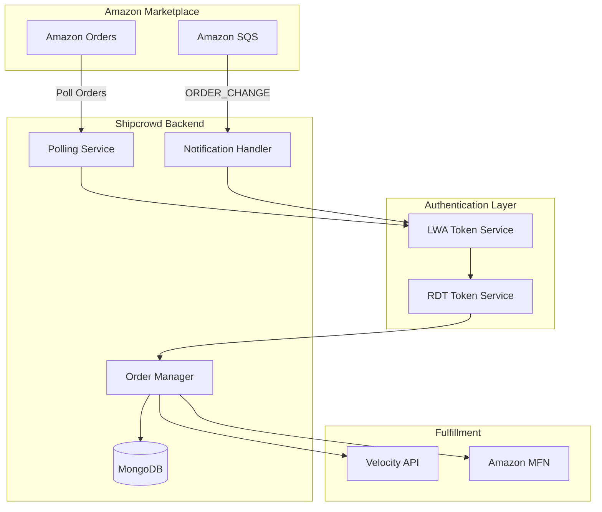

# Amazon SP-API Integration Guide for Shipcrowd

**API Version**: Orders v0, Tokens v2021-03-01, Merchant Fulfillment v0  
**Last Updated**: January 7, 2026  
**Integration Type**: Server-to-Server (Merchant Fulfillment Network - MFN)  
**Authentication**: OAuth 2.0 (Login with Amazon) + AWS Signature Version 4

---

## 📋 Table of Contents

1. [Overview](#overview)
2. [Authentication & Authorization](#authentication--authorization)
3. [Orders API](#orders-api)
4. [Restricted Data Tokens (RDT)](#restricted-data-tokens-rdt)
5. [Merchant Fulfillment API](#merchant-fulfillment-api)
6. [Shipping Confirmation](#shipping-confirmation)
7. [Feeds API](#feeds-api)
8. [Notifications API](#notifications-api)
9. [Listings & Inventory](#listings--inventory)
10. [Reports API](#reports-api)
11. [Implementation Details](#implementation-details)
12. [Common Issues & Solutions](#common-issues--solutions)
13. [Testing Strategies](#testing-strategies)

---

## Overview

Shipcrowd integrates with Amazon SP-API to enable sellers to manage their Merchant Fulfilled Network (MFN) orders. This integration allows:

- **Order Ingestion**: Fetch unshipped orders from Amazon marketplaces
- **Shipment Confirmation**: Send tracking information back to Amazon
- **Label Generation**: Purchase shipping labels through Amazon Buy Shipping (optional)
- **Inventory Sync**: Update stock levels across Amazon listings
- **Real-time Updates**: Receive notifications for order changes

### Architecture Overview



### API Quota Limits

| API | Rate Limit | Burst | Recovery |
|:----|:-----------|:------|:---------|
| **Orders API** | 0.0167 req/sec (1/min) | 10-20 requests | 60 seconds |
| **Order Items** | 0.5 req/sec (30/min) | N/A | Token bucket |
| **Shipment Confirmation** | 2 req/sec | N/A | Token bucket |
| **Merchant Fulfillment** | 1 req/sec | N/A | Token bucket |
| **Listings Items** | 5 req/sec | N/A | Token bucket |
| **Feeds** | 0.0222 req/sec | 15 requests | 45 seconds |

**Reference**: https://developer-docs.amazon.com/sp-api/docs/usage-plans-and-rate-limits-in-the-sp-api

---

## Authentication & Authorization

### 1.1 Modern Authentication (2024+)

Amazon SP-API uses **Login with Amazon (LWA)** OAuth 2.0 for authentication. As of 2024, new applications no longer require AWS IAM users for most Seller APIs, but **AWS Signature Version 4 (SigV4) signing is still mandatory** for all HTTP requests.

**Authentication Stack**:
1. **LWA Credentials**: Client ID + Client Secret (from Developer Central)
2. **Refresh Token**: Obtained via seller authorization
3. **Access Token**: Generated from refresh token (1-hour lifespan)
4. **RDT Token**: Required for accessing PII (addresses, phone numbers)
5. **SigV4 Signature**: Required for every API request

### 1.2 Registration & App Setup

**Step 1: Register as SP-API Developer**

1. Log into Seller Central: https://sellercentral.amazon.in/ (or your region)
2. Navigate to: **Apps & Services** → **Develop Apps**
3. Click **"Add new app client"**
4. Accept the Developer Agreement

**Step 2: Create SP-API Application**

```
App Name: Shipcrowd Integration
OAuth Redirect URIs: https://Shipcrowd.com/auth/amazon/callback
IAM ARN: (Leave blank for LWA-only apps)
```

**Required Roles** (select during app creation):
- `Direct-to-Consumer Shipping` (for Orders, Shipping)
- `Merchant Fulfillment` (for Buy Shipping)
- `Inventory and Listings Management` (for stock updates)

**Step 3: Get LWA Credentials**

After app creation:
1. Go to **Apps & Services** → **Manage Your Apps**
2. Find your app → Click **"View"**
3. Copy **LWA Client ID**: `amzn1.application-oa2-client.xxxxx`
4. Click **"View"** next to Client Secret
5. Copy **LWA Client Secret**: 64-character alphanumeric string

**⚠️ Critical**: Store these credentials securely. The Client Secret is shown only once.

### 1.3 Seller Authorization Flow

**Self-Authorization** (for your own seller account):

1. In Seller Central → **Apps & Services** → **Manage Your Apps**
2. Find your app → Click **"Authorize application"**
3. Review permissions → Click **"Confirm"**
4. Copy the **Refresh Token** displayed
5. **CRITICAL**: This token is shown only once. Save immediately.

**Third-Party Authorization** (for other sellers):

```javascript
// Step 1: Redirect seller to Amazon authorization URL
const authUrl = `https://sellercentral.amazon.in/apps/authorize/consent` +
  `?application_id=${LWA_CLIENT_ID}` +
  `&state=${CSRF_TOKEN}` +
  `&version=beta`;

// Step 2: Handle callback
app.get('/auth/amazon/callback', async (req, res) => {
  const { spapi_oauth_code, state, selling_partner_id } = req.query;
  
  // Exchange authorization code for refresh token
  const response = await axios.post('https://api.amazon.com/auth/o2/token', {
    grant_type: 'authorization_code',
    code: spapi_oauth_code,
    client_id: process.env.AMAZON_LWA_CLIENT_ID,
    client_secret: process.env.AMAZON_LWA_CLIENT_SECRET,
    redirect_uri: 'https://Shipcrowd.com/auth/amazon/callback'
  });
  
  // Store refresh_token for this seller
  await Seller.updateOne(
    { amazonSellerId: selling_partner_id },
    { 
      refreshToken: response.data.refresh_token,
      authorizedAt: new Date()
    }
  );
});
```

### 1.4 Generating Access Tokens

Access tokens expire after 1 hour and must be refreshed before each API call batch.

**Endpoint**: `POST https://api.amazon.com/auth/o2/token`

**Request**:
```bash
curl -X POST https://api.amazon.com/auth/o2/token \
  -H "Content-Type: application/x-www-form-urlencoded" \
  -d "grant_type=refresh_token" \
  -d "refresh_token=Atzr|IwEBxxxxxxxxxxxx" \
  -d "client_id=amzn1.application-oa2-client.xxxxx" \
  -d "client_secret=YOUR_CLIENT_SECRET"
```

**Response**:
```json
{
  "access_token": "Atza|IwEBIHxxxxxxxxxxxxxxxxxxxxxxxxxxxxxxx",
  "token_type": "bearer",
  "expires_in": 3600,
  "refresh_token": "Atzr|IwEBxxxxxxxxxxxx"
}
```

**Implementation**:
```javascript
class AmazonAuthService {
  static async getAccessToken(sellerId) {
    const seller = await Seller.findOne({ amazonSellerId: sellerId });
    
    // Check if cached token is still valid
    if (seller.accessToken && seller.tokenExpiresAt > new Date()) {
      return seller.accessToken;
    }
    
    // Generate new access token
    const response = await axios.post('https://api.amazon.com/auth/o2/token', 
      new URLSearchParams({
        grant_type: 'refresh_token',
        refresh_token: seller.refreshToken,
        client_id: process.env.AMAZON_LWA_CLIENT_ID,
        client_secret: process.env.AMAZON_LWA_CLIENT_SECRET
      }),
      { headers: { 'Content-Type': 'application/x-www-form-urlencoded' } }
    );
    
    // Cache token
    await Seller.updateOne(
      { amazonSellerId: sellerId },
      {
        accessToken: response.data.access_token,
        tokenExpiresAt: new Date(Date.now() + 3500 * 1000) // 58 minutes
      }
    );
    
    return response.data.access_token;
  }
}
```

### 1.5 AWS Signature Version 4 (SigV4)

**Every SP-API request must be signed** using AWS SigV4, even with LWA authentication.

**Required Headers**:
```
Authorization: AWS4-HMAC-SHA256 Credential=...
x-amz-access-token: Atza|IwEBIHxxxxxxx
x-amz-date: 20260107T100000Z
host: sellingpartnerapi-eu.amazon.com
```

**Implementation** (using `aws4` library):
```javascript
const aws4 = require('aws4');

function signRequest(method, path, region, accessToken, body = null) {
  const request = {
    host: `sellingpartnerapi-${region}.amazon.com`,
    method: method,
    url: `https://sellingpartnerapi-${region}.amazon.com${path}`,
    path: path,
    headers: {
      'x-amz-access-token': accessToken,
      'content-type': 'application/json'
    },
    body: body ? JSON.stringify(body) : undefined,
    service: 'execute-api',
    region: region
  };
  
  // Sign with LWA credentials (not AWS IAM)
  aws4.sign(request, {
    accessKeyId: process.env.AMAZON_LWA_CLIENT_ID,
    secretAccessKey: process.env.AMAZON_LWA_CLIENT_SECRET
  });
  
  return request;
}
```

**⚠️ Important Notes**:
- Use the official `amazon-sp-api` SDK to avoid manual signing errors
- SigV4 signing is **region-specific** (use correct endpoint per marketplace)
- Incorrect signatures result in `403 SignatureDoesNotMatch` errors

**Reference**: https://developer-docs.amazon.com/sp-api/docs/creating-and-configuring-iam-policies-and-entities

---

## Orders API

### 2.1 List Orders

**Endpoint**: `GET /orders/v0/orders`

**Required Role**: `Direct-to-Consumer Shipping`

**Rate Limit**: **0.0167 req/sec (1 request per minute)** - This is the most restrictive limit in SP-API.

**Query Parameters**:

| Parameter | Type | Required | Description | Example |
|:----------|:-----|:---------|:------------|:--------|
| `MarketplaceIds` | string | ✅ Yes | Comma-separated marketplace IDs | `A21TJRUUN4KGV` |
| `CreatedAfter` | datetime | Conditional* | Orders created after this date | `2026-01-01T00:00:00Z` |
| `CreatedBefore` | datetime | No | Orders created before this date | `2026-01-31T23:59:59Z` |
| `LastUpdatedAfter` | datetime | Conditional* | Orders updated after this date | `2026-01-07T00:00:00Z` |
| `LastUpdatedBefore` | datetime | No | Orders updated before this date | `2026-01-07T23:59:59Z` |
| `OrderStatuses` | string | No | Filter by status (comma-separated) | `Unshipped,PartiallyShipped` |
| `FulfillmentChannels` | string | No | `MFN` or `AFN` | `MFN` |
| `PaymentMethods` | string | No | Payment method filter | `COD` |
| `MaxResultsPerPage` | integer | No | Results per page (max 100) | `50` |
| `NextToken` | string | No | Pagination token | `2YgYW1hem9uLmNvbS9vcmRlcnMv...` |

*At least one of `CreatedAfter` or `LastUpdatedAfter` is required.

**Marketplace IDs Reference**:

| Region | Marketplace ID | Endpoint Region |
|:-------|:---------------|:----------------|
| **India** | `A21TJRUUN4KGV` | `eu-west-1` |
| United States | `ATVPDKIKX0DER` | `us-east-1` |
| Canada | `A2EUQ1WTGCTBG2` | `us-east-1` |
| United Kingdom | `A1F83G8C2ARO7P` | `eu-west-1` |
| Germany | `A1PA6795UKMFR9` | `eu-west-1` |
| Japan | `A1VC38T7YXB528` | `us-west-2` |

**Full list**: https://developer-docs.amazon.com/sp-api/docs/marketplace-ids

**Example Request**:
```bash
curl -X GET \
  'https://sellingpartnerapi-eu.amazon.com/orders/v0/orders?MarketplaceIds=A21TJRUUN4KGV&CreatedAfter=2026-01-01T00:00:00Z&OrderStatuses=Unshipped&FulfillmentChannels=MFN&MaxResultsPerPage=50' \
  -H 'x-amz-access-token: Atza|IwEBIHxxxxxxx' \
  -H 'Authorization: AWS4-HMAC-SHA256 Credential=...'
```

**Example Response**:
```json
{
  "payload": {
    "Orders": [
      {
        "AmazonOrderId": "404-1234567-1234567",
        "SellerOrderId": null,
        "PurchaseDate": "2026-01-07T12:30:00Z",
        "LastUpdateDate": "2026-01-07T12:30:00Z",
        "OrderStatus": "Unshipped",
        "FulfillmentChannel": "MFN",
        "SalesChannel": "Amazon.in",
        "OrderChannel": "Amazon.in",
        "ShipServiceLevel": "Std IN Dom",
        "OrderTotal": {
          "CurrencyCode": "INR",
          "Amount": "1999.00"
        },
        "NumberOfItemsShipped": 0,
        "NumberOfItemsUnshipped": 2,
        "PaymentMethod": "Other",
        "PaymentMethodDetails": ["Standard"],
        "MarketplaceId": "A21TJRUUN4KGV",
        "ShipmentServiceLevelCategory": "Standard",
        "OrderType": "StandardOrder",
        "EarliestShipDate": "2026-01-07T18:30:00Z",
        "LatestShipDate": "2026-01-09T18:29:59Z",
        "IsBusinessOrder": false,
        "IsPrime": false,
        "IsGlobalExpressEnabled": false,
        "IsPremiumOrder": false,
        "IsSoldByAB": false,
        "IsIBA": false,
        "DefaultShipFromLocationAddress": {
          "Name": "Mumbai Warehouse",
          "AddressLine1": "456 Industrial Area",
          "City": "Mumbai",
          "StateOrRegion": "Maharashtra",
          "PostalCode": "400070",
          "CountryCode": "IN"
        }
      }
    ],
    "NextToken": "2YgYW1hem9uLmNvbS9vcmRlcnMvdjEvb3JkZXJz...",
    "CreatedBefore": "2026-01-31T23:59:59Z"
  }
}
```

**⚠️ Important Notes**:
- **No PII in default response**: Buyer name, address, and phone are **NOT** included unless you use an RDT (see section 4).
- **Pagination**: Use `NextToken` for subsequent pages. Do not increment page numbers.
- **Time Range**: Maximum 7-day window for `CreatedAfter`/`CreatedBefore` queries.
- **Order Status Values**: `Pending`, `Unshipped`, `PartiallyShipped`, `Shipped`, `Canceled`, `Unfulfillable`

### 2.2 Get Order

**Endpoint**: `GET /orders/v0/orders/{orderId}`

**Rate Limit**: 0.0167 req/sec (1/min)

**Example Request**:
```bash
curl -X GET \
  'https://sellingpartnerapi-eu.amazon.com/orders/v0/orders/404-1234567-1234567' \
  -H 'x-amz-access-token: Atza|IwEBIHxxxxxxx' \
  -H 'Authorization: AWS4-HMAC-SHA256 Credential=...'
```

**Use Case**: Fetch full order details after receiving an `ORDER_CHANGE` notification.

### 2.3 Get Order Items

**Endpoint**: `GET /orders/v0/orders/{orderId}/orderItems`

**Rate Limit**: 0.5 req/sec (30/min) - **Much higher than list orders**

**Example Response**:
```json
{
  "payload": {
    "AmazonOrderId": "404-1234567-1234567",
    "OrderItems": [
      {
        "ASIN": "B08N5WRWNW",
        "SellerSKU": "TS-BLK-M",
        "OrderItemId": "12345678901234",
        "Title": "Classic T-Shirt - Black - Medium",
        "QuantityOrdered": 2,
        "QuantityShipped": 0,
        "ProductInfo": {
          "NumberOfItems": "1"
        },
        "PointsGranted": null,
        "ItemPrice": {
          "CurrencyCode": "INR",
          "Amount": "1798.00"
        },
        "ShippingPrice": {
          "CurrencyCode": "INR",
          "Amount": "0.00"
        },
        "ItemTax": {
          "CurrencyCode": "INR",
          "Amount": "201.00"
        },
        "ShippingTax": {
          "CurrencyCode": "INR",
          "Amount": "0.00"
        },
        "ShippingDiscount": {
          "CurrencyCode": "INR",
          "Amount": "0.00"
        },
        "PromotionDiscount": {
          "CurrencyCode": "INR",
          "Amount": "0.00"
        },
        "IsGift": false,
        "ConditionId": "New",
        "ConditionSubtypeId": "New",
        "IsTransparency": false,
        "SerialNumberRequired": false,
        "IossNumber": null,
        "DeemedResellerCategory": "IOSS"
      }
    ]
  }
}
```

**Shipcrowd Implementation**:
```javascript
async function syncOrderFromAmazon(orderId, sellerId) {
  const accessToken = await AmazonAuthService.getAccessToken(sellerId);
  
  // Get order details
  const order = await amazonAPI.getOrder(orderId, accessToken);
  
  // Get order items
  const items = await amazonAPI.getOrderItems(orderId, accessToken);
  
  // Create in Shipcrowd DB
  await ShipcrowdOrder.create({
    channel: 'AMAZON',
    channelOrderId: order.AmazonOrderId,
    channelOrderDisplayId: order.AmazonOrderId,
    sellerId: sellerId,
    customer: {
      // Will be populated after RDT fetch
      name: null,
      email: null,
      phone: null,
      address: null
    },
    items: items.OrderItems.map(item => ({
      sku: item.SellerSKU,
      asin: item.ASIN,
      quantity: item.QuantityOrdered,
      price: parseFloat(item.ItemPrice.Amount),
      channelItemId: item.OrderItemId
    })),
    financials: {
      total: parseFloat(order.OrderTotal.Amount),
      currency: order.OrderTotal.CurrencyCode,
      paymentMethod: order.PaymentMethodDetails.includes('COD') ? 'COD' : 'PREPAID',
      isPaid: order.OrderStatus !== 'Pending'
    },
    shipment: {
      serviceLevel: order.ShipServiceLevel,
      earliestShipDate: order.EarliestShipDate,
      latestShipDate: order.LatestShipDate
    },
    metadata: {
      isPrime: order.IsPrime,
      isBusinessOrder: order.IsBusinessOrder,
      salesChannel: order.SalesChannel
    }
  });
}
```

---

## Restricted Data Tokens (RDT)

### 4.1 Why RDT is Required

Amazon **does not return PII** (Personally Identifiable Information) in standard API responses. To access:
- Buyer name
- Shipping address
- Phone number
- Gift message

You must generate a **Restricted Data Token (RDT)** and use it in place of the standard access token.

**PII Compliance Requirements**:
1. **30-Day Deletion**: Customer PII must be deleted 30 days after delivery confirmation.
2. **Encryption**: PII must be encrypted at rest and in transit.
3. **Access Logging**: All PII access must be logged with user ID and timestamp.
4. **Approval Process**: Apps requiring RDT access undergo rigorous security audits.

**Reference**: https://developer-docs.amazon.com/sp-api/docs/tokens-api-use-case-guide

### 4.2 Generating an RDT

**Endpoint**: `POST /tokens/2021-03-01/restrictedDataToken`

**Request Body**:
```json
{
  "restrictedResources": [
    {
      "method": "GET",
      "path": "/orders/v0/orders/{orderId}",
      "dataElements": ["buyerInfo", "shippingAddress"]
    }
  ]
}
```

**Available Data Elements**:
- `buyerInfo`: Buyer name and email
- `shippingAddress`: Full shipping address and phone

**Example Request**:
```bash
curl -X POST \
  'https://sellingpartnerapi-eu.amazon.com/tokens/2021-03-01/restrictedDataToken' \
  -H 'x-amz-access-token: Atza|IwEBIHxxxxxxx' \
  -H 'Content-Type: application/json' \
  -d '{
    "restrictedResources": [
      {
        "method": "GET",
        "path": "/orders/v0/orders/404-1234567-1234567",
        "dataElements": ["buyerInfo", "shippingAddress"]
      }
    ]
  }'
```

**Response**:
```json
{
  "restrictedDataToken": "Atzr|IwEBIJxxxxxxxxxxxxxxxxxxxxxxxxxxxxxxx",
  "expiresIn": 3600
}
```

### 4.3 Using RDT to Fetch PII

**Replace** the `x-amz-access-token` header with the RDT:

```bash
curl -X GET \
  'https://sellingpartnerapi-eu.amazon.com/orders/v0/orders/404-1234567-1234567' \
  -H 'x-amz-access-token: Atzr|IwEBIJxxxxxxx' \
  -H 'Authorization: AWS4-HMAC-SHA256 Credential=...'
```

**Response (with PII)**:
```json
{
  "payload": {
    "AmazonOrderId": "404-1234567-1234567",
    "BuyerInfo": {
      "BuyerEmail": "customer@example.com",
      "BuyerName": "Rajesh Kumar",
      "BuyerCounty": null,
      "BuyerTaxInfo": null,
      "PurchaseOrderNumber": null
    },
    "ShippingAddress": {
      "Name": "Rajesh Kumar",
      "AddressLine1": "123 MG Road",
      "AddressLine2": "Apt 4B",
      "AddressLine3": null,
      "City": "Mumbai",
      "County": null,
      "District": null,
      "StateOrRegion": "Maharashtra",
      "Municipality": null,
      "PostalCode": "400001",
      "CountryCode": "IN",
      "Phone": "+919876543210",
      "AddressType": "Residential"
    },
    ...
  }
}
```

**Implementation**:
```javascript
async function fetchOrderWithPII(orderId, sellerId) {
  const accessToken = await AmazonAuthService.getAccessToken(sellerId);
  
  // Generate RDT
  const rdtResponse = await axios.post(
    `https://sellingpartnerapi-eu.amazon.com/tokens/2021-03-01/restrictedDataToken`,
    {
      restrictedResources: [
        {
          method: 'GET',
          path: `/orders/v0/orders/${orderId}`,
          dataElements: ['buyerInfo', 'shippingAddress']
        }
      ]
    },
    {
      headers: {
        'x-amz-access-token': accessToken,
        'Content-Type': 'application/json'
      }
    }
  );
  
  const rdt = rdtResponse.data.restrictedDataToken;
  
  // Fetch order with RDT
  const orderResponse = await axios.get(
    `https://sellingpartnerapi-eu.amazon.com/orders/v0/orders/${orderId}`,
    {
      headers: {
        'x-amz-access-token': rdt // Use RDT instead of access token
      }
    }
  );
  
  // Update Shipcrowd order with PII
  await ShipcrowdOrder.updateOne(
    { channelOrderId: orderId },
    {
      'customer.name': orderResponse.data.payload.BuyerInfo.BuyerName,
      'customer.email': orderResponse.data.payload.BuyerInfo.BuyerEmail,
      'customer.phone': orderResponse.data.payload.ShippingAddress.Phone,
      'customer.address': {
        line1: orderResponse.data.payload.ShippingAddress.AddressLine1,
        line2: orderResponse.data.payload.ShippingAddress.AddressLine2,
        city: orderResponse.data.payload.ShippingAddress.City,
        state: orderResponse.data.payload.ShippingAddress.StateOrRegion,
        pincode: orderResponse.data.payload.ShippingAddress.PostalCode,
        country: orderResponse.data.payload.ShippingAddress.CountryCode
      },
      piiAccessedAt: new Date()
    }
  );
}
```

### 4.4 PII Deletion Compliance

**Cron Job** (runs daily):
```javascript
async function deleteStalePII() {
  const thirtyDaysAgo = new Date(Date.now() - 30 * 24 * 60 * 60 * 1000);
  
  const result = await ShipcrowdOrder.updateMany(
    {
      channel: 'AMAZON',
      'shipment.deliveredAt': { $lt: thirtyDaysAgo },
      'customer.name': { $ne: null }
    },
    {
      $set: {
        'customer.name': null,
        'customer.email': null,
        'customer.phone': null,
        'customer.address': null,
        piiDeletedAt: new Date()
      }
    }
  );
  
  console.log(`Deleted PII for ${result.modifiedCount} Amazon orders`);
}
```

---

## Merchant Fulfillment API

### 5.1 Overview

Use this API when sellers want to purchase shipping labels through **Amazon Buy Shipping Services**. This provides:
- A-to-z Guarantee protection
- Competitive carrier rates (UPS, FedEx, BlueDart, etc.)
- Automatic tracking updates to Amazon

**Alternative**: If using Shipcrowd's own courier aggregator (Velocity), skip this section and use **Shipment Confirmation** (Section 6).

### 5.2 Get Eligible Shipping Services

**Endpoint**: `POST /mfn/v0/eligibleShippingServices`

**Rate Limit**: 1 req/sec

**Request Body**:
```json
{
  "ShipmentRequestDetails": {
    "AmazonOrderId": "404-1234567-1234567",
    "ItemList": [
      {
        "OrderItemId": "12345678901234",
        "Quantity": 2
      }
    ],
    "ShipFromAddress": {
      "Name": "Mumbai Warehouse",
      "AddressLine1": "456 Industrial Area",
      "City": "Mumbai",
      "StateOrProvince": "Maharashtra",
      "PostalCode": "400070",
      "CountryCode": "IN",
      "Phone": "+912223334444"
    },
    "PackageDimensions": {
      "Length": 30,
      "Width": 20,
      "Height": 10,
      "Unit": "centimeters"
    },
    "Weight": {
      "Value": 0.5,
      "Unit": "kilograms"
    },
    "ShippingServiceOptions": {
      "DeliveryExperience": "DeliveryConfirmationWithoutSignature",
      "CarrierWillPickUp": false
    }
  }
}
```

**Response**:
```json
{
  "payload": {
    "ShippingServiceList": [
      {
        "ShippingServiceName": "BlueDart Express",
        "CarrierName": "BlueDart",
        "ShippingServiceId": "BlueDart-Express-IN",
        "ShippingServiceOfferId": "offer123456",
        "ShipDate": "2026-01-07T18:30:00Z",
        "EarliestEstimatedDeliveryDate": "2026-01-09T18:30:00Z",
        "LatestEstimatedDeliveryDate": "2026-01-10T18:30:00Z",
        "Rate": {
          "CurrencyCode": "INR",
          "Amount": "85.00"
        },
        "ShippingServiceOptions": {
          "DeliveryExperience": "DeliveryConfirmationWithoutSignature",
          "CarrierWillPickUp": false
        },
        "AvailableShippingServiceOptions": {
          "AvailableCarrierWillPickUpOptions": [false],
          "AvailableDeliveryExperienceOptions": [
            "DeliveryConfirmationWithoutSignature",
            "DeliveryConfirmationWithSignature"
          ]
        },
        "AvailableLabelFormats": ["PDF", "ZPL203", "ZPL300"],
        "RequiresAdditionalSellerInputs": false
      },
      {
        "ShippingServiceName": "Delhivery Surface",
        "CarrierName": "Delhivery",
        "ShippingServiceId": "Delhivery-Surface-IN",
        "ShippingServiceOfferId": "offer123457",
        "ShipDate": "2026-01-07T18:30:00Z",
        "EarliestEstimatedDeliveryDate": "2026-01-10T18:30:00Z",
        "LatestEstimatedDeliveryDate": "2026-01-12T18:30:00Z",
        "Rate": {
          "CurrencyCode": "INR",
          "Amount": "65.00"
        },
        "ShippingServiceOptions": {
          "DeliveryExperience": "NoTracking",
          "CarrierWillPickUp": true
        },
        "AvailableShippingServiceOptions": {
          "AvailableCarrierWillPickUpOptions": [true, false],
          "AvailableDeliveryExperienceOptions": ["NoTracking"]
        },
        "AvailableLabelFormats": ["PDF"],
        "RequiresAdditionalSellerInputs": false
      }
    ],
    "TermsAndConditionsNotAcceptedCarrierList": []
  }
}
```

### 5.3 Create Shipment (Purchase Label)

**Endpoint**: `POST /mfn/v0/shipments`

**Request Body**:
```json
{
  "ShipmentRequestDetails": {
    "AmazonOrderId": "404-1234567-1234567",
    "ItemList": [
      {
        "OrderItemId": "12345678901234",
        "Quantity": 2
      }
    ],
    "ShipFromAddress": {
      "Name": "Mumbai Warehouse",
      "AddressLine1": "456 Industrial Area",
      "City": "Mumbai",
      "StateOrProvince": "Maharashtra",
      "PostalCode": "400070",
      "CountryCode": "IN",
      "Phone": "+912223334444"
    },
    "PackageDimensions": {
      "Length": 30,
      "Width": 20,
      "Height": 10,
      "Unit": "centimeters"
    },
    "Weight": {
      "Value": 0.5,
      "Unit": "kilograms"
    },
    "ShippingServiceOptions": {
      "DeliveryExperience": "DeliveryConfirmationWithoutSignature",
      "CarrierWillPickUp": false
    }
  },
  "ShippingServiceId": "BlueDart-Express-IN",
  "ShippingServiceOfferId": "offer123456",
  "HazmatType": "None",
  "LabelFormatOption": {
    "IncludePackingSlipWithLabel": false
  },
  "ShipmentLevelSellerInputsList": []
}
```

**Response**:
```json
{
  "payload": {
    "ShipmentId": "shipment-123456",
    "AmazonOrderId": "404-1234567-1234567",
    "ItemLevelSellerInputsList": [],
    "ShipmentLevelSellerInputsList": [],
    "Label": {
      "CustomTextForLabel": null,
      "Dimensions": {
        "Length": 10,
        "Width": 10,
        "Unit": "centimeters"
      },
      "FileContents": {
        "Contents": "JVBERi0xLjQKJeLjz9MKMyAwIG9iago8PC9UeXBlIC9QYWdlCi9QYXJlbnQgMSAwIFIKL01lZGlhQm94IFswIDAgNjEyIDc5Ml0KL0NvbnRlbnRzIDQgMCBSCi9SZXNvdXJjZXMgPDwvUHJvY1NldCBbL1BERiAvVGV4dCAvSW1hZ2VCIC9JbWFnZUMgL0ltYWdlSV0KPj4KPj4KZW5kb2JqCjQgMCBvYmoKPDwvTGVuZ3RoIDQ0Pj4Kc3RyZWFtCjAuNTcgdwowIDAgMCBSRwovRjEgMTIgVGYKQlQKNTAgNzAwIFRkCihIZWxsbyBXb3JsZCkgVGoKRVQKZW5kc3RyZWFtCmVuZG9iago...",
        "Checksum": "abc123def456",
        "Type": "application/pdf"
      },
      "LabelFormat": "PDF",
      "StandardIdForLabel": null
    },
    "TrackingId": "BD1234567890IN",
    "CreatedDate": "2026-01-07T12:00:00Z",
    "LastUpdatedDate": "2026-01-07T12:00:00Z"
  }
}
```

**Implementation**:
```javascript
async function purchaseAmazonLabel(order) {
  const accessToken = await AmazonAuthService.getAccessToken(order.sellerId);
  
  // Step 1: Get eligible services
  const servicesResponse = await amazonAPI.getEligibleShippingServices({
    AmazonOrderId: order.channelOrderId,
    ItemList: order.items.map(item => ({
      OrderItemId: item.channelItemId,
      Quantity: item.quantity
    })),
    ShipFromAddress: {
      Name: order.warehouse.name,
      AddressLine1: order.warehouse.address.line1,
      City: order.warehouse.address.city,
      StateOrProvince: order.warehouse.address.state,
      PostalCode: order.warehouse.address.pincode,
      CountryCode: 'IN',
      Phone: order.warehouse.phone
    },
    PackageDimensions: {
      Length: order.package.length,
      Width: order.package.width,
      Height: order.package.height,
      Unit: 'centimeters'
    },
    Weight: {
      Value: order.package.weight,
      Unit: 'kilograms'
    }
  }, accessToken);
  
  // Step 2: Select cheapest service
  const selectedService = servicesResponse.ShippingServiceList
    .sort((a, b) => parseFloat(a.Rate.Amount) - parseFloat(b.Rate.Amount))[0];
  
  // Step 3: Create shipment
  const shipmentResponse = await amazonAPI.createShipment({
    ShipmentRequestDetails: { /* same as above */ },
    ShippingServiceId: selectedService.ShippingServiceId,
    ShippingServiceOfferId: selectedService.ShippingServiceOfferId,
    HazmatType: 'None',
    LabelFormatOption: {
      IncludePackingSlipWithLabel: false
    }
  }, accessToken);
  
  // Step 4: Save label and tracking
  await ShipcrowdOrder.updateOne(
    { _id: order._id },
    {
      'shipment.awbNumber': shipmentResponse.TrackingId,
      'shipment.courierName': selectedService.CarrierName,
      'shipment.labelUrl': await saveLabelToS3(
        shipmentResponse.Label.FileContents.Contents,
        order.channelOrderId
      ),
      'shipment.shippingCost': parseFloat(selectedService.Rate.Amount),
      'shipment.purchasedAt': new Date()
    }
  );
}
```

---

## Shipping Confirmation

### 6.1 Confirm Shipment (Aggregator Fulfilled)

When Shipcrowd generates labels via Velocity (not Amazon Buy Shipping), use this endpoint to notify Amazon.

**Endpoint**: `POST /orders/v0/orders/{orderId}/shipmentConfirmation`

**Rate Limit**: 2 req/sec

**Request Body**:
```json
{
  "marketplaceId": "A21TJRUUN4KGV",
  "packageDetail": {
    "packageReferenceId": "PKG001",
    "carrierCode": "BlueDart",
    "carrierName": "BlueDart",
    "shippingMethod": "Express",
    "trackingNumber": "BD1234567890IN",
    "shipDate": "2026-01-07T14:00:00Z",
    "shipFromSupplySourceId": "0590c8d6-28bc-4e1a-a0aa-1234567890ab",
    "orderItems": [
      {
        "orderItemId": "12345678901234",
        "quantity": 2,
        "transparencyCodes": []
      }
    ]
  }
}
```

**Carrier Codes** (India):
- `BlueDart`
- `Delhivery`
- `DTDC`
- `Ecom Express`
- `FedEx`
- `DHL`
- `India Post`

**Response**:
```json
{
  "payload": {
    "packageReferenceId": "PKG001",
    "shipmentConfirmationStatus": "Success"
  }
}
```

**Implementation**:
```javascript
async function confirmShipmentToAmazon(order, shipment) {
  const accessToken = await AmazonAuthService.getAccessToken(order.sellerId);
  
  const response = await axios.post(
    `https://sellingpartnerapi-eu.amazon.com/orders/v0/orders/${order.channelOrderId}/shipmentConfirmation`,
    {
      marketplaceId: 'A21TJRUUN4KGV',
      packageDetail: {
        packageReferenceId: shipment.packageId,
        carrierCode: shipment.courierName,
        trackingNumber: shipment.awbNumber,
        shipDate: shipment.shippedAt.toISOString(),
        shipFromSupplySourceId: order.warehouse.amazonSupplySourceId,
        orderItems: order.items.map(item => ({
          orderItemId: item.channelItemId,
          quantity: item.quantity
        }))
      }
    },
    {
      headers: {
        'x-amz-access-token': accessToken,
        'Content-Type': 'application/json'
      }
    }
  );
  
  await ShipcrowdOrder.updateOne(
    { _id: order._id },
    {
      'shipment.confirmedToAmazon': true,
      'shipment.confirmedAt': new Date()
    }
  );
}
```

---

## Feeds API

### 7.1 Overview

Use Feeds API for **bulk operations** to avoid rate limiting:
- Updating 100+ order shipments
- Bulk inventory updates
- Bulk price changes

**Workflow**:
1. Create Feed Document → Get S3 upload URL
2. Upload JSON/XML data to S3
3. Create Feed → Triggers processing
4. Poll Feed Status → Check for errors

### 7.2 Create Feed Document

**Endpoint**: `POST /feeds/2021-06-30/documents`

**Request Body**:
```json
{
  "contentType": "application/json; charset=UTF-8"
}
```

**Response**:
```json
{
  "feedDocumentId": "amzn1.tortuga.3.edbcd0d8-3434-8222-1234-52ad8ade1208.T3YUVYPGKE9BMY",
  "url": "https://tortuga-prod-na.s3.amazonaws.com/%2FNinetyDays/amzn1.tortuga.3.edbcd0d8-3434-8222-1234-52ad8ade1208.T3YUVYPGKE9BMY?..."
}
```

### 7.3 Upload Feed Data

**Upload to S3 URL** (no authentication required):
```bash
curl -X PUT \
  'https://tortuga-prod-na.s3.amazonaws.com/...' \
  -H 'Content-Type: application/json; charset=UTF-8' \
  -d '{
    "header": {
      "sellerId": "A1XXXXXXXXXXXXX",
      "version": "2.0",
      "issueLocale": "en_IN"
    },
    "messages": [
      {
        "messageId": 1,
        "sku": "TS-BLK-M",
        "operationType": "Update",
        "productType": "SHIRT",
        "patches": [
          {
            "op": "replace",
            "path": "/attributes/fulfillment_availability",
            "value": [
              {
                "fulfillment_channel_code": "DEFAULT",
                "quantity": 50
              }
            ]
          }
        ]
      }
    ]
  }'
```

### 7.4 Create Feed

**Endpoint**: `POST /feeds/2021-06-30/feeds`

**Request Body**:
```json
{
  "feedType": "JSON_LISTINGS_FEED",
  "marketplaceIds": ["A21TJRUUN4KGV"],
  "inputFeedDocumentId": "amzn1.tortuga.3.edbcd0d8-3434-8222-1234-52ad8ade1208.T3YUVYPGKE9BMY"
}
```

**Feed Types**:
- `POST_ORDER_FULFILLMENT_DATA`: Shipment confirmations
- `JSON_LISTINGS_FEED`: Inventory/price updates
- `POST_FLAT_FILE_INVLOADER_DATA`: Legacy inventory (deprecated)

**Response**:
```json
{
  "feedId": "amzn1.tortuga.3.920614b0-fc4c-4393-b0d9-fff175300000.T2Z0NU1HQzBPRQ"
}
```

### 7.5 Get Feed Status

**Endpoint**: `GET /feeds/2021-06-30/feeds/{feedId}`

**Response**:
```json
{
  "feedId": "amzn1.tortuga.3.920614b0-fc4c-4393-b0d9-fff175300000.T2Z0NU1HQzBPRQ",
  "feedType": "JSON_LISTINGS_FEED",
  "marketplaceIds": ["A21TJRUUN4KGV"],
  "createdTime": "2026-01-07T12:00:00Z",
  "processingStatus": "DONE",
  "processingStartTime": "2026-01-07T12:01:00Z",
  "processingEndTime": "2026-01-07T12:05:00Z",
  "resultFeedDocumentId": "amzn1.tortuga.3.edbcd0d8-3434-8222-1234-52ad8ade1209.T3YUVYPGKE9BMY"
}
```

**Processing Statuses**:
- `IN_QUEUE`: Waiting to process
- `IN_PROGRESS`: Currently processing
- `DONE`: Completed (check result document for errors)
- `CANCELLED`: Cancelled by seller
- `FATAL`: Unrecoverable error

---

## Notifications API

### 8.1 Overview

Avoid aggressive polling by subscribing to **Amazon SQS notifications** for real-time order updates.

**Notification Types**:
- `ORDER_CHANGE`: Order status changed
- `FEED_PROCESSING_FINISHED`: Feed completed
- `LISTINGS_ITEM_STATUS_CHANGE`: Listing updated

### 8.2 Create SQS Destination

**Endpoint**: `POST /notifications/v1/destinations`

**Request Body**:
```json
{
  "resourceSpecification": {
    "sqs": {
      "arn": "arn:aws:sqs:eu-west-1:123456789012:Shipcrowd-amazon-notifications"
    }
  },
  "name": "Shipcrowd-Notifications"
}
```

**Response**:
```json
{
  "payload": {
    "destinationId": "dest-12345678-1234-1234-1234-123456789012",
    "name": "Shipcrowd-Notifications",
    "resource": {
      "sqs": {
        "arn": "arn:aws:sqs:eu-west-1:123456789012:Shipcrowd-amazon-notifications"
      }
    }
  }
}
```

### 8.3 Subscribe to Notifications

**Endpoint**: `POST /notifications/v1/subscriptions/{notificationType}`

**Example**: `POST /notifications/v1/subscriptions/ORDER_CHANGE`

**Request Body**:
```json
{
  "payloadVersion": "1.0",
  "destinationId": "dest-12345678-1234-1234-1234-123456789012"
}
```

### 8.4 Process SQS Messages

**SQS Message Format**:
```json
{
  "NotificationVersion": "1.0",
  "NotificationType": "ORDER_CHANGE",
  "PayloadVersion": "1.0",
  "EventTime": "2026-01-07T12:30:00.000Z",
  "Payload": {
    "OrderChangeNotification": {
      "SellerId": "A1XXXXXXXXXXXXX",
      "AmazonOrderId": "404-1234567-1234567",
      "OrderChangeType": "OrderStatusChange",
      "OrderChangeDate": "2026-01-07T12:30:00.000Z",
      "MarketplaceId": "A21TJRUUN4KGV"
    }
  },
  "NotificationMetadata": {
    "ApplicationId": "amzn1.sellerapps.app.xxxxx",
    "SubscriptionId": "sub-12345678-1234-1234-1234-123456789012",
    "PublishTime": "2026-01-07T12:30:01.000Z",
    "NotificationId": "notif-12345678-1234-1234-1234-123456789012"
  }
}
```

**Implementation**:
```javascript
const AWS = require('aws-sdk');
const sqs = new AWS.SQS({ region: 'eu-west-1' });

async function pollAmazonNotifications() {
  const params = {
    QueueUrl: 'https://sqs.eu-west-1.amazonaws.com/123456789012/Shipcrowd-amazon-notifications',
    MaxNumberOfMessages: 10,
    WaitTimeSeconds: 20
  };
  
  const data = await sqs.receiveMessage(params).promise();
  
  for (const message of data.Messages || []) {
    const notification = JSON.parse(message.Body);
    
    if (notification.NotificationType === 'ORDER_CHANGE') {
      const orderId = notification.Payload.OrderChangeNotification.AmazonOrderId;
      
      // Trigger targeted order sync
      await syncOrderFromAmazon(orderId, notification.Payload.OrderChangeNotification.SellerId);
      
      // Delete message from queue
      await sqs.deleteMessage({
        QueueUrl: params.QueueUrl,
        ReceiptHandle: message.ReceiptHandle
      }).promise();
    }
  }
}

// Run every 30 seconds
setInterval(pollAmazonNotifications, 30000);
```

---

## Common Issues & Solutions

### Issue 1: 403 SignatureDoesNotMatch

**Symptoms**: All API requests fail with `403 Forbidden`

**Causes**:
1. Incorrect AWS SigV4 signing
2. Clock skew (system time incorrect)
3. Wrong region endpoint

**Solutions**:
- Use official `amazon-sp-api` SDK
- Sync system clock: `sudo ntpdate -s time.nist.gov`
- Verify endpoint region matches marketplace

---

### Issue 2: 429 QuotaExceeded

**Symptoms**: `429 Too Many Requests` for Orders API

**Solutions**:
1. **Implement Token Bucket Locally**:
```javascript
class RateLimiter {
  constructor(requestsPerMinute) {
    this.tokens = requestsPerMinute;
    this.maxTokens = requestsPerMinute;
    this.refillRate = requestsPerMinute / 60; // per second
    this.lastRefill = Date.now();
  }
  
  async acquire() {
    this.refill();
    
    if (this.tokens < 1) {
      const waitTime = (1 - this.tokens) / this.refillRate * 1000;
      await new Promise(resolve => setTimeout(resolve, waitTime));
      this.refill();
    }
    
    this.tokens -= 1;
  }
  
  refill() {
    const now = Date.now();
    const elapsed = (now - this.lastRefill) / 1000;
    this.tokens = Math.min(this.maxTokens, this.tokens + elapsed * this.refillRate);
    this.lastRefill = now;
  }
}

const ordersLimiter = new RateLimiter(1); // 1 req/min

async function getOrders() {
  await ordersLimiter.acquire();
  return await amazonAPI.getOrders(...);
}
```

2. **Use Notifications Instead of Polling**

---

### Issue 3: Missing PII in Response

**Symptoms**: `ShippingAddress` is null or masked

**Solution**: Generate and use RDT (see Section 4)

---

## Testing Strategies

### 1. Sandbox Testing

**Static Sandbox**: Returns mocked responses based on order ID patterns.

**Endpoint**: `https://sandbox.sellingpartnerapi-eu.amazon.com`

**Test Order IDs**:
- `TEST_CASE_200`: Successfully shipped order
- `TEST_CASE_400`: Bad request error
- `TEST_CASE_404`: Order not found

**Example**:
```bash
curl -X GET \
  'https://sandbox.sellingpartnerapi-eu.amazon.com/orders/v0/orders/TEST_CASE_200' \
  -H 'x-amz-access-token: Atza|IwEBIHxxxxxxx'
```

### 2. Production Testing Checklist

- [ ] Test with real seller account (not sandbox)
- [ ] Verify RDT access for PII
- [ ] Test rate limiting (intentionally hit limits)
- [ ] Confirm shipment for 1 order
- [ ] Test SQS notifications
- [ ] Verify PII deletion after 30 days

---

**Document Version**: 2.0 (Comprehensive)  
**Last Reviewed**: January 7, 2026  
**Next Review**: April 1, 2026  
**Maintained By**: Shipcrowd Technical Team

**Official References**:
- Orders API: https://developer-docs.amazon.com/sp-api/docs/orders-api-v0-reference
- Tokens API: https://developer-docs.amazon.com/sp-api/docs/tokens-api-use-case-guide
- Merchant Fulfillment: https://developer-docs.amazon.com/sp-api/docs/merchant-fulfillment-api-v0-reference
- Feeds API: https://developer-docs.amazon.com/sp-api/docs/feeds-api-v2021-06-30-reference
- Notifications: https://developer-docs.amazon.com/sp-api/docs/notifications-api-v1-reference
