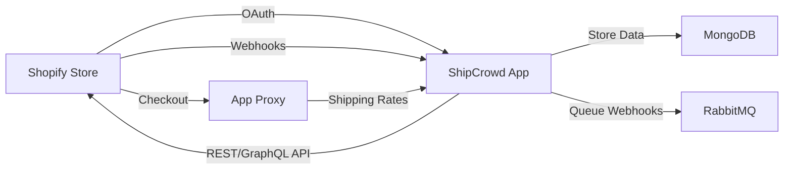
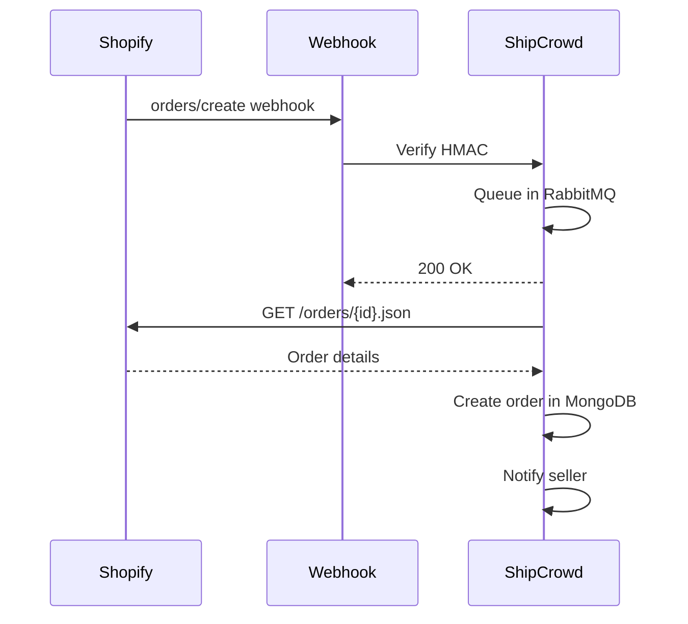
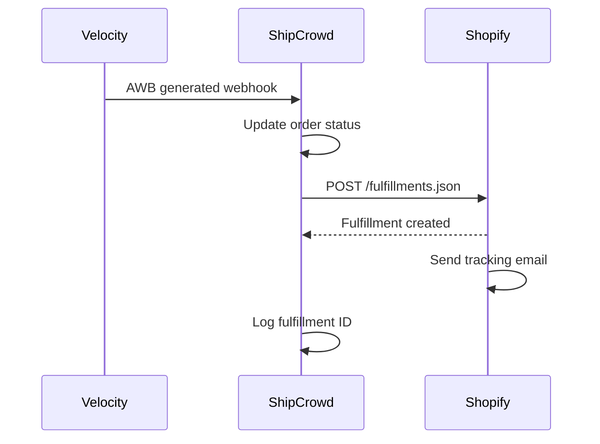

# Shopify Admin API Integration Guide for ShipCrowd

**API Version**: `2025-04`  
**Last Updated**: January 7, 2026  
**Integration Type**: Embedded App (App Bridge) + Public App  
**Authentication**: OAuth 2.0 with App Bridge Session Tokens

---

## 📋 Table of Contents

1. [Overview](#overview)
2. [Authentication & Authorization](#authentication--authorization)
3. [Order APIs](#order-apis)
4. [Fulfillment APIs](#fulfillment-apis)
5. [Inventory APIs](#inventory-apis)
6. [Webhook APIs](#webhook-apis)
7. [Checkout APIs](#checkout-apis)
8. [Product APIs](#product-apis)
9. [Shop APIs](#shop-apis)
10. [Billing APIs](#billing-apis)
11. [GraphQL Admin API](#graphql-admin-api)
12. [Implementation Details](#implementation-details)
13. [Workflow Summary](#workflow-summary)
14. [Common Issues & Solutions](#common-issues--solutions)
15. [Testing Strategies](#testing-strategies)
16. [Migration Recommendations](#migration-recommendations)

---

## Overview

This document provides comprehensive validation and implementation guidelines for integrating ShipCrowd with Shopify stores using the Admin API version `2025-04`. The integration enables bidirectional synchronization of:

- **Orders**: Shopify → ShipCrowd (webhook-driven) and ShipCrowd → Shopify (API-driven)
- **Fulfillments**: Tracking information, shipment status, carrier details
- **Inventory**: Stock levels across multiple warehouses/locations
- **Live Shipping Rates**: Real-time rate calculation at checkout
- **GDPR Compliance**: Data deletion and customer privacy requests

### Architecture Overview



### API Quota Limits

| API Type | Limit | Notes |
|:---------|:------|:------|
| **REST API** | 80 requests/min per shop | Leaky bucket (2 req/sec refill) |
| **GraphQL API** | Cost-based (1000 points) | Varies by query complexity |
| **Bulk Operations** | 1 concurrent operation | Async, webhook notification |
| **Webhooks** | No hard limit | Process asynchronously |

Reference: https://shopify.dev/docs/api/usage/rate-limits

---

## Authentication & Authorization

### 1.1 OAuth 2.0 Flow

**Endpoint** (Unversioned):
```
POST /admin/oauth/access_token
```

**Purpose**: Exchanges authorization code or App Bridge session token for an access token.

**Request Body**:
```json
{
  "client_id": "your_app_client_id",
  "client_secret": "your_app_client_secret",
  "code": "authorization_code_from_callback"
}
```

**Response**:
```json
{
  "access_token": "shpat_xxxxxxxxxxxxxxxxxxxxxxxxxxxxxxxx",
  "scope": "read_orders,write_orders,read_products,write_fulfillments"
}
```

**Storage**: Access token is stored in MongoDB with shop domain as key:
```javascript
{
  shop: "example-store.myshopify.com",
  accessToken: "shpat_xxx",
  scopes: ["read_orders", "write_orders", "read_fulfillments"],
  installedAt: ISODate("2026-01-07T10:00:00Z")
}
```

### 1.2 App Bridge Session Tokens (Modern Embedded Apps)

For embedded apps using Shopify App Bridge, session tokens replace traditional OAuth:

**Token Exchange** (Server-side):
```javascript
const sessionToken = req.headers['authorization']?.replace('Bearer ', '');
const decoded = jwt.verify(sessionToken, process.env.SHOPIFY_API_SECRET);

// Use decoded.dest (shop domain) to fetch access token from DB
const shop = await Shop.findOne({ domain: decoded.dest });
```

**Configuration** (`shopify.app.config.toml`):
```toml
name = "shipcrowd"
client_id = "your_client_id"
scopes = "read_orders,write_orders,read_products,write_fulfillments,read_inventory,write_inventory"

[auth]
redirect_urls = [ 
  "https://shipcrowd.com/auth/callback" 
]

[webhooks.privacy_compliance]
customer_data_request_url = "https://shipcrowd.com/webhooks/customers/data_request"
customer_redaction_url = "https://shipcrowd.com/webhooks/customers/redact"
shop_redaction_url = "https://shipcrowd.com/webhooks/shop/redact"
```

### 1.3 Required Scopes for ShipCrowd

| Scope | Purpose | Critical |
|:------|:--------|:---------|
| `read_orders` | Fetch order details | ✅ Yes |
| `write_orders` | Update order status, tags | ✅ Yes |
| `read_fulfillments` | Fetch fulfillment data | ✅ Yes |
| `write_fulfillments` | Create fulfillments, add tracking | ✅ Yes |
| `read_products` | Map SKUs to ShipCrowd inventory | ✅ Yes |
| `read_inventory` | Sync stock levels | ✅ Yes |
| `write_inventory` | Update stock after fulfillment | ✅ Yes |
| `read_locations` | Map warehouses | ✅ Yes |
| `write_webhooks` | Register event subscriptions | ✅ Yes |
| `read_shop` | Store metadata (currency, timezone) | ✅ Yes |

**Official Documentation**: https://shopify.dev/docs/api/usage/access-scopes

---

## Order APIs

### 2.1 List Orders

**Endpoint**:
```
GET /admin/api/2025-04/orders.json
```

**Required Scopes**: `read_orders`

**Query Parameters**:
| Parameter | Type | Description | Example |
|:----------|:-----|:------------|:--------|
| `status` | string | Filter by order status | `open`, `closed`, `cancelled`, `any` |
| `financial_status` | string | Payment status | `paid`, `pending`, `refunded` |
| `fulfillment_status` | string | Shipping status | `fulfilled`, `partial`, `unfulfilled` |
| `created_at_min` | datetime | Orders created after | `2026-01-01T00:00:00Z` |
| `created_at_max` | datetime | Orders created before | `2026-01-31T23:59:59Z` |
| `updated_at_min` | datetime | Orders updated after | `2026-01-07T00:00:00Z` |
| `limit` | integer | Results per page (max 250) | `100` |
| `since_id` | integer | Pagination cursor | `12345678` |
| `fields` | string | Select specific fields | `id,name,total_price` |

**Example Request**:
```bash
curl -X GET \
  'https://example-store.myshopify.com/admin/api/2025-04/orders.json?status=open&limit=50' \
  -H 'X-Shopify-Access-Token: shpat_xxx'
```

**Example Response**:
```json
{
  "orders": [
    {
      "id": 5891234567890,
      "email": "customer@example.com",
      "created_at": "2026-01-07T10:30:00Z",
      "updated_at": "2026-01-07T10:30:00Z",
      "number": 1234,
      "name": "#1234",
      "total_price": "199.00",
      "subtotal_price": "179.00",
      "total_tax": "20.00",
      "currency": "INR",
      "financial_status": "paid",
      "fulfillment_status": null,
      "line_items": [
        {
          "id": 12345678901234,
          "product_id": 9876543210,
          "variant_id": 1234567890,
          "title": "T-Shirt",
          "quantity": 2,
          "price": "89.50",
          "sku": "TS-BLK-M",
          "fulfillment_status": null
        }
      ],
      "shipping_address": {
        "first_name": "John",
        "last_name": "Doe",
        "address1": "123 Main St",
        "city": "Mumbai",
        "province": "Maharashtra", 
        "country": "India",
        "zip": "400001",
        "phone": "+919876543210"
      }
    }
  ]
}
```

**⚠️ Important Notes**:
- **60-Day Limitation**: By default, only orders from the last 60 days are returned unless `read_all_orders` scope is granted
- **Pagination**: Use `since_id` for cursor-based pagination (more efficient than `page` parameter)
- **Rate Limiting**: Maximum 250 orders per request. For bulk sync, use GraphQL Bulk Operations

**ShipCrowd Implementation**:
```javascript
async function syncOrdersFromShopify(shop, since_id = null) {
  const params = {
    status: 'open',
    limit: 250,
    ...(since_id && { since_id })
  };
  
  const response = await shopifyAPI.get(`/orders.json`, { params });
  
  for (const order of response.orders) {
    await ShipCrowdOrder.create({
      shopifyOrderId: order.id,
      shopDomain: shop,
      orderNumber: order.name,
      customerEmail: order.email,
      items: order.line_items.map(item => ({
        sku: item.sku,
        quantity: item.quantity,
        price: item.price
      })),
      shippingAddress: order.shipping_address,
      totalAmount: order.total_price,
      syncedAt: new Date()
    });
  }
}
```

**Reference**: https://shopify.dev/docs/api/admin-rest/2025-04/resources/order#get-orders

---

### 2.2 Create Order

**Endpoint**:
```
POST /admin/api/2025-04/orders.json
```

**Required Scopes**: `write_orders`, `read_orders`

**Request Body**:
```json
{
  "order": {
    "line_items": [
      {
        "variant_id": 1234567890,
        "quantity": 2,
        "price": "99.00"
      }
    ],
    "customer": {
      "first_name": "John",
      "last_name": "Doe",
      "email": "john@example.com"
    },
    "billing_address": {
      "first_name": "John",
      "last_name": "Doe",
      "address1": "123 Main St",
      "city": "Mumbai",
      "province": "Maharashtra",
      "country": "India",
      "zip": "400001",
      "phone": "+919876543210"
    },
    "shipping_address": {
      "first_name": "John",
      "last_name": "Doe",
      "address1": "123 Main St",
      "city": "Mumbai",
      "province": "Maharashtra",
      "country": "India",
      "zip": "400001",
      "phone": "+919876543210"
    },
    "financial_status": "paid",
    "send_receipt": false,
    "send_fulfillment_receipt": false,
    "tags": "shipcrowd,imported",
    "note": "Order created via ShipCrowd"
  }
}
```

**Response**:
```json
{
  "order": {
    "id": 5891234567890,
    "name": "#1235",
    "created_at": "2026-01-07T11:00:00Z",
    ...
  }
}
```

**Use Case in ShipCrowd**:
- Sync orders created in ShipCrowd platform to Shopify
- Create draft orders for quote-to-order conversion
- Import bulk orders from CSV uploads

---

### 2.3 Get Order by ID

**Endpoint**:
```
GET /admin/api/2025-04/orders/{order_id}.json
```

**Required Scopes**: `read_orders`

**Example**:
```bash
curl -X GET \
  'https://example-store.myshopify.com/admin/api/2025-04/orders/5891234567890.json' \
  -H 'X-Shopify-Access-Token: shpat_xxx'
```

**Use Case**: Verify order details after webhook notification

---

### 2.4 Update Order

**Endpoint**:
```
PUT /admin/api/2025-04/orders/{order_id}.json
```

**Required Scopes**: `write_orders`, `read_orders`

**Request Body** (example - add tags):
```json
{
  "order": {
    "id": 5891234567890,
    "tags": "shipcrowd,shipped,delivered"
  }
}
```

**Use Cases**:
- Add tracking tags after fulfillment
- Update order notes with shipping updates
- Add custom attributes for filtering

**⚠️ Limitations**:
- Cannot modify line items after order creation
- Cannot change prices/totals
- Cannot update customer email (creates new customer instead)

---

### 2.5 Cancel Order

**Endpoint**:
```
POST /admin/api/2025-04/orders/{order_id}/cancel.json
```

**Required Scopes**: `write_orders`, `read_orders`

**Request Body** (optional):
```json
{
  "reason": "customer",
  "email": true,
  "restock": true
}
```

**Reasons**:
- `customer`: Customer changed mind
- `fraud`: Suspected fraud
- `inventory`: Out of stock
- `declined`: Payment declined
- `other`: Other reasons

**ShipCrowd Workflow**:
1. Customer cancels order in ShipCrowd
2. ShipCrowd calls Shopify Cancel API
3. Shopify processes cancellation (refunds, restocks)
4. Webhook `orders/cancelled` triggers
5. ShipCrowd updates order status

---

### 2.6 Close Order

**Endpoint**:
```
POST /admin/api/2025-04/orders/{order_id}/close.json
```

**Required Scopes**: `write_orders`, `read_orders`

**Purpose**: Marks order as complete (no further fulfillment needed)

**Use Case**: After successful delivery, close order to archive it

---

### 2.7 Reopen Order

**Endpoint**:
```
POST /admin/api/2025-04/orders/{order_id}/open.json
```

**Required Scopes**: `write_orders`, `read_orders`

**Purpose**: Reopen a closed order for additional fulfillment

**Use Case**: Customer requests additional items after delivery

---

### 2.8 Count Orders

**Endpoint**:
```
GET /admin/api/2025-04/orders/count.json
```

**Required Scopes**: `read_orders`

**Query Parameters**: Same as List Orders (status, financial_status, etc.)

**Response**:
```json
{
  "count": 1234
}
```

**Use Case**: Dashboard analytics, monitoring order volume

---

## Fulfillment APIs

### 3.1 List Fulfillments for Order

**Endpoint**:
```
GET /admin/api/2025-04/orders/{order_id}/fulfillments.json
```

**Required Scopes**: `read_fulfillments`

**Response**:
```json
{
  "fulfillments": [
    {
      "id": 4567890123456,
      "order_id": 5891234567890,
      "status": "success",
      "created_at": "2026-01-07T12:00:00Z",
      "service": "Delhivery",
      "tracking_company": "Delhivery",
      "tracking_number": "DL1234567890",
      "tracking_urls": [
        "https://www.delhivery.com/track/package/DL1234567890"
      ],
      "line_items": [
        {
          "id": 12345678901234,
          "quantity": 2,
          "product_id": 9876543210
        }
      ],
      "shipment_status": "delivered"
    }
  ]
}
```

**⚠️ Common Mistake**:
```
❌ GET /admin/api/2025-04/fulfillments.json  // NOT VALID
✅ GET /admin/api/2025-04/orders/{order_id}/fulfillments.json  // CORRECT
```

Fulfillments must be scoped to an order.

---

### 3.2 Create Fulfillment

**Endpoint**:
```
POST /admin/api/2025-04/fulfillments.json
```

**Required Scopes**: `write_fulfillments`, `read_fulfillments`

**Request Body**:
```json
{
  "fulfillment": {
    "location_id": 6543210987,
    "tracking_number": "DL1234567890",
    "tracking_company": "Delhivery",
    "tracking_url": "https://www.delhivery.com/track/package/DL1234567890",
    "notify_customer": true,
    "line_items_by_fulfillment_order": [
      {
        "fulfillment_order_id": 1234567890
      }
    ]
  }
}
```

**Response**:
```json
{
  "fulfillment": {
    "id": 4567890123456,
    "order_id": 5891234567890,
    "status": "success",
    "shipment_status": "in_transit",
    "tracking_number": "DL1234567890",
    "tracking_company": "Delhivery",
    "tracking_url": "https://www.delhivery.com/track/package/DL1234567890"
  }
}
```

**ShipCrowd Implementation**:
```javascript
async function createShopifyFulfillment(order, shipment) {
  const fulfillment = {
    location_id: order.shopifyLocationId,
    tracking_number: shipment.awbNumber,
    tracking_company: shipment.courierName,
    tracking_url: `https://shipcrowd.com/track/${shipment.trackingId}`,
    notify_customer: true,
    line_items_by_fulfillment_order: [
      { fulfillment_order_id: order.fulfillmentOrderId }
    ]
  };
  
  const response = await shopifyAPI.post('/fulfillments.json', { fulfillment });
  
  await ShipCrowdOrder.updateOne(
    { _id: order._id },
    { 
      shopifyFulfillmentId: response.fulfillment.id,
      fulfillmentStatus: 'fulfilled',
      fulfilledAt: new Date()
    }
  );
}
```

**Notification Email**: If `notify_customer: true`, Shopify sends tracking email to customer automatically.

---

### 3.3 Update Fulfillment

**Endpoint**:
```
PUT /admin/api/2025-04/fulfillments/{fulfillment_id}.json
```

**Required Scopes**: `write_fulfillments`, `read_fulfillments`

**Request Body** (example - update tracking):
```json
{
  "fulfillment": {
    "tracking_number": "DL0987654321",
    "tracking_url": "https://www.delhivery.com/track/package/DL0987654321",
    "notify_customer": true
  }
}
```

**Use Case**: Update tracking number if AWB changes (rare but possible)

---

### 3.4 Cancel Fulfillment

**Endpoint**:
```
POST /admin/api/2025-04/fulfillments/{fulfillment_id}/cancel.json
```

**Required Scopes**: `write_fulfillments`, `read_fulfillments`

**Purpose**: Cancel fulfillment and restock inventory

**Use Case**: Shipment cancelled before pickup, need to revert

---

### 3.5 List Fulfillment Orders

**Endpoint**:
```
GET /admin/api/2025-04/fulfillment_orders.json
```

**Required Scopes**: `read_fulfillments`

**Purpose**: Fetch all fulfillment orders (newer Shopify model)

**Response**:
```json
{
  "fulfillment_orders": [
    {
      "id": 1234567890,
      "shop_id": 123456,
      "order_id": 5891234567890,
      "assign_to_location_id": 6543210987,
      "status": "open",
      "request_status": "unsubmitted",
      "line_items": [
        {
          "id": 12345678901234,
          "shop_id": 123456,
          "fulfillment_order_id": 1234567890,
          "quantity": 2,
          "line_item_id": 98765432109876,
          "inventory_item_id": 1122334455667788,
          "fulfillable_quantity": 2
        }
      ]
    }
  ]
}
```

**Use Case**: Identify orders awaiting fulfillment assignment

**Reference**: https://shopify.dev/docs/api/admin-rest/2025-04/resources/fulfillmentorder

---

## Inventory APIs

### 4.1 List Inventory Levels

**Endpoint**:
```
GET /admin/api/2025-04/inventory_levels.json
```

**Required Scopes**: `read_inventory`

**Query Parameters**:
| Parameter | Required | Description | Example |
|:----------|:---------|:------------|:--------|
| `inventory_item_ids` | Conditional | Comma-separated IDs (max 50) | `1234,5678,9012` |
| `location_ids` | Conditional | Comma-separated location IDs | `6543210987` |

**At least one of the above is required**

**Example Request**:
```bash
curl -X GET \
  'https://example-store.myshopify.com/admin/api/2025-04/inventory_levels.json?location_ids=6543210987&limit=50' \
  -H 'X-Shopify-Access-Token: shpat_xxx'
```

**Response**:
```json
{
  "inventory_levels": [
    {
      "inventory_item_id": 1122334455667788,
      "location_id": 6543210987,
      "available": 25,
      "updated_at": "2026-01-07T09:00:00Z"
    },
    {
      "inventory_item_id": 2233445566778899,
      "location_id": 6543210987,
      "available": 0,
      "updated_at": "2026-01-06T15:30:00Z"
    }
  ]
}
```

**ShipCrowd Sync Logic**:
```javascript
async function syncInventoryFromShopify(shop, locationId) {
  const response = await shopifyAPI.get('/inventory_levels.json', {
    params: { location_ids: locationId, limit: 250 }
  });
  
  for (const level of response.inventory_levels) {
    await ShipCrowdInventory.updateOne(
      { 
        shopDomain: shop,
        shopifyInventoryItemId: level.inventory_item_id,
        locationId: level.location_id
      },
      {
        available: level.available,
        lastSyncedAt: new Date()
      },
      { upsert: true }
    );
  }
}
```

---

### 4.2 Adjust Inventory Level

**Endpoint**:
```
POST /admin/api/2025-04/inventory_levels/adjust.json
```

**Required Scopes**: `write_inventory`, `read_inventory`

**Request Body**:
```json
{
  "location_id": 6543210987,
  "inventory_item_id": 1122334455667788,
  "available_adjustment": -2
}
```

**Use Case**: Decrement stock after order creation in ShipCrowd

**Response**:
```json
{
  "inventory_level": {
    "inventory_item_id": 1122334455667788,
    "location_id": 6543210987,
    "available": 23,
    "updated_at": "2026-01-07T13:00:00Z"
  }
}
```

**⚠️ Important**: 
- Use negative values to decrement (`available_adjustment: -2`)
- Use positive values to increment (`available_adjustment: 5`)
- This is relative adjustment, not absolute set

---

### 4.3 Set Inventory Level

**Endpoint**:
```
POST /admin/api/2025-04/inventory_levels/set.json
```

**Required Scopes**: `write_inventory`, `read_inventory`

**Request Body**:
```json
{
  "location_id": 6543210987,
  "inventory_item_id": 1122334455667788,
  "available": 50
}
```

**Use Case**: Overwrite Shopify stock with ShipCrowd master inventory

**Difference from Adjust**:
- `adjust`: Relative change (+/-)
- `set`: Absolute value (overwrites current stock)

---

### 4.4 List Inventory Items

**Endpoint**:
```
GET /admin/api/2025-04/inventory_items.json
```

**Required Scopes**: `read_inventory`

**Query Parameters**:
| Parameter | Type | Description |
|:----------|:-----|:------------|
| `ids` | string | Comma-separated inventory item IDs |
| `limit` | integer | Results per page (max 250) |

**Response**:
```json
{
  "inventory_items": [
    {
      "id": 1122334455667788,
      "sku": "TS-BLK-M",
      "created_at": "2025-12-01T10:00:00Z",
      "updated_at": "2026-01-07T09:00:00Z",
      "requires_shipping": true,
      "cost": "45.00",
      "country_code_of_origin": "IN",
      "province_code_of_origin": "MH",
      "tracked": true
    }
  ]
}
```

**Use Case**: Map SKUs to inventory item IDs for stock updates

---

### 4.5 List Locations

**Endpoint**:
```
GET /admin/api/2025-04/locations.json
```

**Required Scopes**: `read_locations`

**Response**:
```json
{
  "locations": [
    {
      "id": 6543210987,
      "name": "Mumbai Warehouse",
      "address1": "456 Industrial Area",
      "address2": null,
      "city": "Mumbai",
      "zip": "400070",
      "province": "Maharashtra",
      "country": "IN",
      "phone": "+912223334444",
      "active": true,
      "legacy": false
    }
  ]
}
```

**ShipCrowd Mapping**:
```javascript
async function mapLocationsToWarehouses(shop) {
  const response = await shopifyAPI.get('/locations.json');
  
  for (const location of response.locations) {
    await ShipCrowdWarehouse.updateOne(
      { shopDomain: shop, shopifyLocationId: location.id },
      {
        name: location.name,
        address: {
          line1: location.address1,
          city: location.city,
          state: location.province,
          pincode: location.zip,
          country: location.country
        },
        active: location.active
      },
      { upsert: true }
    );
  }
}
```

---

## Webhook APIs

### 5.1 Create Webhook

**Endpoint**:
```
POST /admin/api/2025-04/webhooks.json
```

**Required Scopes**: `write_webhooks`, `read_webhooks`

**Request Body**:
```json
{
  "webhook": {
    "topic": "orders/create",
    "address": "https://shipcrowd.com/api/v1/webhooks/shopify/orders/create",
    "format": "json"
  }
}
```

**Response**:
```json
{
  "webhook": {
    "id": 1234567890,
    "address": "https://shipcrowd.com/api/v1/webhooks/shopify/orders/create",
    "topic": "orders/create",
    "created_at": "2026-01-07T10:00:00Z",
    "updated_at": "2026-01-07T10:00:00Z",
    "format": "json",
    "fields": [],
    "api_version": "2025-04"
  }
}
```

**Supported Topics for ShipCrowd**:

| Topic | Purpose | Priority |
|:------|:--------|:---------|
| `orders/create` | New order notification | 🔴 Critical |
| `orders/updated` | Order modification (address, items) | 🔴 Critical |
| `orders/cancelled` | Cancellation sync | 🟡 High |
| `fulfillments/create` | Fulfillment created (deprecated, use fulfillment_orders) | 🟢 Medium |
| `fulfillment_orders/updated` | Fulfillment status change | 🔴 Critical |
| `inventory_levels/update` | Stock level change | 🟡 High |
| `app/uninstalled` | App removal cleanup | 🔴 Critical |

**⚠️ Important Notes**:
- `fulfillment_orders/created` topic is **NOT supported** in REST webhooks
- Maximum 500 webhooks per app
- Webhooks expire if they fail consistently for 19 consecutive times

**Reference**: https://shopify.dev/docs/api/admin-rest/2025-04/resources/webhook#post-webhooks

---

### 5.2 HMAC Verification (Security)

**Purpose**: Verify webhook authenticity to prevent spoofing

**Algorithm**: HMAC-SHA256

**Implementation**:
```javascript
const crypto = require('crypto');

function verifyWebhook(req, secret) {
  const hmacHeader = req.headers['x-shopify-hmac-sha256'];
  const body = req.rawBody; // Must be raw body, not parsed JSON
  
  const hash = crypto
    .createHmac('sha256', secret)
    .update(body, 'utf8')
    .digest('base64');
  
  return hmacHeader === hash;
}

// Express middleware
app.post('/webhooks/shopify/:topic', 
  express.raw({ type: 'application/json' }),
  (req, res) => {
    if (!verifyWebhook(req, process.env.SHOPIFY_WEBHOOK_SECRET)) {
      return res.status(401).send('Unauthorized');
    }
    
    // Process webhook
    const data = JSON.parse(req.body);
    // ...
  }
);
```

**Headers to Capture**:
- `X-Shopify-Hmac-SHA256`: HMAC signature
- `X-Shopify-Topic`: Webhook topic
- `X-Shopify-Shop-Domain`: Store domain
- `X-Shopify-Webhook-Id`: Unique webhook ID (for deduplication)

**Reference**: https://shopify.dev/docs/apps/build/webhooks/subscribe/https#step-5-verify-the-webhook

---

### 5.3 Webhook Retry Logic

**Shopify's Behavior**:
- Retries failed webhooks up to 19 times
- Exponential backoff: 1min → 5min → 15min → ... → 6 hours
- After 19 failures, webhook is disabled

**ShipCrowd Best Practices**:
1. **Respond Quickly**: Return `200 OK` within 5 seconds
2. **Async Processing**: Queue webhook in RabbitMQ, process later
3. **Idempotency**: Use `X-Shopify-Webhook-Id` to detect duplicates

```javascript
async function processWebhook(topic, data, webhookId) {
  // Check if already processed
  const processed = await WebhookLog.findOne({ webhookId });
  if (processed) {
    console.log(`Duplicate webhook ${webhookId}, skipping`);
    return;
  }
  
  // Process webhook
  await handleOrderCreated(data);
  
  // Log as processed
  await WebhookLog.create({
    webhookId,
    topic,
    shopDomain: data.shop_domain || data.myshopify_domain,
    processedAt: new Date()
  });
}
```

---

### 5.4 GDPR Webhooks (Mandatory)

These are configured in `shopify.app.config.toml`, **not via REST API**:

**Configuration**:
```toml
[webhooks.privacy_compliance]
customer_data_request_url = "https://shipcrowd.com/webhooks/customers/data_request"
customer_redaction_url = "https://shipcrowd.com/webhooks/customers/redact"
shop_redaction_url = "https://shipcrowd.com/webhooks/shop/redact"
```

**Processing Requirements**:
- **customer_data_request**: Provide customer data within 30 days
- **customer_redaction**: Delete customer data within 10 days
- **shop_redaction**: Delete shop data within 10 days

**ShipCrowd Implementation**:
```javascript
app.post('/webhooks/customers/redact', async (req, res) => {
  const { shop_domain, customer } = req.body;
  
  // Delete customer data
  await ShipCrowdOrder.deleteMany({ 
    shopDomain: shop_domain,
    customerId: customer.id 
  });
  
  await WebhookLog.create({
    topic: 'customers/redact',
    shopDomain: shop_domain,
    customerId: customer.id,
    processedAt: new Date()
  });
  
  res.status(200).send('OK');
});
```

**Reference**: https://shopify.dev/docs/apps/build/privacy-law-compliance

---

## Checkout APIs (Live Shipping Rates)

### 6.1 App Proxy Configuration

**Purpose**: Provide real-time shipping rates at checkout

**Configuration** (`shopify.app.config.toml`):
```toml
[app_proxy]
url = "https://shipcrowd.com"
subpath = "rates"
prefix = "apps"
```

**Result**: Checkout requests route to:
```
https://shipcrowd.com/apps/rates
```

### 6.2 Rate Calculation Request

**Shopify Request** (sent to your proxy URL):
```json
{
  "rate": {
    "origin": {
      "country": "IN",
      "postal_code": "400070",
      "province": "Maharashtra",
      "city": "Mumbai",
      "name": null,
      "address1": "456 Industrial Area",
      "address2": null
    },
    "destination": {
      "country": "IN",
      "postal_code": "110001",
      "province": "Delhi",
      "city": "Delhi",
      "name": null,
      "address1": null,
      "address2": null
    },
    "items": [
      {
        "name": "T-Shirt",
        "sku": "TS-BLK-M",
        "quantity": 2,
        "grams": 400,
        "price": 8950,
        "vendor": "ShipCrowd Apparel",
        "requires_shipping": true,
        "taxable": true,
        "fulfillment_service": "manual"
      }
    ],
    "currency": "INR",
    "locale": "en-IN"
  }
}
```

**ShipCrowd Response**:
```json
{
  "rates": [
    {
      "service_name": "Delhivery Express",
      "description": "Delivery in 2-3 business days",
      "service_code": "DELHIVERY_EXPRESS",
      "currency": "INR",
      "total_price": "4500",
      "phone_required": true,
      "min_delivery_date": "2026-01-09",
      "max_delivery_date": "2026-01-10"
    },
    {
      "service_name": "BlueDart Standard",
      "description": "Delivery in 3-5 business days",
      "service_code": "BLUEDART_STANDARD",
      "currency": "INR",
      "total_price": "3500",
      "phone_required": false,
      "min_delivery_date": "2026-01-10",
      "max_delivery_date": "2026-01-12"
    }
  ]
}
```

**Implementation**:
```javascript
app.post('/apps/rates', async (req, res) => {
  const { rate } = req.body;
  
  // Calculate weight
  const totalWeight = rate.items.reduce((sum, item) => 
    sum + (item.grams * item.quantity), 0
  );
  
  // Get rates from Velocity API
  const velocityRates = await getVelocityRates({
    origin: rate.origin.postal_code,
    destination: rate.destination.postal_code,
    weight: totalWeight / 1000, // Convert grams to kg
    paymentMode: 'prepaid'
  });
  
  // Transform to Shopify format
  const rates = velocityRates.map(r => ({
    service_name: `${r.courierName} ${r.serviceType}`,
    description: `Delivery in ${r.deliveryDays} days`,
    service_code: r.courierCode,
    currency: 'INR',
    total_price: String(Math.round(r.rate * 100)), // Paisa
    phone_required: r.courierName === 'Delhivery',
    min_delivery_date: addDays(new Date(), r.deliveryDays - 1),
    max_delivery_date: addDays(new Date(), r.deliveryDays + 1)
  }));
  
  res.json({ rates });
});
```

**⚠️ Important**:
- Response time must be < 10 seconds (Shopify timeout)
- Prices in **minor currency units** (paisa for INR, cents for USD)
- `service_code` must be unique per rate

**Reference**: https://shopify.dev/docs/apps/build/shipping/app-shipping#step-3-implement-the-shipping-rate-calculation-endpoint

---

## Product APIs

### 7.1 List Products

**Endpoint**:
```
GET /admin/api/2025-04/products.json
```

**Required Scopes**: `read_products`

**Query Parameters**:
| Parameter | Type | Description |
|:----------|:-----|:------------|
| `ids` | string | Comma-separated product IDs |
| `limit` | integer | Results per page (max 250) |
| `since_id` | integer | Pagination cursor |
| `published_status` | string | `published`, `unpublished`, `any` |

**Response**:
```json
{
  "products": [
    {
      "id": 9876543210,
      "title": "Classic T-Shirt",
      "vendor": "ShipCrowd Apparel",
      "product_type": "Clothing",
      "created_at": "2025-12-01T10:00:00Z",
      "handle": "classic-t-shirt",
      "variants": [
        {
          "id": 1234567890,
          "product_id": 9876543210,
          "title": "Black / M",
          "price": "89.50",
          "sku": "TS-BLK-M",
          "inventory_item_id": 1122334455667788,
          "inventory_quantity": 25,
          "weight": 0.4,
          "weight_unit": "kg"
        }
      ]
    }
  ]
}
```

**Use Case**: Map Shopify SKUs to ShipCrowd inventory system

---

## Shop APIs

### 8.1 Get Shop Details

**Endpoint**:
```
GET /admin/api/2025-04/shop.json
```

**Required Scopes**: `read_shop`

**Response**:
```json
{
  "shop": {
    "id": 123456,
    "name": "Example Store",
    "email": "owner@example.com",
    "domain": "example-store.com",
    "myshopify_domain": "example-store.myshopify.com",
    "country": "IN",
    "currency": "INR",
    "timezone": "(GMT+05:30) Mumbai",
    "iana_timezone": "Asia/Kolkata",
    "plan_name": "advanced",
    "created_at": "2024-06-01T00:00:00Z"
  }
}
```

**Use Case**: 
- Store shop metadata during installation
- Display  store info in ShipCrowd dashboard
- Use timezone for local time calculations

**ShipCrowd Storage**:
```javascript
async function storeShopMetadata(accessToken, shop) {
  const response = await shopifyAPI.get('/shop.json');
  
  await Shop.updateOne(
    { domain: shop },
    {
      shopifyShopId: response.shop.id,
      name: response.shop.name,
      email: response.shop.email,
      currency: response.shop.currency,
      timezone: response.shop.iana_timezone,
      plan: response.shop.plan_name,
      installedAt: new Date()
    },
    { upsert: true }
  );
}
```

---

## Billing APIs

### 9.1 Create One-Time Charge

**Endpoint**:
```
POST /admin/api/2025-04/application_charges.json
```

**Required Scopes**: `write_application_charges`

**Request Body**:
```json
{
  "application_charge": {
    "name": "ShipCrowd Setup Fee",
    "price": 99.00,
    "return_url": "https://shipcrowd.com/billing/callback",
    "test": true
  }
}
```

**Response**:
```json
{
  "application_charge": {
    "id": 1234567890,
    "name": "ShipCrowd Setup Fee",
    "price": "99.00",
    "status": "pending",
    "confirmation_url": "https://example-store.myshopify.com/admin/charges/1234567890/confirm"
  }
}
```

**Workflow**:
1. Create charge
2. Redirect merchant to `confirmation_url`
3. Merchant approves/declines
4. Shopify redirects to `return_url` with `charge_id` parameter
5. Activate charge via `POST /application_charges/{charge_id}/activate.json`

---

### 9.2 Create Recurring Charge

**Endpoint**:
```
POST /admin/api/2025-04/recurring_application_charges.json
```

**Required Scopes**: `write_application_charges`

**Request Body**:
```json
{
  "recurring_application_charge": {
    "name": "ShipCrowd Pro Plan",
    "price": 29.99,
    "return_url": "https://shipcrowd.com/billing/callback",
    "trial_days": 14,
    "test": true,
    "capped_amount": 100.00,
    "terms": "Up to 500 orders/month, ₹0.20 per additional order"
  }
}
```

**Use Case**: Monthly subscription billing

**⚠️ Testing**: Always use `"test": true` in development. Test charges appear in merchant's billing but are not actually charged.

**Reference**: https://shopify.dev/docs/apps/build/billing

---

## GraphQL Admin API

### 10.1 GraphQL Endpoint

**Endpoint**:
```
POST /admin/api/2025-04/graphql.json
```

**Required Scopes**: Varies by query

**Headers**:
```
X-Shopify-Access-Token: shpat_xxx
Content-Type: application/json
```

### 10.2 Check App Scopes

**Query**:
```graphql
query {
  currentAppInstallation {
    accessScopes {
      description
      handle
    }
  }
}
```

**Response**:
```json
{
  "data": {
    "currentAppInstallation": {
      "accessScopes": [
        {
          "description": "Read orders",
          "handle": "read_orders"
        },
        {
          "description": "Write orders",
          "handle": "write_orders"
        }
      ]
    }
  }
}
```

**Use Case**: Verify granted scopes match required scopes

---

### 10.3 Bulk Query Products

**Query**:
```graphql
mutation {
  bulkOperationRunQuery(
    query: """
    {
      products {
        edges {
          node {
            id
            title
            handle
            variants {
              edges {
                node {
                  id
                  sku
                  inventoryQuantity
                }
              }
            }
          }
        }
      }
    }
    """
  ) {
    bulkOperation {
      id
      status
    }
    userErrors {
      field
      message
    }
  }
}
```

**Response**: Bulk operation ID, download results via webhook when complete

**When to Use**: Syncing >10,000 products (more efficient than REST pagination)

**Reference**: https://shopify.dev/docs/api/usage/bulk-operations/queries

---

## Implementation Details

### 11.1 Rate Limiting Strategy

**REST API Limits**:
- **Bucket Size**: 80 requests
- **Leak Rate**: 2 requests/second (120 requests/minute)
- **Header**: `X-Shopify-Shop-Api-Call-Limit: 32/80`

**Implementation**:
```javascript
async function shopifyRequest(method, endpoint, data = null) {
  const response = await axios({
    method,
    url: `https://${shop}/admin/api/2025-04${endpoint}`,
    headers: { 'X-Shopify-Access-Token': accessToken },
    data
  });
  
  const limit = response.headers['x-shopify-shop-api-call-limit'];
  if (limit) {
    const [used, total] = limit.split('/').map(Number);
    if (used >= total * 0.9) {
      // 90% capacity, wait 1 second
      await sleep(1000);
    }
  }
  
  return response.data;
}
```

**GraphQL Cost Limits**:
- **Max Points**: 1000 (replenishes 50/sec)
- **Header**: `X-GraphQL-Cost-Include-Fields: true`

---

### 11.2 Error Handling

**Common HTTP Status Codes**:

| Code | Meaning | Action |
|:-----|:--------|:-------|
| `200` | Success | Process response |
| `400` | Bad Request | Fix request params |
| `401` | Unauthorized | Token expired/invalid |
| `402` | Payment Required | Shopify subscription issue |
| `403` | Forbidden | Missing scope |
| `404` | Not Found | Resource doesn't exist |
| `422` | Unprocessable Entity | Validation error |
| `429` | Too Many Requests | Retry with exponential backoff |
| `500` | Internal Server Error | Retry with backoff |
| `503` | Service Unavailable | Shopify downtime, retry |

**Retry Logic**:
```javascript
async function retryRequest(fn, maxRetries = 3) {
  for (let i = 0; i < maxRetries; i++) {
    try {
      return await fn();
    } catch (error) {
      if (error.response?.status === 429) {
        const retryAfter = error.response.headers['retry-after'] || (2 ** i);
        await sleep(retryAfter * 1000);
        continue;
      }
      throw error;
    }
  }
  throw new Error('Max retries exceeded');
}
```

---

### 11.3 Webhook Processing Architecture

```
┌──────────────┐
│   Shopify    │
└──────┬───────┘
       │ Webhook (HTTPS)
       ▼
┌──────────────┐
│ ShipCrowd    │
│ API Server   │
└──────┬───────┘
       │ 200 OK (< 5sec)
       │
       │ Enqueue
       ▼
┌──────────────┐
│  RabbitMQ    │
└──────┬───────┘
       │ Consume
       ▼
┌──────────────┐
│   Worker     │
│   Process    │
└──────┬───────┘
       │ Store
       ▼
┌──────────────┐
│   MongoDB    │
└──────────────┘
```

**Benefits**:
- Fast webhook response (avoid Shopify retries)
- Resilient to spikes (queue buffers load)
- Retry failed processing without losing data

---

## Workflow Summary

### Order Sync (Shopify → ShipCrowd)



### Fulfillment Sync (ShipCrowd → Shopify)



---

## Common Issues & Solutions

### Issue 1: Webhook Not Received

**Symptoms**: Webhook registered but not triggering

**Causes**:
1. Invalid HTTPS URL (must be publicly accessible)
2. SSL certificate error
3. Webhook endpoint returns non-200 status
4. Firewall blocking Shopify IPs

**Solutions**:
- Use **ngrok** for local testing: `ngrok http 5005`
- Check webhook status: `GET /webhooks/{id}.json`
- Verify SSL certificate: `curl https://your-domain.com/webhook`
- Test with Shopify CLI: `shopify webhook trigger orders/create`

---

### Issue 2: Rate Limit 429 Errors

**Symptoms**: `429 Too Many Requests` response

**Solutions**:
1. **Check bucket usage**: Read `X-Shopify-Shop-Api-Call-Limit` header
2. **Implement backoff**: Wait according to `Retry-After` header
3. **Use GraphQL**: More efficient for bulk data
4. **Batch requests**: Group related operations

---

### Issue 3: Fulfillment Creation Fails

**Error**: `422 Unprocessable Entity - "Fulfillment order cannot be fulfilled"`

**Cause**: Order already fulfilled or cancelled

**Solution**: Check `fulfillment_status` before creating fulfillment

---

## Testing Strategies

### 1. Development Store Testing

1. Create development store via Partners dashboard
2. Install app on dev store
3. Test full OAuth flow
4. Verify webhook registration
5. Create test orders manually
6. Trigger webhooks via Shopify CLI

### 2. Webhook Testing with Hookdeck

```bash
# Forward Shopify webhooks to localhost
hookdeck listen 5005 --source shopify
```

**Benefits**:
- Persist webhook history
- Replay failed webhooks
- Debug webhook payload

Website: https://hookdeck.com

### 3. Performance Testing

**Shopify Lighthouse**:
- Install app on real store
- Shopify runs automated performance tests
- Must achieve >90% score for App Store approval

**Metrics**:
- Time to Interactive (TTI)
- First Contentful Paint (FCP)
- Cumulative Layout Shift (CLS)

Reference: https://shopify.dev/docs/apps/launch/performance

---

## Migration Recommendations

### Legacy → Modern API Migration

| Legacy API | Modern Alternative | Deadline |
|:-----------|:-------------------|:---------|
| REST Order API | GraphQL Order API | No deadline yet |
| REST Fulfillment API | GraphQL FulfillmentOrder API | 2026-04-01 |
| Checkout API | Checkout Extensions | 2026-01-01 |

### GraphQL Advantages

1. **Single Request**: Fetch orders + products + customers in one query
2. **No Over-fetching**: Request only needed fields
3. **Bulk Operations**: Process 10,000+ records efficiently
4. **Better Versioning**: Fewer breaking changes

**Example Migration**:

**REST (2 requests)**:
```javascript
const order = await GET('/orders/123.json');
const fulfillments = await GET('/orders/123/fulfillments.json');
```

**GraphQL (1 request)**:
```graphql
query {
  order(id: "gid://shopify/Order/123") {
    id
    name
    fulfillments {
      trackingNumber
      trackingUrl
    }
  }
}
```

---

## Additional Resources

### Official Shopify Documentation

- **API Reference**: https://shopify.dev/docs/api/admin-rest/2025-04
- **GraphQL Reference**: https://shopify.dev/docs/api/admin-graphql/2025-04
- **Webhooks Guide**: https://shopify.dev/docs/apps/build/webhooks
- **OAuth Guide**: https://shopify.dev/docs/apps/build/authentication-authorization
- **App Store Requirements**: https://shopify.dev/docs/apps/launch
- **Developer Blog**: https://www.shopify.com/partners/blog

### ShipCrowd-Specific Contacts

- **Shopify Partner Support**: partners@shopify.com
- **API Issues**: https://community.shopify.com
- **App Review Team**: app-review@shopify.com

---

**Document Version**: 3.0 (Comprehensive)  
**Last Reviewed**: January 7, 2026  
**Next Review**: April 1, 2026 (API version update)  
**Maintained By**: ShipCrowd Technical Team