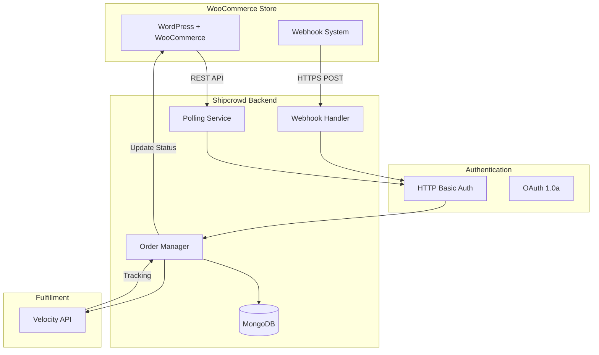

# WooCommerce REST API Integration Guide for Shipcrowd

**API Version**: WooCommerce REST API v3  
**Last Updated**: January 7, 2026  
**Integration Type**: WordPress Plugin / REST Client  
**Authentication**: HTTP Basic Auth (Consumer Key/Secret) + OAuth 1.0a

---

## 📋 Table of Contents

1. [Overview](#overview)
2. [Prerequisites & Setup](#prerequisites--setup)
3. [Authentication](#authentication)
4. [Orders API](#orders-api)
5. [Products API](#products-api)
6. [Customers API](#customers-api)
7. [Webhooks](#webhooks)
8. [Batch Operations](#batch-operations)
9. [Rate Limiting](#rate-limiting)
10. [Implementation Details](#implementation-details)
11. [Common Issues & Solutions](#common-issues--solutions)
12. [Local Development](#local-development)
13. [Production Deployment](#production-deployment)

---

## Overview

Shipcrowd integrates with WooCommerce stores via the REST API v3 to enable order management and fulfillment automation. This integration allows:

- **Order Ingestion**: Fetch new orders for fulfillment
- **Order Updates**: Update order status and add tracking information
- **Product Sync**: Maintain inventory levels
- **Webhook Notifications**: Real-time order updates
- **Customer Management**: Access customer data for shipping

### Architecture Overview



### API Endpoints Structure

All WooCommerce REST API endpoints follow this pattern:
```
{STORE_URL}/wp-json/wc/v3/{RESOURCE}
```

**Examples**:
- Orders: `https://example.com/wp-json/wc/v3/orders`
- Products: `https://example.com/wp-json/wc/v3/products`
- Customers: `https://example.com/wp-json/wc/v3/customers`

---

## Prerequisites & Setup

### 1.1 WordPress & WooCommerce Requirements

**Minimum Versions**:
- WordPress: 5.8+ (6.0+ recommended)
- WooCommerce: 6.0+ (8.0+ recommended)
- PHP: 7.4+ (8.0+ recommended)
- MySQL: 5.6+ or MariaDB 10.3+

### 1.2 Critical Permalink Configuration

**⚠️ MOST COMMON ISSUE**: WooCommerce REST API **will not work** with "Plain" permalinks.

**Setup**:
1. WordPress Admin → **Settings** → **Permalinks**
2. Select **any option except "Plain"**:
   - ✅ **Post name** (Recommended): `https://example.com/sample-post/`
   - ✅ Day and name: `https://example.com/2026/01/07/sample-post/`
   - ✅ Month and name: `https://example.com/2026/01/sample-post/`
   - ✅ Numeric: `https://example.com/archives/123`
   - ✅ Custom Structure: `/%postname%/`
   - ❌ **Plain**: `https://example.com/?p=123` (WILL NOT WORK)
3. Click **"Save Changes"**

**Why This Matters**:
- REST API uses pretty URLs: `/wp-json/wc/v3/orders`
- Plain permalinks break URL routing
- Results in `404 Not Found` for all API requests
- **This is the #1 cause of "API not working" issues**

**Reference**: https://stackoverflow.com/questions/56618526/how-can-i-use-the-woocommerce-rest-api-with-plain-permalinks

### 1.3 Generate API Keys

**Step 1: Access WooCommerce Settings**
1. WordPress Admin → **WooCommerce** → **Settings**
2. Click **Advanced** tab
3. Click **REST API** sub-tab
4. Click **"Add key"** button

**Step 2: Configure API Key**
```
Description: Shipcrowd Integration
User: [Select admin user]
Permissions: Read/Write
```

**⚠️ Important**: 
- **Read** permission: Can only fetch data
- **Write** permission: Can only create/update data
- **Read/Write** permission: Full access (required for Shipcrowd)

**Step 3: Save and Copy Credentials**

After clicking "Generate API key", you'll see:
```
Consumer key: ck_xxxxxxxxxxxxxxxxxxxxxxxxxxxxxxxxxxxxxxxx
Consumer secret: cs_xxxxxxxxxxxxxxxxxxxxxxxxxxxxxxxxxxxxxxxx
```

**⚠️ Critical**: These are shown **only once**. Copy and store them immediately.

**Credential Format**:
- Consumer Key: 43 characters starting with `ck_`
- Consumer Secret: 43 characters starting with `cs_`

---

## Authentication

### 2.1 HTTP Basic Authentication

**For HTTPS connections** (Production):

**Headers**:
```http
Authorization: Basic base64(consumer_key:consumer_secret)
```

**Example**:
```bash
# Encode credentials
echo -n "ck_xxx:cs_xxx" | base64
# Output: Y2tfxxx...

curl -X GET \
  'https://example.com/wp-json/wc/v3/orders' \
  -H 'Authorization: Basic Y2tfxxx...'
```

**Node.js Implementation**:
```javascript
const axios = require('axios');

const wooCommerceAPI = axios.create({
  baseURL: 'https://example.com/wp-json/wc/v3',
  auth: {
    username: process.env.WOO_CONSUMER_KEY,
    password: process.env.WOO_CONSUMER_SECRET
  },
  headers: {
    'Content-Type': 'application/json'
  }
});

// Usage
const orders = await wooCommerceAPI.get('/orders');
```

### 2.2 Query String Authentication

**For HTTP connections** (Local development only):

**⚠️ Security Warning**: Never use this in production. Always use HTTPS with Basic Auth.

**Format**:
```
https://example.com/wp-json/wc/v3/orders?consumer_key=ck_xxx&consumer_secret=cs_xxx
```

**Example**:
```bash
curl -X GET \
  'https://example.com/wp-json/wc/v3/orders?consumer_key=ck_xxx&consumer_secret=cs_xxx'
```

### 2.3 OAuth 1.0a (Advanced)

**For mobile apps or JavaScript applications**:

OAuth 1.0a provides more secure authentication without exposing credentials.

**Flow**:
1. Request token
2. User authorization
3. Access token exchange
4. Signed requests

**Implementation** (using `oauth-1.0a` library):
```javascript
const OAuth = require('oauth-1.0a');
const crypto = require('crypto');

const oauth = OAuth({
  consumer: {
    key: process.env.WOO_CONSUMER_KEY,
    secret: process.env.WOO_CONSUMER_SECRET
  },
  signature_method: 'HMAC-SHA256',
  hash_function(base_string, key) {
    return crypto
      .createHmac('sha256', key)
      .update(base_string)
      .digest('base64');
  }
});

const request_data = {
  url: 'https://example.com/wp-json/wc/v3/orders',
  method: 'GET'
};

const authHeader = oauth.toHeader(oauth.authorize(request_data));

const response = await axios.get(request_data.url, {
  headers: authHeader
});
```

**Reference**: https://woocommerce.github.io/woocommerce-rest-api-docs/#authentication

---

## Orders API

### 3.1 List Orders

**Endpoint**: `GET /wp-json/wc/v3/orders`

**Query Parameters**:

| Parameter | Type | Description | Example |
|:----------|:-----|:------------|:--------|
| `page` | integer | Page number | `1` |
| `per_page` | integer | Results per page (max 100) | `50` |
| `search` | string | Search by order number or customer | `#1234` |
| `after` | datetime | Orders created after date | `2026-01-01T00:00:00` |
| `before` | datetime | Orders created before date | `2026-01-31T23:59:59` |
| `status` | string | Filter by status | `processing,on-hold` |
| `customer` | integer | Filter by customer ID | `123` |
| `product` | integer | Filter by product ID | `456` |
| `orderby` | string | Sort by field | `date`, `id`, `title` |
| `order` | string | Sort direction | `asc`, `desc` |

**Order Status Values**:
- `pending`: Payment pending
- `processing`: Payment received, awaiting fulfillment
- `on-hold`: Awaiting payment or stock
- `completed`: Order fulfilled and complete
- `cancelled`: Cancelled by customer or admin
- `refunded`: Refunded
- `failed`: Payment failed

**Example Request**:
```bash
curl -X GET \
  'https://example.com/wp-json/wc/v3/orders?status=processing&per_page=50&orderby=date&order=desc' \
  -u "ck_xxx:cs_xxx"
```

**Example Response**:
```json
[
  {
    "id": 1234,
    "parent_id": 0,
    "status": "processing",
    "currency": "INR",
    "version": "8.0.0",
    "prices_include_tax": true,
    "date_created": "2026-01-07T10:30:00",
    "date_modified": "2026-01-07T10:30:00",
    "discount_total": "0.00",
    "discount_tax": "0.00",
    "shipping_total": "0.00",
    "shipping_tax": "0.00",
    "cart_tax": "161.86",
    "total": "1060.86",
    "total_tax": "161.86",
    "customer_id": 5,
    "order_key": "wc_order_abc123def456",
    "billing": {
      "first_name": "Rajesh",
      "last_name": "Kumar",
      "company": "",
      "address_1": "123 MG Road",
      "address_2": "Apt 4B",
      "city": "Mumbai",
      "state": "MH",
      "postcode": "400001",
      "country": "IN",
      "email": "rajesh@example.com",
      "phone": "+919876543210"
    },
    "shipping": {
      "first_name": "Rajesh",
      "last_name": "Kumar",
      "company": "",
      "address_1": "123 MG Road",
      "address_2": "Apt 4B",
      "city": "Mumbai",
      "state": "MH",
      "postcode": "400001",
      "country": "IN"
    },
    "payment_method": "cod",
    "payment_method_title": "Cash on Delivery",
    "transaction_id": "",
    "customer_ip_address": "103.xxx.xxx.xxx",
    "customer_user_agent": "Mozilla/5.0...",
    "created_via": "checkout",
    "customer_note": "Please deliver after 6 PM",
    "date_completed": null,
    "date_paid": null,
    "cart_hash": "abc123def456",
    "number": "1234",
    "meta_data": [],
    "line_items": [
      {
        "id": 12,
        "name": "Classic T-Shirt - Black - Medium",
        "product_id": 456,
        "variation_id": 789,
        "quantity": 2,
        "tax_class": "",
        "subtotal": "899.00",
        "subtotal_tax": "161.82",
        "total": "899.00",
        "total_tax": "161.82",
        "taxes": [
          {
            "id": 1,
            "total": "161.82",
            "subtotal": "161.82"
          }
        ],
        "meta_data": [
          {
            "id": 123,
            "key": "pa_color",
            "value": "Black",
            "display_key": "Color",
            "display_value": "Black"
          },
          {
            "id": 124,
            "key": "pa_size",
            "value": "Medium",
            "display_key": "Size",
            "display_value": "Medium"
          }
        ],
        "sku": "TS-BLK-M",
        "price": 449.50,
        "parent_name": null
      }
    ],
    "tax_lines": [
      {
        "id": 13,
        "rate_code": "IN-GST-1",
        "rate_id": 1,
        "label": "GST",
        "compound": false,
        "tax_total": "161.86",
        "shipping_tax_total": "0.00",
        "rate_percent": 18,
        "meta_data": []
      }
    ],
    "shipping_lines": [
      {
        "id": 14,
        "method_title": "Flat Rate",
        "method_id": "flat_rate",
        "instance_id": "1",
        "total": "0.00",
        "total_tax": "0.00",
        "taxes": [],
        "meta_data": []
      }
    ],
    "fee_lines": [],
    "coupon_lines": [],
    "refunds": [],
    "payment_url": "https://example.com/checkout/order-pay/1234/?pay_for_order=true&key=wc_order_abc123def456",
    "is_editable": false,
    "needs_payment": false,
    "needs_processing": true,
    "date_created_gmt": "2026-01-07T05:00:00",
    "date_modified_gmt": "2026-01-07T05:00:00",
    "date_completed_gmt": null,
    "date_paid_gmt": null,
    "currency_symbol": "₹",
    "_links": {
      "self": [
        {
          "href": "https://example.com/wp-json/wc/v3/orders/1234"
        }
      ],
      "collection": [
        {
          "href": "https://example.com/wp-json/wc/v3/orders"
        }
      ],
      "customer": [
        {
          "href": "https://example.com/wp-json/wc/v3/customers/5"
        }
      ]
    }
  }
]
```

**Pagination Headers**:
```http
X-WP-Total: 150
X-WP-TotalPages: 3
Link: <https://example.com/wp-json/wc/v3/orders?page=2>; rel="next"
```

**Shipcrowd Implementation**:
```javascript
async function syncOrdersFromWooCommerce(storeUrl, credentials) {
  let page = 1;
  let hasMore = true;
  let allOrders = [];
  
  while (hasMore) {
    const response = await axios.get(`${storeUrl}/wp-json/wc/v3/orders`, {
      auth: {
        username: credentials.consumerKey,
        password: credentials.consumerSecret
      },
      params: {
        status: 'processing',
        per_page: 100,
        page: page,
        orderby: 'date',
        order: 'desc'
      }
    });
    
    allOrders = allOrders.concat(response.data);
    
    // Check if there are more pages
    const totalPages = parseInt(response.headers['x-wp-totalpages']);
    hasMore = page < totalPages;
    page++;
  }
  
  // Create Shipcrowd orders
  for (const order of allOrders) {
    await ShipcrowdOrder.create({
      channel: 'WOOCOMMERCE',
      channelOrderId: order.id.toString(),
      channelOrderDisplayId: `#${order.number}`,
      storeUrl: storeUrl,
      customer: {
        name: `${order.billing.first_name} ${order.billing.last_name}`,
        email: order.billing.email,
        phone: order.billing.phone,
        address: {
          line1: order.shipping.address_1,
          line2: order.shipping.address_2,
          city: order.shipping.city,
          state: order.shipping.state,
          pincode: order.shipping.postcode,
          country: order.shipping.country
        }
      },
      items: order.line_items.map(item => ({
        sku: item.sku,
        productId: item.product_id,
        variationId: item.variation_id,
        quantity: item.quantity,
        price: parseFloat(item.price),
        name: item.name
      })),
      financials: {
        total: parseFloat(order.total),
        currency: order.currency,
        paymentMethod: order.payment_method === 'cod' ? 'COD' : 'PREPAID',
        isPaid: order.date_paid !== null
      },
      metadata: {
        customerNote: order.customer_note,
        paymentMethodTitle: order.payment_method_title
      }
    });
  }
}
```

### 3.2 Get Single Order

**Endpoint**: `GET /wp-json/wc/v3/orders/{id}`

**Example**:
```bash
curl -X GET \
  'https://example.com/wp-json/wc/v3/orders/1234' \
  -u "ck_xxx:cs_xxx"
```

### 3.3 Update Order

**Endpoint**: `PUT /wp-json/wc/v3/orders/{id}`

**Request Body** (update status):
```json
{
  "status": "completed"
}
```

**Request Body** (add tracking):
```json
{
  "status": "completed",
  "meta_data": [
    {
      "key": "_tracking_provider",
      "value": "Delhivery"
    },
    {
      "key": "_tracking_number",
      "value": "DL1234567890IN"
    },
    {
      "key": "_tracking_url",
      "value": "https://www.delhivery.com/track/package/DL1234567890IN"
    },
    {
      "key": "_date_shipped",
      "value": "2026-01-07T14:00:00"
    }
  ]
}
```

**Example**:
```bash
curl -X PUT \
  'https://example.com/wp-json/wc/v3/orders/1234' \
  -u "ck_xxx:cs_xxx" \
  -H 'Content-Type: application/json' \
  -d '{
    "status": "completed",
    "meta_data": [
      {"key": "_tracking_number", "value": "DL1234567890IN"}
    ]
  }'
```

**Implementation**:
```javascript
async function updateOrderWithTracking(orderId, trackingInfo, storeUrl, credentials) {
  await axios.put(
    `${storeUrl}/wp-json/wc/v3/orders/${orderId}`,
    {
      status: 'completed',
      meta_data: [
        {
          key: '_tracking_provider',
          value: trackingInfo.courierName
        },
        {
          key: '_tracking_number',
          value: trackingInfo.awbNumber
        },
        {
          key: '_tracking_url',
          value: trackingInfo.trackingUrl
        },
        {
          key: '_date_shipped',
          value: new Date().toISOString()
        },
        {
          key: '_Shipcrowd_shipment_id',
          value: trackingInfo.shipmentId
        }
      ]
    },
    {
      auth: {
        username: credentials.consumerKey,
        password: credentials.consumerSecret
      }
    }
  );
}
```

### 3.4 Create Order Note

**Endpoint**: `POST /wp-json/wc/v3/orders/{order_id}/notes`

**Request Body**:
```json
{
  "note": "Your order has been shipped via Delhivery. Tracking: DL1234567890IN",
  "customer_note": true,
  "added_by_user": false
}
```

**Parameters**:
- `note`: Note content
- `customer_note`: `true` = visible to customer, `false` = private
- `added_by_user`: Set to `false` for system-generated notes

**Example**:
```bash
curl -X POST \
  'https://example.com/wp-json/wc/v3/orders/1234/notes' \
  -u "ck_xxx:cs_xxx" \
  -H 'Content-Type: application/json' \
  -d '{
    "note": "Shipped via Delhivery. Tracking: DL1234567890IN",
    "customer_note": true
  }'
```

---

## Products API

### 4.1 List Products

**Endpoint**: `GET /wp-json/wc/v3/products`

**Query Parameters**:
- `sku`: Filter by SKU
- `stock_status`: `instock`, `outofstock`, `onbackorder`
- `type`: `simple`, `grouped`, `external`, `variable`

**Example**:
```bash
curl -X GET \
  'https://example.com/wp-json/wc/v3/products?sku=TS-BLK-M' \
  -u "ck_xxx:cs_xxx"
```

### 4.2 Update Product Stock

**Endpoint**: `PUT /wp-json/wc/v3/products/{id}`

**Request Body**:
```json
{
  "stock_quantity": 50,
  "stock_status": "instock"
}
```

**Implementation**:
```javascript
async function updateProductStock(productId, quantity, storeUrl, credentials) {
  await axios.put(
    `${storeUrl}/wp-json/wc/v3/products/${productId}`,
    {
      stock_quantity: quantity,
      stock_status: quantity > 0 ? 'instock' : 'outofstock',
      manage_stock: true
    },
    {
      auth: {
        username: credentials.consumerKey,
        password: credentials.consumerSecret
      }
    }
  );
}
```

---

## Webhooks

### 5.1 Webhook Configuration

**Setup** (via WooCommerce Admin):
1. **WooCommerce** → **Settings** → **Advanced** → **Webhooks**
2. Click **"Add webhook"**
3. Configure:
   ```
   Name: Shipcrowd Order Created
   Status: Active
   Topic: Order created
   Delivery URL: https://Shipcrowd.com/webhooks/woocommerce/orders/created
   Secret: [Generate strong random string]
   API Version: WP REST API Integration v3
   ```

**Available Topics**:
- `order.created`
- `order.updated`
- `order.deleted`
- `order.restored`
- `product.created`
- `product.updated`
- `product.deleted`
- `customer.created`
- `customer.updated`
- `customer.deleted`

### 5.2 Webhook Signature Verification

**Security**: WooCommerce sends HMAC-SHA256 signature in `X-WC-Webhook-Signature` header.

**Verification Process**:
```javascript
const crypto = require('crypto');

function verifyWooCommerceWebhook(req, secret) {
  const signature = req.headers['x-wc-webhook-signature'];
  const body = req.rawBody; // Must be raw body string
  
  // Generate HMAC
  const hash = crypto
    .createHmac('sha256', secret)
    .update(body, 'utf8')
    .digest('base64');
  
  return signature === hash;
}

// Express middleware
app.post('/webhooks/woocommerce/:topic',
  express.raw({ type: 'application/json' }),
  async (req, res) => {
    const secret = process.env.WOO_WEBHOOK_SECRET;
    
    if (!verifyWooCommerceWebhook(req, secret)) {
      console.error('Invalid webhook signature');
      return res.status(401).send('Unauthorized');
    }
    
    // Acknowledge receipt immediately
    res.status(200).send('OK');
    
    // Process webhook asynchronously
    const data = JSON.parse(req.body);
    await processWooCommerceWebhook(req.params.topic, data);
  }
);
```

**Webhook Payload** (order.created):
```json
{
  "id": 1234,
  "status": "processing",
  "total": "1060.86",
  "billing": {
    "first_name": "Rajesh",
    "last_name": "Kumar",
    "email": "rajesh@example.com",
    "phone": "+919876543210"
  },
  "line_items": [
    {
      "id": 12,
      "name": "Classic T-Shirt",
      "product_id": 456,
      "quantity": 2,
      "sku": "TS-BLK-M"
    }
  ]
}
```

**Headers**:
```http
X-WC-Webhook-Source: https://example.com/
X-WC-Webhook-Topic: order.created
X-WC-Webhook-Resource: order
X-WC-Webhook-Event: created
X-WC-Webhook-Signature: base64_encoded_hmac_sha256
X-WC-Webhook-ID: 123
X-WC-Webhook-Delivery-ID: 456
```

**Reference**: https://woocommerce.github.io/woocommerce-rest-api-docs/#webhooks

---

## Batch Operations

### 6.1 Batch Update Orders

**Endpoint**: `POST /wp-json/wc/v3/orders/batch`

**⚠️ Limit**: Maximum **100 objects** per batch request.

**Request Body**:
```json
{
  "update": [
    {
      "id": 1234,
      "status": "completed",
      "meta_data": [
        {"key": "_tracking_number", "value": "DL1234567890IN"}
      ]
    },
    {
      "id": 1235,
      "status": "completed",
      "meta_data": [
        {"key": "_tracking_number", "value": "DL0987654321IN"}
      ]
    }
  ]
}
```

**Response**:
```json
{
  "update": [
    {
      "id": 1234,
      "status": "completed",
      ...
    },
    {
      "id": 1235,
      "status": "completed",
      ...
    }
  ]
}
```

**Implementation**:
```javascript
async function batchUpdateOrders(updates, storeUrl, credentials) {
  // Split into chunks of 100
  const chunks = [];
  for (let i = 0; i < updates.length; i += 100) {
    chunks.push(updates.slice(i, i + 100));
  }
  
  for (const chunk of chunks) {
    await axios.post(
      `${storeUrl}/wp-json/wc/v3/orders/batch`,
      { update: chunk },
      {
        auth: {
          username: credentials.consumerKey,
          password: credentials.consumerSecret
        }
      }
    );
    
    // Wait 1 second between batches to avoid rate limiting
    await new Promise(resolve => setTimeout(resolve, 1000));
  }
}
```

---

## Rate Limiting

### 7.1 Rate Limit Configuration

**Default Limits** (if enabled):
- **Store API POST requests**: 25 requests per 10 seconds
- **Checkout endpoint**: 3 requests per 60 seconds

**⚠️ Important**: Rate limiting is **disabled by default** in WooCommerce. It must be explicitly enabled.

**Enable Rate Limiting**:
1. **WooCommerce** → **Settings** → **Advanced** → **Features**
2. Enable **"Checkout rate limiting"**

### 7.2 Rate Limit Headers

When rate limiting is enabled, responses include:
```http
RateLimit-Limit: 25
RateLimit-Remaining: 20
RateLimit-Reset: 1704628800
RateLimit-Retry-After: 5
```

**Handling Rate Limits**:
```javascript
async function callWooCommerceAPI(url, options, credentials) {
  try {
    const response = await axios({
      ...options,
      url: url,
      auth: {
        username: credentials.consumerKey,
        password: credentials.consumerSecret
      }
    });
    
    // Check rate limit headers
    const remaining = parseInt(response.headers['ratelimit-remaining'] || 999);
    if (remaining < 5) {
      console.warn(`Rate limit warning: ${remaining} requests remaining`);
    }
    
    return response.data;
    
  } catch (error) {
    if (error.response?.status === 429) {
      const retryAfter = parseInt(error.response.headers['ratelimit-retry-after'] || 10);
      console.log(`Rate limited. Retrying after ${retryAfter} seconds`);
      
      await new Promise(resolve => setTimeout(resolve, retryAfter * 1000));
      
      // Retry request
      return callWooCommerceAPI(url, options, credentials);
    }
    
    throw error;
  }
}
```

**Reference**: https://woocommerce.com/document/woocommerce-store-api-rate-limits/

---

## Common Issues & Solutions

### Issue 1: 404 Not Found for All API Requests

**Symptoms**: All API calls return `404 Not Found`

**Root Cause**: Permalinks set to "Plain"

**Solution**:
1. WordPress Admin → **Settings** → **Permalinks**
2. Select **any option except "Plain"** (recommend "Post name")
3. Click **"Save Changes"**
4. Test API: `curl https://example.com/wp-json/wc/v3/`

**Reference**: https://stackoverflow.com/questions/56618526/how-can-i-use-the-woocommerce-rest-api-with-plain-permalinks

---

### Issue 2: 401 Unauthorized

**Symptoms**: `401 Unauthorized` or `consumer_key is missing`

**Causes**:
1. Invalid Consumer Key/Secret
2. Server stripping `Authorization` header
3. Incorrect authentication method

**Solutions**:

**A. Verify Credentials**:
```bash
# Test with correct credentials
curl -X GET \
  'https://example.com/wp-json/wc/v3/orders' \
  -u "ck_xxx:cs_xxx"
```

**B. Fix Apache Authorization Header** (if using Apache):

Add to `.htaccess`:
```apache
# Enable Authorization header
RewriteEngine On
RewriteCond %{HTTP:Authorization} ^(.*)
RewriteRule ^(.*) - [E=HTTP_AUTHORIZATION:%1]
```

**C. Fix Nginx Authorization Header** (if using Nginx):

Add to nginx config:
```nginx
fastcgi_param HTTP_AUTHORIZATION $http_authorization;
```

---

### Issue 3: SSL Certificate Errors (Localhost)

**Symptoms**: `UNABLE_TO_VERIFY_LEAF_SIGNATURE` or SSL errors

**Cause**: Self-signed SSL certificate on localhost

**Solution** (for testing only):
```javascript
const https = require('https');

const agent = new https.Agent({
  rejectUnauthorized: false // ⚠️ ONLY for localhost testing
});

const response = await axios.get('https://localhost:8000/wp-json/wc/v3/orders', {
  auth: {
    username: credentials.consumerKey,
    password: credentials.consumerSecret
  },
  httpsAgent: agent
});
```

**⚠️ Never use `rejectUnauthorized: false` in production!**

---

### Issue 4: CORS Errors

**Symptoms**: CORS policy errors in browser console

**Cause**: Trying to call API from browser JavaScript

**Solution**: **Always call WooCommerce API from server-side** (Node.js, PHP, Python), never from browser.

Browser → Shipcrowd Server → WooCommerce API ✅  
Browser → WooCommerce API directly ❌

---

## Local Development

### 8.1 LocalWP (Recommended)

**Download**: https://localwp.com/

**Setup**:
1. Install LocalWP
2. Click **"Create a new site"**
3. Site name: `Shipcrowd-test-store`
4. PHP version: 8.0+
5. Click **"Add Site"**
6. Access: `http://Shipcrowd-test-store.local`

**Install WooCommerce**:
1. Click **"WP Admin"** in LocalWP
2. Plugins → Add New → Search "WooCommerce"
3. Install and Activate
4. Complete setup wizard

### 8.2 Docker Setup

**docker-compose.yml**:
```yaml
version: '3.8'

services:
  wordpress:
    image: wordpress:latest
    ports:
      - "8080:80"
    environment:
      WORDPRESS_DB_HOST: db
      WORDPRESS_DB_USER: wordpress
      WORDPRESS_DB_PASSWORD: wordpress
      WORDPRESS_DB_NAME: wordpress
    volumes:
      - ./wp-content:/var/www/html/wp-content

  db:
    image: mysql:5.7
    environment:
      MYSQL_DATABASE: wordpress
      MYSQL_USER: wordpress
      MYSQL_PASSWORD: wordpress
      MYSQL_ROOT_PASSWORD: rootpassword
    volumes:
      - db_data:/var/lib/mysql

volumes:
  db_data:
```

**Start**:
```bash
docker-compose up -d
```

**Access**: `http://localhost:8080`

### 8.3 Testing with Ngrok

**For webhook testing**:
```bash
# Expose localhost to internet
ngrok http 8080

# Copy HTTPS URL (e.g., https://abc123.ngrok.io)
# Use this as webhook delivery URL in WooCommerce
```

---

## Production Deployment

### 9.1 Production Checklist

- [ ] **HTTPS enabled** (SSL certificate installed)
- [ ] **Permalinks** set to "Post name" or custom structure
- [ ] **API keys** generated with Read/Write permissions
- [ ] **Webhooks** configured with strong secrets
- [ ] **Rate limiting** enabled (optional)
- [ ] **Firewall** configured to allow Shipcrowd IPs
- [ ] **Backup** system in place
- [ ] **Monitoring** for API errors

### 9.2 Security Best Practices

**1. Use HTTPS Only**:
```javascript
// Reject HTTP connections
if (!storeUrl.startsWith('https://')) {
  throw new Error('Store URL must use HTTPS');
}
```

**2. Rotate API Keys Regularly**:
- Generate new keys every 90 days
- Delete old keys after rotation

**3. Implement Request Logging**:
```javascript
async function logAPIRequest(method, endpoint, response, error = null) {
  await APILog.create({
    method,
    endpoint,
    statusCode: response?.status || error?.response?.status,
    timestamp: new Date(),
    error: error?.message
  });
}
```

**4. Monitor Failed Requests**:
```javascript
// Alert on high error rate
const errorRate = await APILog.countDocuments({
  timestamp: { $gte: new Date(Date.now() - 60 * 60 * 1000) },
  statusCode: { $gte: 400 }
});

if (errorRate > 50) {
  await sendAlert('High WooCommerce API error rate');
}
```

---

**Document Version**: 2.0 (Comprehensive)  
**Last Reviewed**: January 7, 2026  
**Next Review**: April 1, 2026  
**Maintained By**: Shipcrowd Technical Team

**Official References**:
- WooCommerce REST API Docs: https://woocommerce.github.io/woocommerce-rest-api-docs/
- Authentication Guide: https://woocommerce.github.io/woocommerce-rest-api-docs/#authentication
- Orders API: https://woocommerce.github.io/woocommerce-rest-api-docs/#orders
- Products API: https://woocommerce.github.io/woocommerce-rest-api-docs/#products
- Webhooks: https://woocommerce.github.io/woocommerce-rest-api-docs/#webhooks
- Rate Limits: https://woocommerce.com/document/woocommerce-store-api-rate-limits/
- LocalWP: https://localwp.com/
- Permalink Issues: https://stackoverflow.com/questions/56618526/how-can-i-use-the-woocommerce-rest-api-with-plain-permalinks
