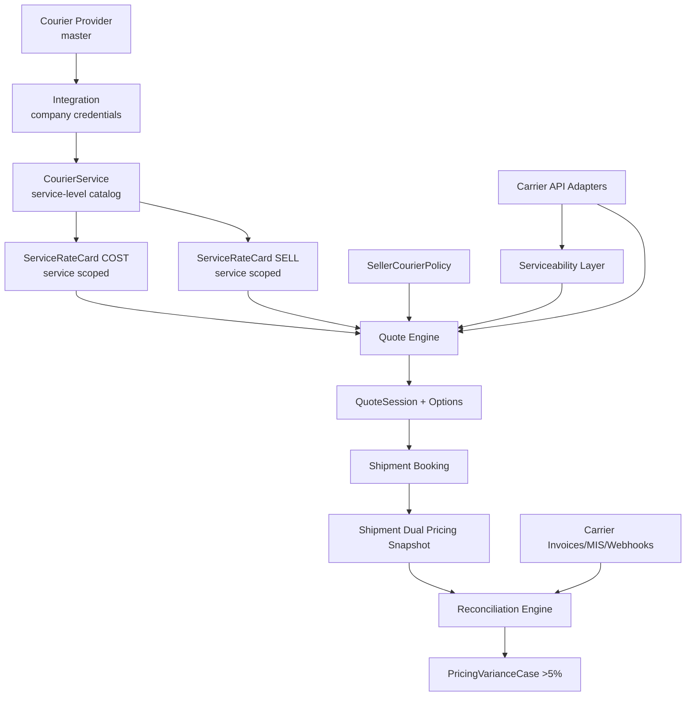

# ShipCrowd Courier + RateCard Target Architecture (Enhanced v3 - Production Ready)

**Date:** February 8, 2026
**Status:** Implemented (Feature-Flagged) + Stabilization Cleanup Applied
**Scope:** End-to-end courier management, service-level quoting, rate-card management, booking, and reconciliation

---

## Related Documents

1. Full legacy decommission runbook:
   - `/Users/dhirajgiri/Documents/Projects/Helix India/Shipcrowd/docs/Development/Domains/Shipping/Legacy_Decommission_and_Full_Migration_Runbook.md`
2. Detailed runtime architecture guide:
   - `/Users/dhirajgiri/Documents/Projects/Helix India/Shipcrowd/docs/Development/Domains/Shipping/Service_Level_Pricing_and_Order_Shipment_Architecture_Guide.md`
3. Final courier + ratecard refactor blueprint:
   - `/Users/dhirajgiri/Documents/Projects/Helix India/Shipcrowd/docs/Development/Domains/Shipping/Courier_RateCard_Final_Refactor_Blueprint.md`

---

## 0.1 Current Code Reality (Post-Implementation, Feb 2026)

This document now reflects implemented behavior in `codex/feature/service-level-pricing`:

1. Service-level entities are active in code:
   - `CourierService`, `ServiceRateCard`, `SellerCourierPolicy`, `QuoteSession`
   - `CarrierBillingRecord`, `PricingVarianceCase`
2. Legacy bridge endpoints are intentionally kept behind feature flag fallback:
   - `GET /api/v1/orders/courier-rates`
   - `POST /api/v1/orders/:orderId/ship`
3. Canonical quote contract is active:
   - `sessionId`, `options[]`, `recommendation`, `expiresAt`, `confidence`, `providerTimeouts`
4. Canonical error/status behavior:
   - Expired quote session: `410`
   - Invalid option/session mismatch: `422`
5. Reconciliation threshold behavior:
   - `<= 5%` -> auto-resolved variance case
   - `> 5%` -> open `PricingVarianceCase`

---

## 0. Critical Fixes Applied (v2 → v3)

This version incorporates critical corrections based on verified codebase and API documentation:

### [HIGH] Ekart API Capabilities Verified
- **Fixed:** Changed Ekart from "TBD/assumed" to fully verified with actual API endpoints
- **Source Strategy:** `LIVE_API` (primary via lane-level `/data/v3/serviceability` + `/data/pricing/estimate`) → `TABLE` (fallback)
- **Serviceability:** Use lane-level `/data/v3/serviceability` for accurate carrier options

### [HIGH] Booking Rollback Pattern Fixed
- **Fixed:** Replaced "delete shipment" with saga compensation pattern
- **Before AWB:** Refund wallet, mark `booking_failed`, keep immutable record
- **After AWB:** Keep shipment, mark `booking_partial`, log compensation event, create support ticket
- **Never delete shipments** - maintain audit trail integrity

### [MEDIUM] Velocity Auth Clarified
- **Fixed:** Changed from "Static Token" to "Token via Auth API"
- **Accurate:** Token obtained via `/custom/api/v1/auth-token`, valid 24 hours

### [MEDIUM] Quote Latency Target Made Realistic
- **Fixed:** Added per-provider timeout budgets and partial result strategy
- **Timeouts:** Ekart 2s, Delhivery 1.5s/1s, Velocity 1.5s
- **Partial results:** Return available quotes with confidence flags if providers timeout

### [MEDIUM] Rollout Strategy Clarified
- **Fixed:** Explicit phased rollout with feature flags (not single cutover)
- **11 phases:** Internal → 10% → 50% → 100% over 4 weeks with dual-write safety

### [ADDED] Seller Selection Behavior Recommendation
- **Default mode:** `manual_with_recommendation` (show all, pre-select best)
- **Balanced rule:** Choose fastest if within 5% of cheapest, else cheapest
- **Fully configurable** via `SellerCourierPolicy`

---

## 1. Objective

Build a production-correct multi-courier architecture for ShipCrowd that:

1. Supports **carrier-wise quote display** to end users (contract requirement).
2. Works with current go-live providers: **Velocity, Delhivery, Ekart**.
3. Preserves feasibility: implement only what is supported by real APIs and reliable fallbacks.
4. Produces stable margins and finance control with **quote vs invoice variance threshold = 5%**.

---

## 2. Non-Negotiable Product Behaviors

1. Seller can choose carrier/service explicitly at booking time.
2. Seller can set preference policies:
   - only specific providers/services
   - allow all
   - auto-select by priority (`price`, `speed`, `balanced`)
3. Quote engine must show multiple valid options with transparent basis.
4. Booking must lock and store selected quote snapshot.
5. Reconciliation must detect and route >5% variance automatically.

### 2.1 Recommended Seller Selection Behavior

**Default Mode:** `manual_with_recommendation`
- Seller sees all allowed quote options
- System pre-selects best option with "RECOMMENDED" tag
- Seller can override and choose any displayed option

**Per-Seller Policy Configuration:**
- `allowedProviders[]`: Whitelist of allowed courier providers
- `allowedServiceIds[]`: Whitelist of specific services
- `blockedProviders[]`: Blacklist of excluded providers
- `blockedServiceIds[]`: Blacklist of specific services
- `selectionMode`: `manual_with_recommendation` | `auto` | `manual_only`
- `autoPriority`: `price` | `speed` | `balanced`

**Balanced Priority Rule (Recommended Default):**
- Choose **fastest** option if within **5% cost delta** of cheapest
- Else choose **cheapest** option
- Formula: `if (fastestCost <= cheapestCost × 1.05) then fastest else cheapest`
- Configurable via `balancedDeltaPercent` (default: 5)

---

## 3. Feasibility Matrix (Verified from API Documentation)

### Velocity (Shipfast)

| Capability | Status | API Endpoint | Notes |
|---|---|---|---|
| Auth | Token via Auth API | `/custom/api/v1/auth-token` | Token obtained via auth endpoint, 24h validity |
| Serviceability | ✅ Yes | `/custom/api/v1/serviceability` | Returns carrier list with IDs |
| Pre-shipment Rate Estimate | ⚠️ Charges at Creation | `/custom/api/v1/forward-order-orchestration` | Returns `charges.frwd_charges` with `shipping_charges`, `cod_charges`, `rto_charges` |
| Tracking | ✅ Yes | `/custom/api/v1/order-tracking` | Real-time status with activities |
| Webhooks | ❌ Not documented | N/A | Use polling fallback |
| NDR Actions | ❌ Not in API | N/A | Derive from tracking activities |
| Label/Manifest | ✅ Yes | Response includes `label_url` | Auto-generated |

**Design Rule:** Use **TABLE + API HYBRID** - store charges from creation response, use table pricing for pre-quotes.

### Delhivery

| Capability | Status | API Endpoint | Notes |
|---|---|---|---|
| Auth | Static Token | Header: `Authorization: Token XXX` | Lifetime token |
| Serviceability | ✅ Yes | `/c/api/pin-codes/json/` | Filter by pincode |
| Pre-shipment Rate Estimate | ✅ Yes | `/api/kinko/v1/invoice/charges/.json` | Live pricing API with params: md, cgm, o_pin, d_pin, ss, pt |
| Tracking | ✅ Yes | `/api/v1/packages/json/` | By waybill or order ID |
| Webhooks | ✅ Yes | Scan Push + POD Push | Requires registration via email |
| NDR Actions | ✅ Yes | `/api/p/update` | Actions: RE-ATTEMPT, PICKUP_RESCHEDULE |
| Label/Manifest | ✅ Yes | `/api/p/packing_slip` | PDF or JSON response |

**Design Rule:** Use **LIVE_API** for cost estimation, fall back to table if API fails.

### Ekart

| Capability | Status | API Endpoint | Notes |
|---|---|---|---|
| Auth | ✅ Token via Auth API | `/integrations/v2/auth/token/{client_id}` | Bearer token, typically 24-hour cached validity |
| Serviceability | ✅ Yes | `/data/v3/serviceability` (lane-level, recommended)<br>`/api/v2/serviceability/{pincode}` (pincode-level, fallback) | Lane-level returns route-wise courier options and charge blocks |
| Pre-shipment Rate Estimate | ✅ Yes | `/data/pricing/estimate` | Detailed estimate with zone, billing weight, and charge components |
| Tracking | ✅ Yes | `/api/v1/track/{id}` or `/data/v1/elite/track/{wbn}` | Public and raw tracking supported |
| Webhooks | ✅ Yes | `/api/v2/webhook` | Topics include tracking and shipment lifecycle updates |
| NDR Actions | ✅ Yes | `/api/v2/package/ndr` | Actions include `Re-Attempt` and `RTO` |

**Design Rule:** Use **LIVE_API** for serviceability and pricing: `/data/v3/serviceability` for lane-level option discovery + `/data/pricing/estimate` for detailed costing when required. Fall back to **TABLE** only on provider/API failure.

**Quote Engine Source Strategy:**
- Delhivery: `LIVE_API` (primary) → `TABLE` (fallback)
- Ekart: `LIVE_API` (primary, via `/data/v3/serviceability` + `/data/pricing/estimate`) → `TABLE` (fallback)
- Velocity: `TABLE` (primary for pre-quotes) → Actual charges captured post-booking

---

## 4. Current State Summary (Verified in Codebase)

### Existing Models

1. **Courier** (`courier.model.ts`):
   - Fields: `name`, `displayName`, `serviceTypes[]`, `regions[]`, `isActive`, `codEnabled`, `codLimit`, `weightLimit`
   - Role: Provider master catalog

2. **Integration** (`integration.model.ts`):
   - Fields: `companyId`, `type` (courier/ecommerce/payment), `provider`, `credentials` (encrypted), `settings.isActive`
   - Role: Company-provider credentials

3. **CarrierProfile** (`carrier-profile.model.ts`):
   - Fields: `carrierId`, `dimFactors`, `weightLimits`, `api.baseUrl`, `api.retryPolicy`, `capabilities`
   - Role: Technical carrier profile
   - Used by: DynamicPricingService for DIM calculations

4. **RateCard** (`rate-card.model.ts`):
   - Current: Zone linear pricing (A-E), not service-scoped
   - Fields: `zonePricing.zoneA-E` with `baseWeight`, `basePrice`, `additionalPricePerKg`
   - Limitation: **No service-level differentiation**

5. **Shipment** (`shipment.model.ts`):
   - Current pricing snapshot: Single-ledger (sell only)
   - Fields: `pricingDetails.{ rateCardId, baseRate, weightCharge, zoneCharge, codCharge, gstAmount, totalPrice }`
   - Missing: **Cost amount, expected margin**

6. **RoutingRule** (`routing-rule.model.ts`):
   - Fields: `conditions` (minWeight, maxWeight, paymentMode), `actions` (blockedCarriers, preferredCarriers)
   - Used by: SmartRateCalculatorService

### Existing Services

1. **DynamicPricingService** (`dynamic-pricing.service.ts`):
   - Steps: Chargeable weight → Zone → Zone pricing → COD → Fuel surcharge → GST
   - Limitation: **No service-level differentiation, no dual-ledger**

2. **SmartRateCalculatorService** (`smart-rate-calculator.service.ts`):
   - 5-step pipeline: Fetch rates → Filter serviceability → Apply rules → Score/rank → Medal tags
   - Limitation: **Uses single pricing, no cost vs sell separation**

3. **PricingOrchestratorService** (`pricing-orchestrator.service.ts`):
   - Workflow: Select rate card → Calculate → Audit log
   - Fallback: Base ₹50 + weight ₹20/kg + COD 2%

---

## 5. Target Domain Architecture



---

## 6. Data Model (Target)

### 6.1 Keep Existing (Enhanced Roles)

1. **Courier** = provider master (global catalog)
2. **Integration** = company-provider credentials
3. **CarrierProfile** = technical constraints (DIM, limits, capabilities)
4. **RoutingRule** = company-level preference base

### 6.2 New Models

#### A) CourierService

Service-level operational unit for quotes and booking.

**Schema:**
```typescript
{
  companyId: ObjectId,
  provider: 'velocity' | 'delhivery' | 'ekart',
  integrationId: ObjectId,
  serviceCode: string, // unique stable code: 'VEL-STD', 'DEL-EXPRESS'
  providerServiceId: string, // carrier's service ID if exists
  displayName: string, // 'Velocity Standard Surface'
  serviceType: 'surface' | 'express' | 'air' | 'standard',
  status: 'active' | 'inactive' | 'hidden',

  constraints: {
    minWeightKg: number,
    maxWeightKg: number,
    maxCodValue: number,
    maxPrepaidValue: number,
    maxDimensions: { length, width, height },
    paymentModes: ['cod', 'prepaid', 'pickup', 'repl']
  },

  sla: {
    eddMinDays: number,
    eddMaxDays: number
  },

  zoneSupport: string[], // ['A', 'B', 'C', 'D', 'E'] or provider zones
  rating: number, // ops-maintained 0-5
  source: 'manual' | 'synced',

  isDeleted: boolean,
  createdAt: Date,
  updatedAt: Date
}
```

**Indexes:**
- `{ companyId: 1, provider: 1, status: 1 }`
- `{ companyId: 1, serviceCode: 1 }` unique
- `{ integrationId: 1, providerServiceId: 1 }`

#### B) ServiceRateCard

Service-scoped pricing matrix (supports cost and sell).

**Schema:**
```typescript
{
  companyId: ObjectId,
  serviceId: ObjectId, // reference to CourierService
  cardType: 'cost' | 'sell',
  sourceMode: 'LIVE_API' | 'TABLE' | 'HYBRID',
  currency: 'INR',

  effectiveDates: {
    startDate: Date,
    endDate: Date
  },

  status: 'draft' | 'active' | 'inactive',

  calculation: {
    weightBasis: 'actual' | 'volumetric' | 'max',
    roundingUnitKg: number, // 0.5, 1.0
    roundingMode: 'ceil' | 'floor' | 'nearest',
    dimDivisor: number // from CarrierProfile, e.g., 5000
  },

  zoneRules: [{
    zoneKey: string, // 'A', 'B', 'within', 'metro', etc.
    slabs: [{
      minKg: number,
      maxKg: number,
      charge: number
    }],
    additionalPerKg: number, // after last slab
    codRule: {
      type: 'percentage' | 'flat' | 'slab',
      percentage: number,
      minCharge: number,
      maxCharge: number,
      slabs: [{ min, max, value, type }]
    },
    fuelSurcharge: {
      percentage: number,
      base: 'freight' | 'freight_cod'
    },
    rtoRule: {
      percentage: number, // of forward freight
      minCharge: number
    }
  }],

  metadata: {
    version: number,
    importedFrom: string,
    importedAt: Date,
    approvedBy: ObjectId,
    approvedAt: Date
  },

  isDeleted: boolean,
  createdAt: Date,
  updatedAt: Date
}
```

---

## Legacy Deprecation Trigger Checklist

Legacy pricing/booking code should be removed only when all conditions below stay true for at least one full release cycle:

1. Feature flag `enable_service_level_pricing` is enabled for 100% target companies.
2. `GET /orders/courier-rates` bridge path serves service-level quotes without regression reports.
3. `POST /orders/:orderId/ship` bridge path books from quote sessions without fallback usage.
4. Variance auto-close/open pipeline is stable at expected thresholds.
5. No unresolved P1/P2 incidents tied to service-level pricing rollout in the last release window.

**Indexes:**
- `{ companyId: 1, serviceId: 1, cardType: 1, status: 1 }`
- `{ companyId: 1, cardType: 1, 'effectiveDates.startDate': 1 }`

#### C) SellerCourierPolicy

Seller-specific restrictions and auto-selection strategy.

**Schema:**
```typescript
{
  companyId: ObjectId,
  sellerId: ObjectId,

  allowedProviders: string[], // ['velocity', 'delhivery']
  allowedServiceIds: ObjectId[], // specific services
  blockedProviders: string[],
  blockedServiceIds: ObjectId[],

  selectionMode: 'manual' | 'auto',
  autoPriority: 'price' | 'speed' | 'balanced',
  balancedDeltaPercent: number, // default 10

  isActive: boolean,
  createdAt: Date,
  updatedAt: Date
}
```

**Index:** `{ companyId: 1, sellerId: 1 }` unique

#### D) QuoteSession

Ephemeral persisted quote result for lock/book flow.

**Schema:**
```typescript
{
  companyId: ObjectId,
  sellerId: ObjectId,

  input: {
    fromPincode: string,
    toPincode: string,
    weight: number,
    dimensions: { length, width, height },
    paymentMode: string,
    orderValue: number,
    shipmentType: string
  },

  options: [{
    optionId: string, // unique within session
    provider: string,
    serviceId: ObjectId,
    serviceName: string,

    chargeableWeight: number,

    costBreakdown: {
      baseCharge: number,
      weightCharge: number,
      zoneCharge: number,
      codCharge: number,
      fuelSurcharge: number,
      rtoCharge: number,
      subtotal: number,
      gst: number,
      total: number
    },

    sellBreakdown: {
      baseCharge: number,
      weightCharge: number,
      zoneCharge: number,
      codCharge: number,
      fuelSurcharge: number,
      subtotal: number,
      discount: number,
      gst: number,
      total: number
    },

    quotedAmount: number, // seller-facing price
    costAmount: number, // expected cost
    estimatedMargin: number,
    estimatedMarginPercent: number,

    eta: {
      minDays: number,
      maxDays: number,
      estimatedDeliveryDate: Date
    },

    pricingSource: 'live' | 'table' | 'hybrid',
    confidence: 'high' | 'medium' | 'low',

    rankScore: number,
    tags: string[] // ['CHEAPEST', 'FASTEST', 'RECOMMENDED']
  }],

  selectedOptionId: string,
  expiresAt: Date, // 30 minutes

  createdAt: Date
}
```

**Indexes:**
- `{ companyId: 1, sellerId: 1, createdAt: -1 }`
- TTL on `expiresAt`

#### E) CarrierBillingRecord

Actual billed charge rows from carrier.

**Schema:**
```typescript
{
  companyId: ObjectId,
  shipmentId: ObjectId,
  provider: string,
  awb: string,
  invoiceRef: string,
  remittanceRef: string,

  billedComponents: {
    freight: number,
    cod: number,
    fuel: number,
    rto: number,
    reversePickup: number,
    qc: number,
    taxes: number,
    misc: number
  },

  billedTotal: number,
  currency: 'INR',

  source: 'api' | 'webhook' | 'mis' | 'manual',
  billedAt: Date,

  createdAt: Date
}
```

**Indexes:**
- `{ companyId: 1, awb: 1, provider: 1 }`
- `{ companyId: 1, shipmentId: 1 }`

#### F) PricingVarianceCase

Generated when variance >5%.

**Schema:**
```typescript
{
  companyId: ObjectId,
  shipmentId: ObjectId,
  awb: string,
  provider: string,

  expectedCost: number,
  billedCost: number,
  varianceAmount: number,
  variancePercent: number,
  thresholdPercent: number, // default 5

  breakdown: {
    freightVariance: number,
    codVariance: number,
    fuelVariance: number,
    rtoVariance: number,
    otherVariance: number
  },

  status: 'open' | 'under_review' | 'resolved' | 'waived',

  resolution: {
    outcome: string,
    adjustedCost: number,
    refundAmount: number,
    resolvedBy: ObjectId,
    resolvedAt: Date,
    notes: string
  },

  createdAt: Date,
  updatedAt: Date
}
```

**Indexes:**
- `{ companyId: 1, status: 1, createdAt: -1 }`
- `{ shipmentId: 1 }`

---

## 7. Shipment Pricing Snapshot (Required Changes)

Extend `Shipment.pricingDetails` to dual-ledger:

```typescript
pricingDetails: {
  // Quote-locked data
  selectedQuote: {
    quoteSessionId: ObjectId,
    optionId: string,
    provider: string,
    serviceId: ObjectId,
    serviceName: string,

    // Seller-facing (SELL)
    quotedSellAmount: number,
    sellBreakdown: {
      baseCharge, weightCharge, zoneCharge,
      codCharge, fuelSurcharge, discount,
      subtotal, gst, total
    },

    // Expected cost (COST)
    expectedCostAmount: number,
    costBreakdown: {
      baseCharge, weightCharge, zoneCharge,
      codCharge, fuelSurcharge, rtoCharge,
      subtotal, gst, total
    },

    // Margin
    expectedMarginAmount: number,
    expectedMarginPercent: number,

    // Metadata
    chargeableWeight: number,
    zone: string,
    pricingSource: string,
    confidence: string,
    calculatedAt: Date
  },

  // Legacy fields (keep for backward compatibility during cutover)
  rateCardId: ObjectId,
  rateCardName: string,
  baseRate: number,
  weightCharge: number,
  // ... existing fields
}
```

---

## 8. API Architecture (Target)

### 8.1 Courier Provider APIs (Keep + Harden)

- `GET /api/v1/admin/couriers`
- `GET /api/v1/admin/couriers/:id`
- `PUT /api/v1/admin/couriers/:id`
- `POST /api/v1/admin/couriers/:id/toggle-status`
- `POST /api/v1/admin/couriers/:id/test-connection`

### 8.2 Courier Service APIs (New)

- `GET /api/v1/admin/courier-services`
- `POST /api/v1/admin/courier-services`
- `GET /api/v1/admin/courier-services/:id`
- `PUT /api/v1/admin/courier-services/:id`
- `POST /api/v1/admin/courier-services/:id/toggle-status`
- `POST /api/v1/admin/couriers/:provider/services/sync`

### 8.3 Service RateCard APIs (New)

- `GET /api/v1/admin/service-ratecards`
- `POST /api/v1/admin/service-ratecards`
- `GET /api/v1/admin/service-ratecards/:id`
- `PUT /api/v1/admin/service-ratecards/:id`
- `POST /api/v1/admin/service-ratecards/:id/import` (CSV/XLSX)
- `POST /api/v1/admin/service-ratecards/:id/simulate`

### 8.4 Seller Policy APIs (New)

- `GET /api/v1/sellers/:sellerId/courier-policy`
- `PUT /api/v1/sellers/:sellerId/courier-policy`

### 8.5 Quote + Booking APIs (New Core)

**Quote Request:**
```http
POST /api/v1/quotes/courier-options
Content-Type: application/json

{
  "fromPincode": "110001",
  "toPincode": "560001",
  "weight": 2.5,
  "dimensions": { "length": 30, "width": 20, "height": 10 },
  "paymentMode": "cod",
  "orderValue": 1500,
  "shipmentType": "forward"
}

Response: {
  "sessionId": "QS-20260208-XXXXX",
  "expiresAt": "2026-02-08T12:30:00Z",
  "options": [
    {
      "optionId": "opt-1",
      "provider": "delhivery",
      "serviceName": "Delhivery Standard Surface",
      "quotedAmount": 85,
      "costAmount": 60,
      "estimatedMargin": 25,
      "chargeableWeight": 3.0,
      "eta": { "minDays": 3, "maxDays": 5 },
      "tags": ["CHEAPEST", "RECOMMENDED"],
      "pricingSource": "live"
    },
    {
      "optionId": "opt-2",
      "provider": "velocity",
      "serviceName": "Velocity Express",
      "quotedAmount": 120,
      "costAmount": 90,
      "estimatedMargin": 30,
      "chargeableWeight": 3.0,
      "eta": { "minDays": 1, "maxDays": 2 },
      "tags": ["FASTEST"],
      "pricingSource": "table"
    }
  ],
  "recommendation": "delhivery-standard-surface"
}
```

**Select Option:**
```http
POST /api/v1/quotes/:sessionId/select
Content-Type: application/json

{
  "optionId": "opt-1"
}

Response: { "success": true, "selectedOption": {...} }
```

**Book from Quote:**
```http
POST /api/v1/shipments/book-from-quote
Content-Type: application/json

{
  "sessionId": "QS-20260208-XXXXX",
  "optionId": "opt-1",
  "orderId": "ORD-12345",
  "pickupDetails": {...},
  "deliveryDetails": {...}
}

Response: {
  "shipmentId": "SHP-20260208-XXXXX",
  "trackingNumber": "TRACK123456",
  "carrierTrackingNumber": "AWB789012",
  "pricingSnapshot": {
    "quotedAmount": 85,
    "expectedCost": 60,
    "expectedMargin": 25
  }
}
```

### 8.6 Reconciliation APIs (New)

- `POST /api/v1/finance/carrier-billing/import`
- `GET /api/v1/finance/pricing-variance-cases`
- `PATCH /api/v1/finance/pricing-variance-cases/:id`

---

## 9. Quote Engine (Deterministic Flow)

**Input:**
- fromPincode, toPincode, weight, dimensions, paymentMode, orderValue, sellerId

**Steps:**

1. **Validate Input:** Normalize units, validate pincodes
2. **Resolve Seller Policy:** Fetch `SellerCourierPolicy`, fallback to `RoutingRule`
3. **Fetch Active Services:** Query `CourierService` with policy filters
4. **Parallel Serviceability Check with Timeout Budget:**
   - **Ekart:** Call `/data/v3/serviceability` (lane-level, 2s timeout)
   - **Delhivery:** Call `/c/api/pin-codes/json/` (1.5s timeout)
   - **Velocity:** Call `/custom/api/v1/serviceability` (1.5s timeout)
   - **On timeout:** Mark provider as `unavailable`, continue with other providers
   - **Partial results:** Return available quotes with `confidence: medium` flag
5. **Apply Hard Constraints:** Weight, COD, dimensions, payment mode checks
6. **Calculate Chargeable Weight:** Volumetric vs actual, apply rounding
7. **Resolve COST Amount:** Use `ServiceRateCard` (cost), live API or table
   - **Ekart:** Use lane-level charge blocks from `/data/v3/serviceability` (`forwardDeliveredCharges`, etc.); if detailed breakdown is required/missing, call `/data/pricing/estimate`
   - **Delhivery:** Call `/api/kinko/v1/invoice/charges/.json` (1s timeout)
   - **Velocity:** Use table pricing (no pre-booking live rate)
8. **Resolve SELL Amount:** Use `ServiceRateCard` (sell), apply discounts
9. **Calculate Margin:** `sell - cost`
10. **Score & Rank:** Price/speed/reliability weighted by `autoPriority`
11. **Apply Tags:** CHEAPEST, FASTEST, RECOMMENDED
12. **Create QuoteSession:** Save with 30-min expiry, include provider timeout flags

**Output Structure:**
```typescript
{
  sessionId: string,
  expiresAt: Date,
  options: [{
    optionId, provider, serviceName,
    quotedAmount, costAmount, estimatedMargin,
    chargeableWeight, zone,
    costBreakdown, sellBreakdown,
    eta, pricingSource, confidence,
    rankScore, tags
  }],
  recommendation: string
}
```

---

## 10. Booking Flow (Atomic)

**Steps:**

1. **Validate Session:** Fetch `QuoteSession`, check expiry
2. **Re-price Check:** If expired or live, re-fetch rate
3. **Create Shipment:** Lock pricing snapshot with dual-ledger, status: `pending_booking`
4. **Wallet Debit:** Debit `quotedSellAmount` (seller-facing)
5. **Provider Shipment Creation:** Call carrier API, store AWB
6. **Update Shipment:** Save carrier details, status: `manifested`
7. **Update QuoteSession:** Mark selected option
8. **Return Response:** Shipment ID, tracking numbers, pricing snapshot

**Compensation on Failure (Saga Pattern):**
- **Before AWB creation:** Refund wallet, mark shipment `booking_failed`, keep immutable record
- **After AWB creation:** Keep shipment, mark `booking_partial`, log compensation event, refund wallet, create support ticket for AWB cancellation
- **Never delete shipment** - maintain immutable audit trail with compensation status

---

## 11. Reconciliation Engine

**Process:**

1. **Ingest Billing Data:** From webhook/MIS/manual → Create `CarrierBillingRecord`
2. **Match Shipment:** Query by AWB + provider
3. **Compare Amounts:** `variance = billedCost - expectedCost`
4. **Apply Threshold:**
   - `<=5%`: Auto-close
   - `>5%`: Create `PricingVarianceCase`, notify finance
5. **Variance Resolution:** Finance reviews, resolves/waives

**Scheduled Job:** Daily cron for delivered shipments without billing records

---

## 12. UX Architecture

### 12.1 Admin UX

- **Couriers:** Provider management with connection tests
- **Courier Services:** Real CRUD (replace mock), constraints, SLA, rating
- **Service RateCards:** Cost/Sell tabs, zone/slab matrix editor, CSV import, simulator
- **Quote Simulator:** Test quote engine with sample inputs
- **Reconciliation Dashboard:** Variance cases, resolution workflow

### 12.2 Seller UX

- **Quote & Book Screen:**
  - Enter shipment details
  - View multi-option cards with pricing, ETA, tags
  - Filter by provider, type, delivery window
  - Auto-select toggle
  - Confirm & book

---

## 13. Performance + Reliability

1. **Quote API Latency Target:**
   - **p95 < 1200ms** with 3 providers (realistic with partial results)
   - **Per-provider timeout budget:**
     - Ekart serviceability: 2s
     - Delhivery serviceability: 1.5s
     - Delhivery pricing: 1s
     - Velocity serviceability: 1.5s
   - **Partial result strategy:** Return available quotes if any provider times out, mark with `confidence: medium`
   - **Circuit breaker:** After 5 consecutive failures, skip provider for 30s
2. **Redis Cache:**
   - Serviceability: 5-15min TTL
   - Service metadata: 1hr TTL
   - RateCard data: 30min TTL
3. **Idempotency:**
   - Booking: `orderId + companyId + timestamp`
   - Billing import: `awb + provider + invoiceRef`
4. **Retry Policy:**
   - Provider API calls: 2 retries with exponential backoff (500ms, 1s)
   - Webhook processing: 3 retries with 5s delay
5. **Graceful Degradation:**
   - If Delhivery/Ekart live API fails: Fall back to table pricing with `confidence: low`
   - If all providers fail serviceability: Return error with retry suggestion
   - If quote engine fails: Return fallback single-provider quote (legacy path)

---

## 14. Security + Audit

1. Credentials encrypted at rest
2. Quote/Booking immutable audit logs
3. Rate card versioning with change tracking
4. Webhook signature validation
5. API rate limiting per company

---

## 15. Backward Compatibility & Rollout Strategy

**Phased Rollout with Feature Flags:**

- **Phase 1-2 (Week 1-4):** Build data + services layer with feature flag OFF (production stable)
- **Phase 3-4 (Week 5-8):** Build API + Admin UX (feature flag: `ENABLE_SERVICE_LEVEL_PRICING`, default: false)
- **Phase 5-6 (Week 9-12):** Build Seller UX + Reconciliation
- **Phase 7 (Week 11):** Enable flag for internal company only (beta testing)
- **Phase 8 (Week 12):** Enable for 10% of companies (canary)
- **Phase 9 (Week 13):** Enable for 50% of companies (gradual rollout)
- **Phase 10 (Week 14):** Enable for 100% of companies (full rollout)
- **Phase 11 (Week 15+):** Deprecate legacy endpoints (maintain 3-month grace period for migration)

**Feature Flag Behavior:**
- `ENABLE_SERVICE_LEVEL_PRICING=false`: Use existing `RateCard` + `DynamicPricingService` (current behavior)
- `ENABLE_SERVICE_LEVEL_PRICING=true`: Use new `ServiceRateCard` + `QuoteEngineService`
- **Dual-write period (Week 11-14):** Write to both old and new pricing tables for safety

---

## 16. Acceptance Criteria

1. ✅ Admin can manage service-level rows for Velocity/Delhivery/Ekart
2. ✅ Admin can create service rate cards (cost + sell)
3. ✅ Seller receives multi-option carrier-wise quotes
4. ✅ Seller policies enforced in quotes
5. ✅ Booking locks selected quote option
6. ✅ Shipment stores dual-ledger (sell + cost + margin)
7. ✅ Reconciliation auto-closes <=5% variance
8. ✅ Reconciliation creates >5% variance cases
9. ✅ Admin service page uses real data (not mock)

---

## 17. Explicitly Deferred

1. ML pricing optimizer
2. Cross-border tariff engine
3. Real-time NDR action APIs for Velocity
4. Multi-pickup-location optimization

---

## 18. Next Steps for Implementation

**Week 1-2:** Create models, migration scripts, seed data
**Week 3-4:** Build core services (RateCard, QuoteEngine, Reconciliation)
**Week 5-6:** Implement APIs with tests
**Week 7-8:** Build Admin UX
**Week 9-10:** Build Seller UX
**Week 11-12:** Reconciliation + end-to-end testing
**Week 13-14:** Beta rollout + production deployment

---

**End of Document**
