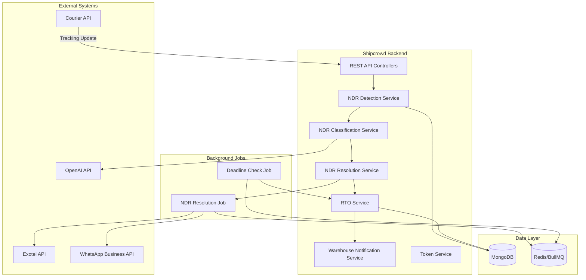
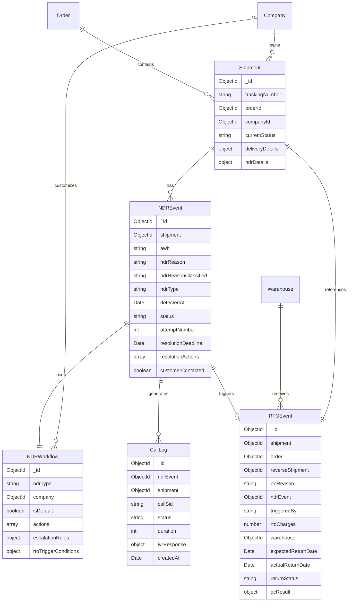
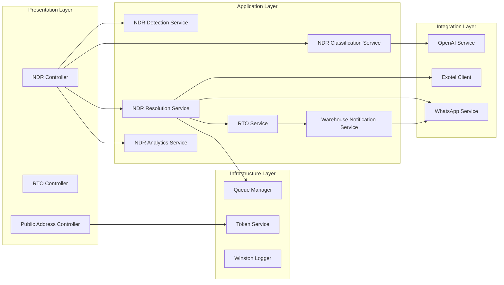
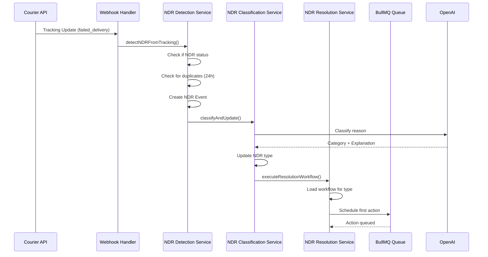
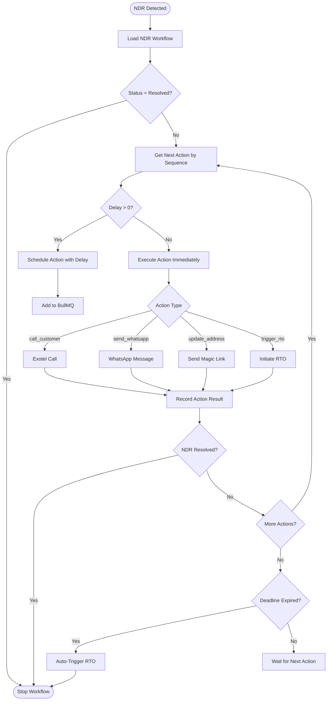
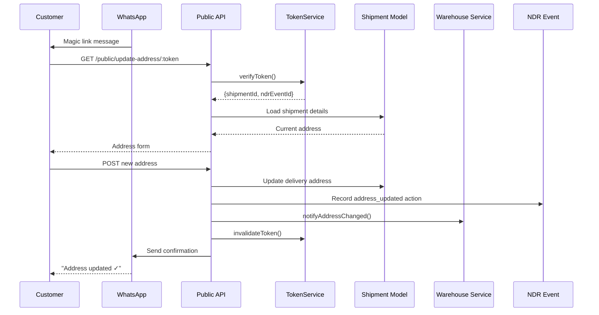
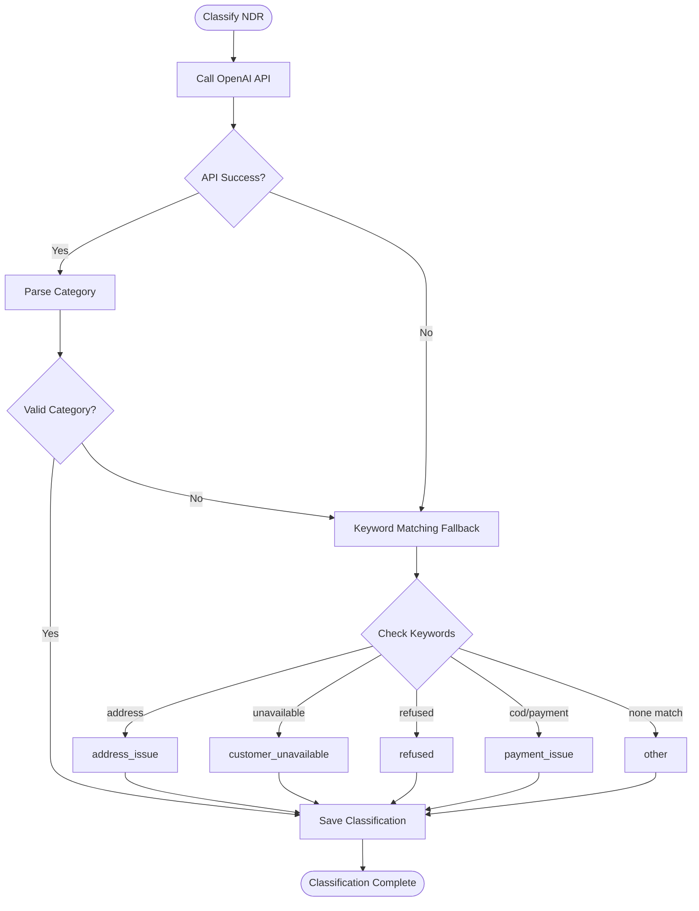
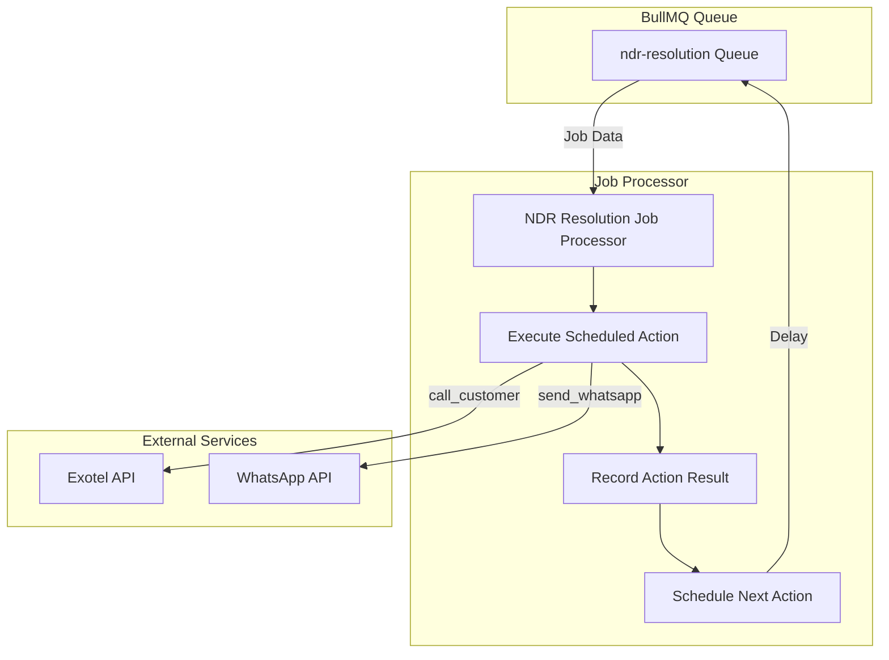
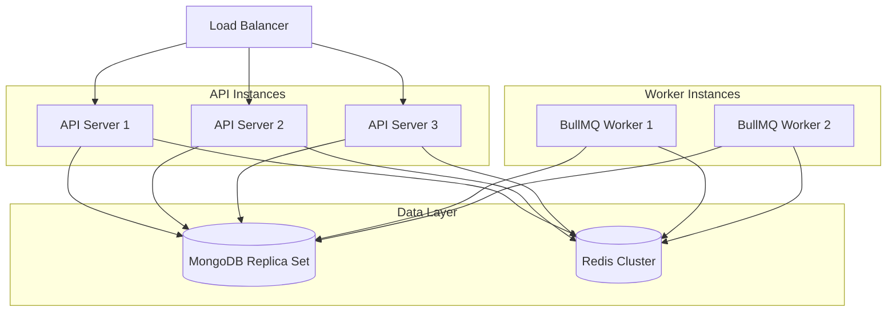
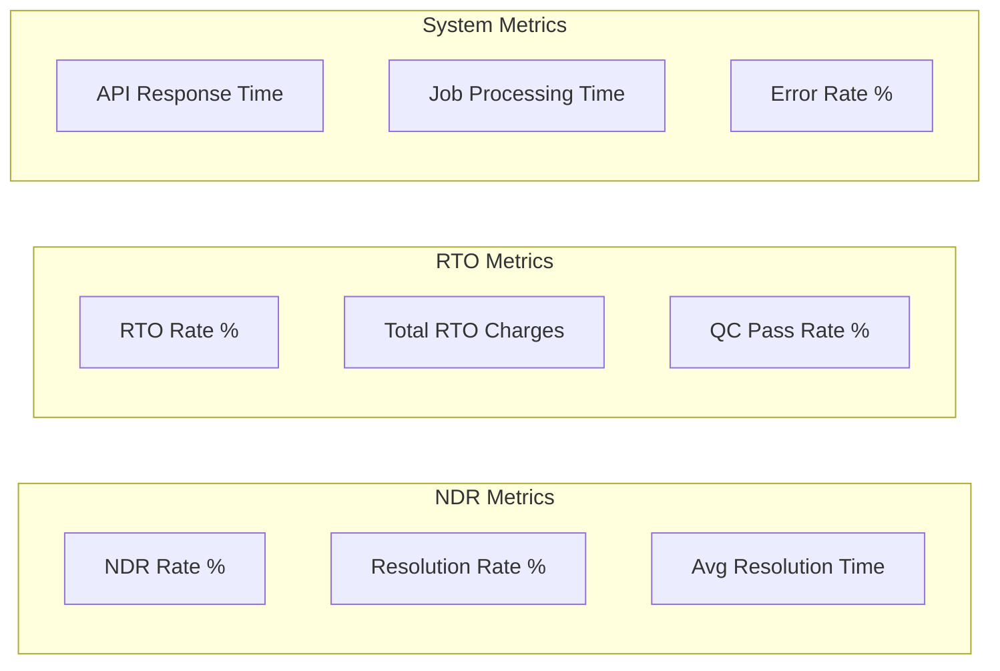

# NDR/RTO Context Package

**Version:** 1.0
**Last Updated:** 2025-12-27
**Implementation Week:** Week 6-7
**Dependencies:** Shipment model, Webhook infrastructure, Notification system

---

## 1. OVERVIEW

### What is NDR & RTO?

**NDR (Non-Delivery Report)** is a status generated when a courier partner fails to deliver an order. Common reasons include:
- Customer unavailable at delivery address
- Incorrect or incomplete address
- Customer phone unreachable
- Customer refused delivery
- Delivery address inaccessible
- Customer requested reschedule

**RTO (Return to Origin)** occurs when an undelivered order is sent back to the warehouse after multiple failed delivery attempts (typically 3 attempts).

### Business Impact

**RTO Cost Analysis:**
- Forward shipping cost: Already paid
- Return shipping cost: Additional charge (typically 60-80% of forward cost)
- Inventory holding cost: Product stuck in transit
- Customer dissatisfaction: Lost sale opportunity
- Potential refund: If prepaid order

**Industry Benchmarks (India 2025):**
- Average RTO rate: 20-30% for COD orders
- RTO reduction with NDR management: 15-20% improvement
- Cost impact: RTO can increase shipping costs by 40-60%

### Shipcrowd's NDR/RTO Strategy

1. **Real-time NDR Detection**: Webhook-based instant notification
2. **Automated Customer Communication**: SMS/WhatsApp/Email alerts
3. **Smart Resolution Workflows**: Reattempt vs RTO decision engine
4. **Multi-channel Follow-ups**: IVR, WhatsApp, SMS, Email
5. **Analytics Dashboard**: NDR trends, resolution rates, RTO metrics

---

## 2. CURRENT IMPLEMENTATION STATUS

### ✅ What's Working (30% Complete)

**Shipment Model with NDR Fields:**
```typescript
// File: server/src/infrastructure/database/mongoose/models/Shipment.ts:83-90

ndrDetails?: {
  ndrReason?: string;
  ndrDate?: Date;
  ndrStatus?: 'pending' | 'reattempt' | 'return_initiated' | 'returned' | 'resolved';
  ndrAttempts?: number;
  ndrResolutionDate?: Date;
  ndrComments?: string;
};
```

**Indexes for NDR Queries:**
```typescript
ShipmentSchema.index({ 'ndrDetails.ndrStatus': 1 });
ShipmentSchema.index({ 'ndrDetails.ndrStatus': 1, companyId: 1 }); // NDR dashboard
```

**Reverse Order Support (Partial):**
- Postman collection includes reverse order endpoints
- Basic RTO API structure defined

### ❌ What's Missing (70% Implementation Gap)

1. **Webhook Handler** - No VelocityWebhookHandler.ts implementation
2. **NDR Service** - No business logic for NDR processing
3. **Customer Communication** - No SMS/WhatsApp integration
4. **Resolution Workflows** - No automated reattempt logic
5. **RTO Processing** - No reverse shipment automation
6. **Analytics** - No NDR metrics tracking
7. **API Endpoints** - No NDR management APIs
8. **Testing** - No webhook verification tests

---

## 3. DATABASE SCHEMA

### Shipment Model (Enhanced)

```typescript
export interface IShipment extends Document {
  // ... existing fields ...

  currentStatus: string;
  statusHistory: Array<{
    status: string;
    timestamp: Date;
    location?: string;
    remarks?: string;
    updatedBy?: 'system' | 'webhook' | 'admin';
  }>;

  // NDR Details
  ndrDetails?: {
    ndrReason?: string;           // Why delivery failed
    ndrReasonCode?: string;       // Standardized code from carrier
    ndrDate?: Date;               // When NDR was raised
    ndrStatus?: 'pending' | 'reattempt' | 'return_initiated' | 'returned' | 'resolved';
    ndrAttempts?: number;         // Number of reattempt attempts
    ndrResolutionDate?: Date;     // When resolved (delivered or RTO)
    ndrComments?: string;         // Admin/customer comments
    lastContactedAt?: Date;       // Last customer contact attempt
    nextReattemptDate?: Date;     // Scheduled reattempt delivery date
    reattemptInstructions?: string; // Customer instructions for reattempt
  };

  // RTO Details
  rtoDetails?: {
    rtoInitiatedDate?: Date;
    rtoReason?: string;
    rtoExpectedDate?: Date;
    rtoActualDate?: Date;
    rtoStatus?: 'initiated' | 'in_transit' | 'delivered_to_warehouse' | 'qc_pending' | 'completed';
    rtoTrackingNumber?: string;
    rtoShippingCost?: number;
    rtoHandledBy?: mongoose.Types.ObjectId; // Staff who processed RTO
  };

  isDeleted: boolean;
  createdAt: Date;
  updatedAt: Date;
}
```

### NDRLog Model (New)

Track all NDR communications and actions:

```typescript
// File: server/src/infrastructure/database/mongoose/models/NDRLog.ts

export interface INDRLog extends Document {
  shipmentId: mongoose.Types.ObjectId;
  companyId: mongoose.Types.ObjectId;
  orderId: mongoose.Types.ObjectId;

  eventType: 'ndr_raised' | 'customer_contacted' | 'reattempt_scheduled' |
             'reattempt_failed' | 'rto_initiated' | 'delivered' | 'customer_response';

  communicationChannel?: 'sms' | 'whatsapp' | 'email' | 'ivr' | 'manual';
  communicationStatus?: 'sent' | 'delivered' | 'failed' | 'read' | 'replied';

  customerResponse?: {
    responseType: 'reattempt' | 'cancel' | 'address_correction' | 'reschedule' | 'no_response';
    responseDate: Date;
    updatedAddress?: string;
    preferredDeliveryDate?: Date;
    additionalInstructions?: string;
  };

  actionTaken?: string;
  automatedAction: boolean;

  metadata?: {
    messageId?: string;
    webhookId?: string;
    carrierStatus?: string;
  };

  createdAt: Date;
}

const NDRLogSchema = new Schema<INDRLog>({
  shipmentId: {
    type: Schema.Types.ObjectId,
    ref: 'Shipment',
    required: true,
    index: true
  },
  companyId: {
    type: Schema.Types.ObjectId,
    ref: 'Company',
    required: true,
    index: true
  },
  orderId: {
    type: Schema.Types.ObjectId,
    ref: 'Order',
    required: true
  },
  eventType: {
    type: String,
    enum: ['ndr_raised', 'customer_contacted', 'reattempt_scheduled',
           'reattempt_failed', 'rto_initiated', 'delivered', 'customer_response'],
    required: true
  },
  communicationChannel: {
    type: String,
    enum: ['sms', 'whatsapp', 'email', 'ivr', 'manual']
  },
  communicationStatus: {
    type: String,
    enum: ['sent', 'delivered', 'failed', 'read', 'replied']
  },
  customerResponse: {
    responseType: {
      type: String,
      enum: ['reattempt', 'cancel', 'address_correction', 'reschedule', 'no_response']
    },
    responseDate: Date,
    updatedAddress: String,
    preferredDeliveryDate: Date,
    additionalInstructions: String
  },
  actionTaken: String,
  automatedAction: {
    type: Boolean,
    default: false
  },
  metadata: Schema.Types.Mixed
}, { timestamps: true });

// Indexes
NDRLogSchema.index({ shipmentId: 1, createdAt: -1 }); // NDR timeline
NDRLogSchema.index({ companyId: 1, eventType: 1, createdAt: -1 }); // Company analytics

const NDRLog = mongoose.model<INDRLog>('NDRLog', NDRLogSchema);
export default NDRLog;
```

---

## 4. WEBHOOK INFRASTRUCTURE

### Velocity Webhook Handler

```typescript
// File: server/src/infrastructure/webhooks/VelocityWebhookHandler.ts

import { Request, Response } from 'express';
import crypto from 'crypto';
import Shipment from '../database/mongoose/models/Shipment';
import NDRLog from '../database/mongoose/models/NDRLog';
import { NDRService } from '../../core/application/services/ndr/NDRService';

interface VelocityWebhookPayload {
  event_type: 'shipment_status_update' | 'ndr_raised' | 'rto_initiated' | 'delivered';
  awb: string;
  order_id: string;
  status: string;
  status_code: string;
  timestamp: string;
  location?: string;
  remarks?: string;

  // NDR specific fields
  ndr_reason?: string;
  ndr_reason_code?: string;
  delivery_attempts?: number;

  // RTO specific fields
  rto_awb?: string;
  rto_initiated?: boolean;

  // Signature for verification
  signature?: string;
}

export class VelocityWebhookHandler {
  private ndrService: NDRService;

  constructor(ndrService: NDRService) {
    this.ndrService = ndrService;
  }

  /**
   * Verify webhook signature using HMAC SHA256
   */
  verifyWebhookSignature(payload: string, signature: string): boolean {
    try {
      const webhookSecret = process.env.VELOCITY_WEBHOOK_SECRET;

      if (!webhookSecret) {
        throw new Error('VELOCITY_WEBHOOK_SECRET not configured');
      }

      const expectedSignature = crypto
        .createHmac('sha256', webhookSecret)
        .update(payload)
        .digest('hex');

      // Use timing-safe comparison to prevent timing attacks
      return crypto.timingSafeEqual(
        Buffer.from(expectedSignature),
        Buffer.from(signature)
      );
    } catch (error) {
      console.error('Webhook signature verification failed:', error);
      return false;
    }
  }

  /**
   * Main webhook handler
   */
  async handleWebhook(req: Request, res: Response): Promise<void> {
    try {
      const signature = req.headers['x-velocity-signature'] as string;
      const webhookBody = JSON.stringify(req.body);

      // Verify signature
      if (!this.verifyWebhookSignature(webhookBody, signature)) {
        console.error('Invalid webhook signature');
        res.status(401).json({ error: 'Invalid signature' });
        return;
      }

      const payload: VelocityWebhookPayload = req.body;

      // Route to appropriate handler
      switch (payload.event_type) {
        case 'shipment_status_update':
          await this.handleStatusUpdate(payload);
          break;
        case 'ndr_raised':
          await this.handleNDRRaised(payload);
          break;
        case 'rto_initiated':
          await this.handleRTOInitiated(payload);
          break;
        case 'delivered':
          await this.handleDelivered(payload);
          break;
        default:
          console.warn(`Unknown event type: ${payload.event_type}`);
      }

      res.status(200).json({ status: 'success' });
    } catch (error) {
      console.error('Webhook processing error:', error);
      res.status(500).json({ error: 'Webhook processing failed' });
    }
  }

  /**
   * Handle status update webhook
   */
  private async handleStatusUpdate(payload: VelocityWebhookPayload): Promise<void> {
    const shipment = await Shipment.findOne({ trackingNumber: payload.awb });

    if (!shipment) {
      console.error(`Shipment not found: ${payload.awb}`);
      return;
    }

    // Update status history
    shipment.statusHistory.push({
      status: payload.status,
      timestamp: new Date(payload.timestamp),
      location: payload.location,
      remarks: payload.remarks,
      updatedBy: 'webhook'
    });

    shipment.currentStatus = payload.status;
    await shipment.save();

    console.log(`Status updated for ${payload.awb}: ${payload.status}`);
  }

  /**
   * Handle NDR raised webhook
   */
  private async handleNDRRaised(payload: VelocityWebhookPayload): Promise<void> {
    const shipment = await Shipment.findOne({ trackingNumber: payload.awb });

    if (!shipment) {
      console.error(`Shipment not found for NDR: ${payload.awb}`);
      return;
    }

    // Update shipment with NDR details
    shipment.ndrDetails = {
      ndrReason: payload.ndr_reason || 'Unknown',
      ndrReasonCode: payload.ndr_reason_code,
      ndrDate: new Date(payload.timestamp),
      ndrStatus: 'pending',
      ndrAttempts: payload.delivery_attempts || 1,
      lastContactedAt: undefined,
      nextReattemptDate: undefined
    };

    shipment.currentStatus = 'NDR_RAISED';
    shipment.statusHistory.push({
      status: 'NDR_RAISED',
      timestamp: new Date(payload.timestamp),
      remarks: payload.ndr_reason,
      updatedBy: 'webhook'
    });

    await shipment.save();

    // Log NDR event
    await NDRLog.create({
      shipmentId: shipment._id,
      companyId: shipment.companyId,
      orderId: shipment.orderId,
      eventType: 'ndr_raised',
      automatedAction: true,
      metadata: {
        webhookId: payload.awb,
        carrierStatus: payload.status_code
      }
    });

    // Trigger NDR resolution workflow
    await this.ndrService.processNewNDR(shipment);

    console.log(`NDR raised for ${payload.awb}: ${payload.ndr_reason}`);
  }

  /**
   * Handle RTO initiated webhook
   */
  private async handleRTOInitiated(payload: VelocityWebhookPayload): Promise<void> {
    const shipment = await Shipment.findOne({ trackingNumber: payload.awb });

    if (!shipment) {
      console.error(`Shipment not found for RTO: ${payload.awb}`);
      return;
    }

    // Update shipment with RTO details
    shipment.rtoDetails = {
      rtoInitiatedDate: new Date(payload.timestamp),
      rtoReason: payload.remarks || shipment.ndrDetails?.ndrReason || 'Multiple delivery failures',
      rtoStatus: 'initiated',
      rtoTrackingNumber: payload.rto_awb
    };

    shipment.currentStatus = 'RTO_INITIATED';
    shipment.statusHistory.push({
      status: 'RTO_INITIATED',
      timestamp: new Date(payload.timestamp),
      remarks: payload.remarks,
      updatedBy: 'webhook'
    });

    // Update NDR status
    if (shipment.ndrDetails) {
      shipment.ndrDetails.ndrStatus = 'return_initiated';
    }

    await shipment.save();

    // Log RTO event
    await NDRLog.create({
      shipmentId: shipment._id,
      companyId: shipment.companyId,
      orderId: shipment.orderId,
      eventType: 'rto_initiated',
      automatedAction: true,
      metadata: {
        rtoAwb: payload.rto_awb,
        carrierStatus: payload.status_code
      }
    });

    // Trigger RTO workflow (wallet adjustment, inventory update)
    await this.ndrService.processRTO(shipment);

    console.log(`RTO initiated for ${payload.awb}`);
  }

  /**
   * Handle delivered webhook
   */
  private async handleDelivered(payload: VelocityWebhookPayload): Promise<void> {
    const shipment = await Shipment.findOne({ trackingNumber: payload.awb });

    if (!shipment) {
      console.error(`Shipment not found for delivery: ${payload.awb}`);
      return;
    }

    shipment.currentStatus = 'DELIVERED';
    shipment.actualDelivery = new Date(payload.timestamp);
    shipment.statusHistory.push({
      status: 'DELIVERED',
      timestamp: new Date(payload.timestamp),
      location: payload.location,
      updatedBy: 'webhook'
    });

    // If this was an NDR that got resolved
    if (shipment.ndrDetails && shipment.ndrDetails.ndrStatus !== 'resolved') {
      shipment.ndrDetails.ndrStatus = 'resolved';
      shipment.ndrDetails.ndrResolutionDate = new Date();

      await NDRLog.create({
        shipmentId: shipment._id,
        companyId: shipment.companyId,
        orderId: shipment.orderId,
        eventType: 'delivered',
        automatedAction: true
      });
    }

    await shipment.save();

    console.log(`Shipment delivered: ${payload.awb}`);
  }
}
```

---

## 5. NDR SERVICE

### Core Business Logic

```typescript
// File: server/src/core/application/services/ndr/NDRService.ts

import Shipment, { IShipment } from '../../../../infrastructure/database/mongoose/models/Shipment';
import Order from '../../../../infrastructure/database/mongoose/models/Order';
import NDRLog from '../../../../infrastructure/database/mongoose/models/NDRLog';
import { NotificationService } from '../notifications/NotificationService';

export interface NDRProcessingConfig {
  maxReattempts: number;           // Max reattempt attempts before RTO
  autoReattemptWindow: number;     // Hours to wait before auto-reattempt
  customerResponseTimeout: number; // Hours to wait for customer response
  enableAutoRTO: boolean;          // Auto-trigger RTO after max attempts
}

export class NDRService {
  private notificationService: NotificationService;
  private config: NDRProcessingConfig;

  constructor(
    notificationService: NotificationService,
    config: NDRProcessingConfig = {
      maxReattempts: 3,
      autoReattemptWindow: 24,
      customerResponseTimeout: 48,
      enableAutoRTO: true
    }
  ) {
    this.notificationService = notificationService;
    this.config = config;
  }

  /**
   * Process newly raised NDR
   */
  async processNewNDR(shipment: IShipment): Promise<void> {
    const order = await Order.findById(shipment.orderId);

    if (!order) {
      throw new Error(`Order not found: ${shipment.orderId}`);
    }

    // Send customer notification
    await this.notificationService.sendNDRAlert({
      customerId: order.customerId.toString(),
      shipmentId: shipment._id.toString(),
      trackingNumber: shipment.trackingNumber,
      ndrReason: shipment.ndrDetails?.ndrReason || 'Delivery failed',
      channels: ['sms', 'whatsapp', 'email']
    });

    // Log customer contact
    await NDRLog.create({
      shipmentId: shipment._id,
      companyId: shipment.companyId,
      orderId: shipment.orderId,
      eventType: 'customer_contacted',
      communicationChannel: 'whatsapp',
      communicationStatus: 'sent',
      automatedAction: true
    });

    // Schedule auto-reattempt if no response
    await this.scheduleAutoReattempt(shipment);
  }

  /**
   * Schedule automatic reattempt
   */
  private async scheduleAutoReattempt(shipment: IShipment): Promise<void> {
    const nextReattemptDate = new Date();
    nextReattemptDate.setHours(nextReattemptDate.getHours() + this.config.autoReattemptWindow);

    if (shipment.ndrDetails) {
      shipment.ndrDetails.nextReattemptDate = nextReattemptDate;
      await shipment.save();
    }

    // TODO: Integrate with job queue (Bull/Agenda) to trigger reattempt
    console.log(`Auto-reattempt scheduled for ${shipment.trackingNumber} at ${nextReattemptDate}`);
  }

  /**
   * Process customer response to NDR
   */
  async processCustomerResponse(args: {
    shipmentId: string;
    responseType: 'reattempt' | 'cancel' | 'address_correction' | 'reschedule';
    updatedAddress?: string;
    preferredDeliveryDate?: Date;
    additionalInstructions?: string;
  }): Promise<void> {
    const shipment = await Shipment.findById(args.shipmentId);

    if (!shipment || !shipment.ndrDetails) {
      throw new Error('Invalid shipment or no NDR details');
    }

    // Log customer response
    await NDRLog.create({
      shipmentId: shipment._id,
      companyId: shipment.companyId,
      orderId: shipment.orderId,
      eventType: 'customer_response',
      customerResponse: {
        responseType: args.responseType,
        responseDate: new Date(),
        updatedAddress: args.updatedAddress,
        preferredDeliveryDate: args.preferredDeliveryDate,
        additionalInstructions: args.additionalInstructions
      },
      automatedAction: false
    });

    // Handle response type
    switch (args.responseType) {
      case 'reattempt':
        await this.initiateReattempt(shipment, args.additionalInstructions);
        break;
      case 'address_correction':
        await this.updateDeliveryAddress(shipment, args.updatedAddress!);
        await this.initiateReattempt(shipment, 'Address corrected by customer');
        break;
      case 'reschedule':
        await this.scheduleDelivery(shipment, args.preferredDeliveryDate!);
        break;
      case 'cancel':
        await this.initiateRTO(shipment, 'Customer cancelled');
        break;
    }
  }

  /**
   * Initiate reattempt delivery
   */
  private async initiateReattempt(shipment: IShipment, instructions?: string): Promise<void> {
    if (!shipment.ndrDetails) return;

    const currentAttempts = shipment.ndrDetails.ndrAttempts || 0;

    // Check if max attempts exceeded
    if (currentAttempts >= this.config.maxReattempts) {
      console.log(`Max reattempts exceeded for ${shipment.trackingNumber}, initiating RTO`);
      await this.initiateRTO(shipment, 'Max reattempt attempts exceeded');
      return;
    }

    // Update shipment
    shipment.ndrDetails.ndrStatus = 'reattempt';
    shipment.ndrDetails.ndrAttempts = currentAttempts + 1;
    shipment.ndrDetails.reattemptInstructions = instructions;
    shipment.currentStatus = 'REATTEMPT_SCHEDULED';

    shipment.statusHistory.push({
      status: 'REATTEMPT_SCHEDULED',
      timestamp: new Date(),
      remarks: instructions || `Reattempt #${currentAttempts + 1}`,
      updatedBy: 'system'
    });

    await shipment.save();

    // Log reattempt
    await NDRLog.create({
      shipmentId: shipment._id,
      companyId: shipment.companyId,
      orderId: shipment.orderId,
      eventType: 'reattempt_scheduled',
      actionTaken: `Reattempt attempt ${currentAttempts + 1}`,
      automatedAction: true
    });

    // TODO: Call Velocity API to schedule reattempt
    console.log(`Reattempt scheduled for ${shipment.trackingNumber}`);
  }

  /**
   * Update delivery address
   */
  private async updateDeliveryAddress(shipment: IShipment, newAddress: string): Promise<void> {
    if (shipment.deliveryDetails) {
      shipment.deliveryDetails.address = newAddress;
      await shipment.save();
    }

    console.log(`Address updated for ${shipment.trackingNumber}`);
  }

  /**
   * Schedule delivery for specific date
   */
  private async scheduleDelivery(shipment: IShipment, preferredDate: Date): Promise<void> {
    if (shipment.ndrDetails) {
      shipment.ndrDetails.nextReattemptDate = preferredDate;
      shipment.ndrDetails.ndrStatus = 'reattempt';
      await shipment.save();
    }

    console.log(`Delivery scheduled for ${shipment.trackingNumber} on ${preferredDate}`);
  }

  /**
   * Initiate RTO process
   */
  async initiateRTO(shipment: IShipment, reason: string): Promise<void> {
    // Update shipment
    shipment.rtoDetails = {
      rtoInitiatedDate: new Date(),
      rtoReason: reason,
      rtoStatus: 'initiated'
    };

    if (shipment.ndrDetails) {
      shipment.ndrDetails.ndrStatus = 'return_initiated';
    }

    shipment.currentStatus = 'RTO_INITIATED';
    shipment.statusHistory.push({
      status: 'RTO_INITIATED',
      timestamp: new Date(),
      remarks: reason,
      updatedBy: 'system'
    });

    await shipment.save();

    // Log RTO
    await NDRLog.create({
      shipmentId: shipment._id,
      companyId: shipment.companyId,
      orderId: shipment.orderId,
      eventType: 'rto_initiated',
      actionTaken: reason,
      automatedAction: true
    });

    // TODO: Call Velocity API to create reverse shipment
    console.log(`RTO initiated for ${shipment.trackingNumber}: ${reason}`);
  }

  /**
   * Process RTO completion (shipment returned to warehouse)
   */
  async processRTO(shipment: IShipment): Promise<void> {
    const order = await Order.findById(shipment.orderId);

    if (!order) {
      throw new Error(`Order not found: ${shipment.orderId}`);
    }

    // Calculate RTO cost (estimate: 70% of forward shipping cost)
    const forwardCost = shipment.shippingCost || 0;
    const rtoCost = forwardCost * 0.7;

    if (shipment.rtoDetails) {
      shipment.rtoDetails.rtoShippingCost = rtoCost;
    }

    await shipment.save();

    // TODO: Debit RTO cost from wallet
    // TODO: Update inventory (mark product as returned)
    // TODO: Process refund for prepaid orders
    // TODO: Send RTO notification to merchant

    console.log(`RTO processed for ${shipment.trackingNumber}, cost: ₹${rtoCost}`);
  }

  /**
   * Get NDR analytics for company
   */
  async getNDRAnalytics(companyId: string, dateRange: { start: Date; end: Date }) {
    const totalNDRs = await Shipment.countDocuments({
      companyId,
      'ndrDetails.ndrDate': { $gte: dateRange.start, $lte: dateRange.end }
    });

    const resolvedNDRs = await Shipment.countDocuments({
      companyId,
      'ndrDetails.ndrStatus': 'resolved',
      'ndrDetails.ndrDate': { $gte: dateRange.start, $lte: dateRange.end }
    });

    const rtoCount = await Shipment.countDocuments({
      companyId,
      'ndrDetails.ndrStatus': 'return_initiated',
      'ndrDetails.ndrDate': { $gte: dateRange.start, $lte: dateRange.end }
    });

    const resolutionRate = totalNDRs > 0 ? (resolvedNDRs / totalNDRs) * 100 : 0;
    const rtoRate = totalNDRs > 0 ? (rtoCount / totalNDRs) * 100 : 0;

    return {
      totalNDRs,
      resolvedNDRs,
      rtoCount,
      resolutionRate: Math.round(resolutionRate * 100) / 100,
      rtoRate: Math.round(rtoRate * 100) / 100
    };
  }
}
```

---

## 6. WORKFLOW DIAGRAMS

### NDR Detection & Resolution Flow

```
┌─────────────────────────────────────────────────────────────┐
│                    NDR WORKFLOW                              │
└─────────────────────────────────────────────────────────────┘

1. CARRIER ATTEMPTS DELIVERY
   ├─ Customer Unavailable
   ├─ Incorrect Address
   ├─ Phone Unreachable
   └─ Delivery Refused
          ↓
2. CARRIER RAISES NDR
   - Webhook: ndr_raised
   - Payload: AWB, Reason, Timestamp
          ↓
3. Shipcrowd RECEIVES WEBHOOK
   - Verify signature
   - Update shipment.ndrDetails
   - Create NDRLog entry
          ↓
4. AUTOMATED CUSTOMER NOTIFICATION
   - SMS: "Delivery failed for Order #12345..."
   - WhatsApp: Template message with options
   - Email: Detailed NDR notification
          ↓
5. CUSTOMER RESPONSE OPTIONS
   ├─ Option A: REATTEMPT
   │  └─→ Schedule reattempt (max 3 attempts)
   │
   ├─ Option B: ADDRESS CORRECTION
   │  └─→ Update address → Schedule reattempt
   │
   ├─ Option C: RESCHEDULE
   │  └─→ Set preferred date → Schedule delivery
   │
   ├─ Option D: CANCEL ORDER
   │  └─→ Initiate RTO immediately
   │
   └─ Option E: NO RESPONSE (48 hours)
      └─→ Auto-reattempt OR Auto-RTO
          ↓
6. REATTEMPT ATTEMPTS
   - Attempt 1 → Failed? → Notify customer
   - Attempt 2 → Failed? → Notify customer
   - Attempt 3 → Failed? → Initiate RTO
          ↓
7. FINAL RESOLUTION
   ├─ SUCCESS: Delivered
   │  └─→ Update status, Complete order
   │
   └─ FAILURE: RTO Initiated
      └─→ Return shipment to warehouse
```

### RTO Processing Flow

```
┌─────────────────────────────────────────────────────────────┐
│                    RTO WORKFLOW                              │
└─────────────────────────────────────────────────────────────┘

1. RTO TRIGGER
   ├─ Max reattempts exceeded (3 attempts)
   ├─ Customer cancelled
   └─ Manual RTO by merchant
          ↓
2. RTO INITIATION
   - Update shipment.rtoDetails.rtoStatus = 'initiated'
   - Create reverse shipment with carrier
   - Get RTO tracking number
          ↓
3. CARRIER PICKS UP FROM DELIVERY ADDRESS
   - Status: RTO_INITIATED → RTO_IN_TRANSIT
   - Webhook: rto_status_update
          ↓
4. RTO IN TRANSIT
   - Track reverse shipment
   - Send merchant updates
          ↓
5. RTO DELIVERED TO WAREHOUSE
   - Status: RTO_DELIVERED_TO_WAREHOUSE
   - QC pending
          ↓
6. WAREHOUSE QC INSPECTION
   ├─ Product OK
   │  └─→ Add to inventory
   │
   └─ Product Damaged
      └─→ Mark as damaged, Record loss
          ↓
7. FINANCIAL SETTLEMENT
   - Calculate RTO cost (70% of forward cost)
   - Debit from wallet
   - Process refund (if prepaid order)
          ↓
8. RTO COMPLETION
   - Update status: RTO_COMPLETED
   - Close shipment
   - Generate RTO report
```

---

## 7. WEEK 6-7 IMPLEMENTATION ROADMAP

### Week 6: Webhook Infrastructure + NDR Detection

**Day 1: Webhook Handler (6-7 hours)**
- [ ] Create VelocityWebhookHandler.ts
- [ ] Implement signature verification
- [ ] Add webhook routing
- [ ] Test with mock payloads

**Day 2: NDR Model + Logging (6-7 hours)**
- [ ] Create NDRLog model
- [ ] Update Shipment model with rtoDetails
- [ ] Add indexes for NDR queries
- [ ] Migration script for existing data

**Day 3: NDRService Core Logic (7-8 hours)**
- [ ] Implement processNewNDR()
- [ ] Implement processCustomerResponse()
- [ ] Implement initiateReattempt()
- [ ] Implement scheduleAutoReattempt()
- [ ] Write unit tests

**Day 4: Customer Notification Integration (6-7 hours)**
- [ ] Integrate SMS gateway (Twilio/MSG91)
- [ ] Integrate WhatsApp Business API
- [ ] Create NDR notification templates
- [ ] Test multi-channel notifications

**Day 5: Testing + Documentation (5-6 hours)**
- [ ] Write integration tests for webhooks
- [ ] Test end-to-end NDR flow
- [ ] Document webhook payload formats
- [ ] Create Postman collection for testing

**Week 6 Deliverables:**
- ✅ Webhook handler with signature verification
- ✅ NDR detection and logging
- ✅ Customer notification system
- ✅ Basic reattempt logic

---

### Week 7: RTO Processing + Analytics

**Day 1: RTO Logic (7-8 hours)**
- [ ] Implement initiateRTO()
- [ ] Implement processRTO()
- [ ] Integrate with Velocity reverse order API
- [ ] Calculate RTO costs

**Day 2: RTO-Wallet Integration (6-7 hours)**
- [ ] Debit RTO costs from wallet
- [ ] Handle refunds for prepaid orders
- [ ] Update wallet transaction ledger
- [ ] Test wallet RTO scenarios

**Day 3: NDR API Endpoints (6-7 hours)**
- [ ] Create ndr.routes.ts
- [ ] Implement NDRController
- [ ] Add authentication middleware
- [ ] Test all API endpoints

**Day 4: NDR Analytics (6-7 hours)**
- [ ] Implement getNDRAnalytics()
- [ ] Create analytics aggregation queries
- [ ] Add date range filtering
- [ ] Build analytics dashboard API

**Day 5: Testing + Polish (6-7 hours)**
- [ ] End-to-end RTO testing
- [ ] Load testing for webhook handler
- [ ] Fix bugs and edge cases
- [ ] Update documentation

**Week 7 Deliverables:**
- ✅ Complete RTO workflow
- ✅ Wallet integration for RTO costs
- ✅ NDR management APIs
- ✅ Analytics dashboard
- ✅ Comprehensive testing

---

## 8. ENVIRONMENT VARIABLES

Add to `.env`:

```bash
# Velocity Webhook Configuration
VELOCITY_WEBHOOK_SECRET=your_webhook_secret_here

# NDR Configuration
NDR_MAX_REATTEMPTS=3
NDR_AUTO_REATTEMPT_WINDOW_HOURS=24
NDR_CUSTOMER_RESPONSE_TIMEOUT_HOURS=48
NDR_ENABLE_AUTO_RTO=true

# SMS Configuration (MSG91 or Twilio)
SMS_API_KEY=your_sms_api_key
SMS_SENDER_ID=SHIPCR
SMS_ROUTE=transactional

# WhatsApp Configuration
WHATSAPP_API_KEY=your_whatsapp_api_key
WHATSAPP_BUSINESS_NUMBER=+919876543210
```

---

## 9. KEY IMPLEMENTATION NOTES

### Security Considerations

1. **Webhook Signature Verification**: Always use timing-safe comparison to prevent timing attacks
2. **Rate Limiting**: Implement rate limiting on webhook endpoints to prevent abuse
3. **Idempotency**: Use webhook IDs to prevent duplicate processing
4. **Input Validation**: Validate all webhook payloads against schema

### Performance Optimization

1. **Async Processing**: Use job queues (Bull/Agenda) for NDR notifications and auto-reattempts
2. **Batch Operations**: Process multiple NDRs in batches for analytics
3. **Caching**: Cache NDR analytics for dashboard (Redis with 5-minute TTL)
4. **Indexing**: Ensure proper indexes on ndrStatus, companyId, ndrDate

### Business Rules

1. **Max Reattempts**: Default 3, configurable per company
2. **Auto-RTO Trigger**: After 3 failed attempts OR 48 hours no response
3. **RTO Cost Calculation**: 70% of forward shipping cost (industry standard)
4. **Refund Processing**: Only for prepaid orders, deduct RTO cost

---

## 10. SOURCES & REFERENCES

This context package was created based on research and industry best practices for NDR/RTO management in Indian e-commerce logistics:

- [RTO & NDR Management in eCommerce - Velocity Blog](https://blog.velocity.in/rto-and-ndr-management-in-ecommerce/)
- [What is NDR (Non-Delivery Report) and RTO (Return To Origin)?](https://www.shiprocket.in/blog/what-is-ndr-rto/)
- [Manage RTO, (NDR) Non-Delivery Report in eCommerce [2025]](https://wareiq.com/resources/blogs/rto-ndr-non-delivery-report-in-ecommerce/)
- [RTO in eCommerce Shipping: A Complete Guide [2025] - NimbusPost](https://nimbuspost.com/blog/everything-you-need-to-know-about-rto-in-ecommerce-shipping)
- [Best Courier Aggregator to Reduce RTO in E-Commerce (India)](https://www.ithinklogistics.com/blog/best-courier-aggregator-to-reduce-rto-in-e-commerce-india/)

---

**Next Steps:** Proceed with Week 6 implementation starting with webhook handler development. This NDR/RTO system will significantly reduce RTO costs and improve customer satisfaction.
# NDR/RTO System Architecture

Complete architectural documentation for the NDR (Non-Delivery Report) and RTO (Return To Origin) automation system.

---

## Table of Contents

1. [System Overview](#system-overview)
2. [Data Models](#data-models)
3. [Service Architecture](#service-architecture)
4. [Workflow Engine](#workflow-engine)
5. [OpenAI Integration](#openai-integration)
6. [Background Jobs](#background-jobs)
7. [API Design](#api-design)
8. [Scalability](#scalability)
9. [Security](#security)

---

## System Overview

The NDR/RTO system automates the detection, classification, and resolution of delivery failures, minimizing manual intervention and reducing return-to-origin costs.

### Key Features

- **Automated NDR Detection:** Real-time detection from tracking updates
- **AI-Powered Classification:** OpenAI-based intelligent categorization
- **Workflow Automation:** Configurable resolution workflows
- **Multi-Channel Communication:** WhatsApp, Email, Voice (Exotel)
- **Magic Link Address Updates:** Secure, token-based address corrections
- **RTO Management:** Automated return triggering and tracking
- **Warehouse Integration:** Real-time notifications for incoming returns
- **Analytics Dashboard:** Comprehensive metrics and insights

### High-Level Architecture



---

## Data Models

### Entity Relationship Diagram



### NDREvent Schema

```typescript
interface INDREvent {
    shipment: ObjectId;
    awb: string;
    ndrReason: string; // Raw reason from courier
    ndrReasonClassified?: string; // OpenAI classified
    ndrType: 'address_issue' | 'customer_unavailable' | 'refused' | 'payment_issue' | 'other';
    detectedAt: Date;
    status: 'detected' | 'in_resolution' | 'resolved' | 'escalated' | 'rto_triggered';
    attemptNumber: number;
    resolutionDeadline: Date; // 48 hours from detection
    resolutionActions: INDRResolutionAction[];
    customerContacted: boolean;
    order: ObjectId;
    company: ObjectId;
}
```

### NDRWorkflow Schema

```typescript
interface INDRWorkflow {
    ndrType: string;
    company?: ObjectId; // null = default workflow
    isDefault: boolean;
    actions: Array<{
        sequence: number;
        actionType: 'call_customer' | 'send_whatsapp' | 'send_email' | 
                     'update_address' | 'request_reattempt' | 'trigger_rto';
        delayMinutes: number; // Delay after previous action
        autoExecute: boolean;
        actionConfig: Record<string, any>;
    }>;
    escalationRules: {
        afterHours: number;
        escalateTo: string;
    };
    rtoTriggerConditions: {
        maxAttempts: number;
        maxHours: number;
        autoTrigger: boolean;
    };
}
```

---

## Service Architecture

### Service Layer Design



### Service Responsibilities

| Service | Responsibility | Dependencies |
|---------|---------------|--------------|
| **NDRDetectionService** | Detect NDR from tracking updates | NDREvent Model |
| **NDRClassificationService** | Classify NDR using OpenAI | OpenAIService |
| **NDRResolutionService** | Execute resolution workflows | NDRActionExecutors, QueueManager |
| **RTOService** | Manage return to origin | RTOEvent, WarehouseNotificationService |
| **WarehouseNotificationService** | Notify warehouses | WhatsAppService |
| **NDRAnalyticsService** | Generate metrics and reports | NDREvent, RTOEvent |
| **TokenService** | Generate/verify magic link tokens | JWT |

---

## Workflow Engine

### NDR Detection Flow



### Resolution Workflow Execution



### Address Update Flow



---

## OpenAI Integration

### Classification Prompt Structure

```
System: You are an expert logistics analyst. Classify delivery failures into categories.

User: 
Raw NDR Reason: "{ndrReason}"
Courier Remarks: "{courierRemarks}"

Categories:
1. address_issue - Wrong/incomplete address
2. customer_unavailable - Customer not reachable
3. refused - Customer refused delivery
4. payment_issue - COD/payment problems
5. other - Any other reason

Respond with ONLY:
Category: <category_name>
Explanation: <one sentence>
```

### Fallback Logic



---

## Background Jobs

### NDR Resolution Job Architecture



### Job Configuration

```typescript
// Job Options
{
  jobId: `ndr-action-${ndrEventId}-${sequence}`,
  delay: delayMinutes * 60 * 1000,
  attempts: 3,
  backoff: {
    type: 'exponential',
    delay: 5000
  },
  removeOnComplete: false,
  removeOnFail: false
}
```

---

## API Design

### RESTful Endpoints

| Method | Endpoint | Purpose |
|--------|----------|---------|
| GET | `/api/v1/ndr/events` | List NDR events |
| GET | `/api/v1/ndr/events/:id` | Get NDR details |
| POST | `/api/v1/ndr/events/:id/resolve` | Manual resolution |
| POST | `/api/v1/ndr/events/:id/escalate` | Escalate NDR |
| GET | `/api/v1/ndr/analytics/stats` | Get statistics |
| GET | `/api/v1/rto/events` | List RTO events |
| POST | `/api/v1/rto/trigger` | Manual RTO trigger |
| GET | `/public/update-address/:token` | Address update form |
| POST | `/public/update-address/:token` | Submit address update |

### Response Format

```typescript
// Success Response
{
  success: true,
  data: T,
  pagination?: {
    total: number,
    page: number,
    limit: number,
    pages: number
  }
}

// Error Response
{
  success: false,
  error: string, // Error code
  message: string // User-friendly message
}
```

---

## Scalability

### Horizontal Scaling



### Performance Optimizations

1. **Database Indexes:**
   - `ndrevents`: `{ companyId: 1, status: 1, detectedAt: -1 }`
   - `rtoevents`: `{ company: 1, returnStatus: 1 }`
   - `ndrevents`: `{ resolutionDeadline: 1, status: 1 }` (for deadline checks)

2. **Caching Strategy:**
   - Workflow definitions (1 hour TTL)
   - Company settings (30 minutes TTL)
   - Analytics aggregations (5 minutes TTL)

3. **Queue Concurrency:**
   - NDR resolution: 5 concurrent jobs per worker
   - Deadline checks: 1 job at a time
   - Can scale to 10+ workers

---

## Security

### Authentication & Authorization

- **API Endpoints:** JWT-based authentication
- **Public Endpoints:** Token-based (magic links)
- **Admin Endpoints:** Role-based access control

### Token Security

```typescript
// Magic Link Token
{
  shipmentId: string,
  ndrEventId?: string,
  purpose: 'address_update',
  iss: 'Shipcrowd',
  sub: 'address-update',
  exp: 48 hours
}
```

- Tokens expire in 48 hours
- One-time use (invalidated after submission)
- Stored in Redis for quick invalidation checks

### Data Protection

- **PII Encryption:** Customer phone/email encrypted at rest
- **API Rate Limiting:** 100 requests/minute per company
- **Webhook Signature Verification:** HMAC-SHA256 signatures
- **Input Validation:** Joi schemas for all endpoints

---

## Monitoring & Observability

### Key Metrics



### Logging

- **Winston Logger** with structured JSON logging
- Log levels: error, warn, info, debug
- Correlation IDs for request tracing
- Integration with ELK/DataDog/Sentry

---

**Version:** 1.0.0  
**Last Updated:** 2026-01-01
