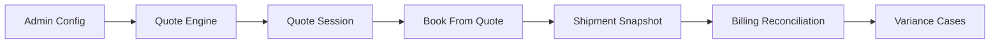
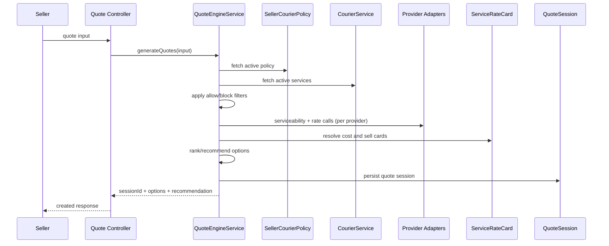
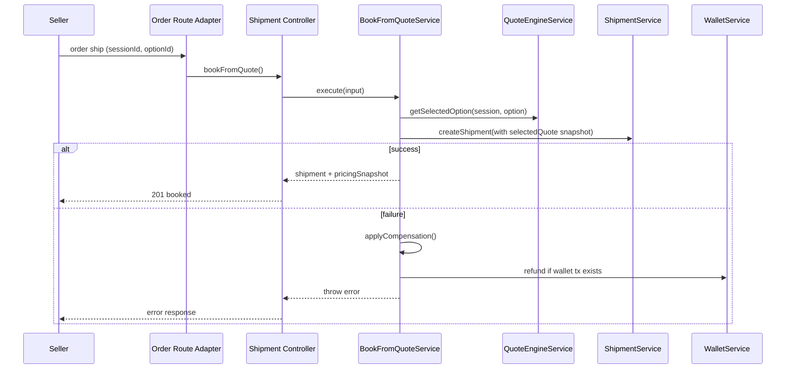

# ShipCrowd Service-Level Pricing and Order-Shipment Architecture Guide

**Document Owner:** Shipping Platform Team
**Last Updated:** February 9, 2026
**Status:** Detailed operational guide for current architecture

---

## Related Documents

1. Legacy decommission and full migration runbook:
   - `/Users/dhirajgiri/Documents/Projects/Helix India/Shipcrowd/docs/Development/Domains/Shipping/Legacy_Decommission_and_Full_Migration_Runbook.md`
2. Final courier + ratecard refactor blueprint:
   - `/Users/dhirajgiri/Documents/Projects/Helix India/Shipcrowd/docs/Development/Domains/Shipping/Courier_RateCard_Final_Refactor_Blueprint.md`

---

## 1. Purpose

This document explains, step by step, how the current ShipCrowd service-level architecture works across:

1. Courier management
2. Service-level rate card management
3. Quote generation
4. Quote selection
5. Book-from-quote shipment creation
6. Billing reconciliation and pricing variance handling

It is intended for engineering, product, QA, and future migration work.

---

## 2. System context and architecture layers

The architecture is layered to separate concerns:

1. **Configuration layer** (admin-managed): courier services, service rate cards, seller policy
2. **Decision layer** (runtime): quote engine, ranking, recommendation, provider confidence
3. **Execution layer** (booking): book-from-quote saga + shipment creation + compensation handling
4. **Finance control layer**: billing import, expected vs billed comparison, variance case lifecycle



---

## 3. Core domain entities and responsibilities

## 3.1 `CourierService`

Represents a sellable/logical service option under a provider for a company.

Key responsibilities:

1. Service catalog record per provider/service code
2. Service constraints (weight limits, payment-mode compatibility, value constraints)
3. SLA and zone support metadata for quote filtering/ranking

Model path:
- `/Users/dhirajgiri/Documents/Projects/Helix India/Shipcrowd/server/src/infrastructure/database/mongoose/models/logistics/shipping/configuration/courier-service.model.ts`

**Implementation Details** (verified from codebase):

Schema Fields:
- `companyId`, `provider` (enum: velocity/delhivery/ekart), `serviceCode`, `displayName`
- `constraints`: `{ minWeightKg, maxWeightKg, maxCodValue, maxPrepaidValue, paymentModes[] }`
- `sla`: `{ eddMinDays, eddMaxDays }`
- `zoneSupport`: Array (e.g., ['zoneA', 'zoneB'] or ['all'])
- `status`: 'active' | 'inactive'

Eligibility Check Logic (`quote-engine.service.ts` lines 556-615):
- Weight: `input.weight >= minWeightKg && input.weight <= maxWeightKg` (if set)
- COD value: `input.orderValue <= maxCodValue` (if COD mode and set)
- Payment mode: Must be in `paymentModes` array (if set)
- Zone: Route zone must be in `zoneSupport` (unless 'all' present)

Indexes:
1. `idx_courier_service_company_provider_status`
2. `uidx_courier_service_company_service_code` (unique)

## 3.2 `ServiceRateCard`

Represents pricing rules scoped to a service, with `cardType` distinguishing cost vs sell.

Key responsibilities:

1. Zone/slab pricing rules
2. Source mode (`live`, `table`, `hybrid`) handling intent
3. Activation and effective date windows

Model path:
- `/Users/dhirajgiri/Documents/Projects/Helix India/Shipcrowd/server/src/infrastructure/database/mongoose/models/logistics/shipping/configuration/service-rate-card.model.ts`

**Implementation Details** (verified from codebase):

Schema Fields:
- `companyId`, `serviceId` (FK to CourierService), `cardType`: 'cost' | 'sell'
- `sourceMode`: 'LIVE_API' | 'TABLE' | 'HYBRID'
  - LIVE_API: Use provider live rates only
  - TABLE: Use configured zone/slab rules only
  - HYBRID: Prefer live rates, fallback to table if live fails
- `zoneRules`: Array of `{ zoneKey, slabs[], additionalPerKg }`
  - `zoneKey`: 'zoneA', 'zoneB', etc. (normalized via `normalizeZoneKey()`)
  - `slabs`: `[{ minKg, maxKg, charge }]`
  - `additionalPerKg`: Per-kg rate beyond max slab
- `calculation`: `{ weightBasis, roundingUnitKg, roundingMode }`
  - `roundingMode`: 'ceil' | 'floor' | 'nearest'
  - `roundingUnitKg`: e.g., 0.5 for half-kg rounding
- `effectiveDates`: `{ startDate, endDate }`
- `status`: 'draft' | 'active' | 'inactive'

Rate Calculation Logic (`quote-engine.service.ts` lines 772-820):
1. Find matching zone rule by `normalizeZoneKey(zone)`
2. Find slab where `weight >= minKg && weight <= maxKg`
3. If weight exceeds max slab:
   - Calculate extra weight: `weight - maxSlab.maxKg`
   - Round extra weight per `roundingUnitKg` and `roundingMode`
   - Add charge: `lastSlab.charge + (roundedExtraWeight * additionalPerKg)`
4. Return calculated amount

Fallback: If no zone rule or slab matches → `Math.max(50, weight * 20)` (lines 785, 801)

Indexes:
1. `idx_service_rate_card_company_service_type_status`
2. `idx_service_rate_card_company_card_type_start_date`

## 3.3 `SellerCourierPolicy`

Controls seller-level filtering and recommendation behavior.

Key responsibilities:

1. Allowed/blocked providers and services
2. Selection mode (`manual_with_recommendation`, `manual_only`, `auto`)
3. Auto-priority mode (`price`, `speed`, `balanced`) and threshold

Model path:
- `/Users/dhirajgiri/Documents/Projects/Helix India/Shipcrowd/server/src/infrastructure/database/mongoose/models/logistics/shipping/configuration/seller-courier-policy.model.ts`

**Implementation Details** (verified from codebase):

Schema Fields:
- `companyId`, `sellerId`
- `allowedProviders`: Array ['velocity', 'delhivery', 'ekart'] (empty = all allowed)
- `blockedProviders`: Array (takes precedence over allowed)
- `allowedServiceIds`: Array of ObjectIds (empty = all allowed)
- `blockedServiceIds`: Array of ObjectIds (takes precedence over allowed)
- `selectionMode`: 'manual_with_recommendation' | 'manual_only' | 'auto'
  - `manual_with_recommendation`: Show options + system recommendation (default)
  - `manual_only`: Show options, no recommendation
  - `auto`: System auto-selects best option
- `autoPriority`: 'price' | 'speed' | 'balanced'
- `balancedDeltaPercent`: Number (default: 5)
  - Used in balanced mode: If fastest ≤ cheapest × (1 + delta/100), pick fastest
- `isActive`: Boolean

Policy Filter Logic (`quote-engine.service.ts` lines 377-419):
1. If `allowedProviders.length > 0`: Only include services with provider in allowed list
2. If `blockedProviders.includes(service.provider)`: Exclude service
3. If `allowedServiceIds.length > 0`: Only include services with _id in allowed list
4. If `blockedServiceIds.includes(service._id)`: Exclude service

Recommendation Logic (`quote-engine.service.ts` lines 881-902):
- **Price mode**: Return cheapest option
- **Speed mode**: Return fastest option (by `eta.maxDays`)
- **Balanced mode**:
  - Find cheapest option
  - Find fastest option
  - If `fastest.quotedAmount <= cheapest.quotedAmount × (1 + balancedDeltaPercent/100)`:
    - Return fastest (speed wins within price tolerance)
  - Else: Return cheapest (price wins)

Indexes:
1. `uidx_seller_courier_policy_company_seller` (unique)
2. `idx_seller_courier_policy_company_active`

## 3.4 `QuoteSession`

Stores ephemeral quote result set and recommendation for booking continuity.

Key responsibilities:

1. Persist quote input + options
2. Persist recommendation and selected option
3. TTL expiry behavior through `expiresAt`
4. Provider timeout confidence data for partial-result transparency

Model path:
- `/Users/dhirajgiri/Documents/Projects/Helix India/Shipcrowd/server/src/infrastructure/database/mongoose/models/logistics/shipping/core/quote-session.model.ts`

**Implementation Details** (verified from codebase):

Schema Fields:
- `companyId`, `sellerId`
- `input`: Object (preserved quote request for audit)
  - `{ fromPincode, toPincode, weight, dimensions, paymentMode, orderValue, shipmentType }`
- `options`: Array of QuoteOptionOutput
  - Each option: `{ optionId, provider, serviceId, serviceName, chargeableWeight, zone, quotedAmount, costAmount, estimatedMargin, estimatedMarginPercent, eta, pricingSource, confidence, rankScore, tags[] }`
- `selectedOptionId`: String (set via `selectOption()` method)
- `recommendation`: String (optionId of recommended option)
- `providerTimeouts`: Object `{ [provider]: boolean }` (tracks which providers timed out)
- `expiresAt`: Date (**TTL: 30 minutes** from creation, line 253 in quote-engine.service.ts)

TTL Index:
- `idx_quote_session_ttl_expires_at`: `{ expiresAt: 1 }` with `expireAfterSeconds: 0`
- MongoDB automatically deletes expired sessions

Session Validation (`quote-engine.service.ts` lines 297-327, 335-371):
- **Expiry check**: `session.expiresAt < new Date()` → Throw 410 Gone
- **Option validation**: `optionId` must exist in `session.options[]` → Throw 422 if not
- **Selection lock**: `session.selectedOptionId` preserved for booking continuity

Indexes:
1. `idx_quote_session_ttl_expires_at` (TTL index)
2. `idx_quote_session_company_seller_created_at`

## 3.5 `Shipment` (extended with selected quote snapshot)

Shipment now stores selected quote dual-ledger details in `pricingDetails.selectedQuote`.

Key responsibilities:

1. Preserve sell amount and expected cost at booking time
2. Preserve expected margin and confidence metadata
3. Enable later reconciliation to compare billed vs expected cost

Model path:
- `/Users/dhirajgiri/Documents/Projects/Helix India/Shipcrowd/server/src/infrastructure/database/mongoose/models/logistics/shipping/core/shipment.model.ts`

## 3.6 `CarrierBillingRecord`

Incoming carrier billing/import fact table.

Key responsibilities:

1. Store billed components and billed total from provider/MIS/webhook/manual source
2. Link to shipment if matched
3. Drive variance evaluation

Model path:
- `/Users/dhirajgiri/Documents/Projects/Helix India/Shipcrowd/server/src/infrastructure/database/mongoose/models/finance/reconciliation/carrier-billing-record.model.ts`

## 3.7 `PricingVarianceCase`

Case management object for expected vs billed difference.

Key responsibilities:

1. Store expected cost, billed cost, variance amount and percent
2. Auto-resolve within threshold (`<=5%`)
3. Keep open case for over-threshold variance (`>5%`)

Model path:
- `/Users/dhirajgiri/Documents/Projects/Helix India/Shipcrowd/server/src/infrastructure/database/mongoose/models/finance/reconciliation/pricing-variance-case.model.ts`

---

## 4. API surfaces in current architecture

## 4.1 Quote APIs

1. `POST /api/v1/quotes/courier-options`
2. `POST /api/v1/quotes/:sessionId/select`

Routes:
- `/Users/dhirajgiri/Documents/Projects/Helix India/Shipcrowd/server/src/presentation/http/routes/v1/shipping/quote.routes.ts`

Controller:
- `/Users/dhirajgiri/Documents/Projects/Helix India/Shipcrowd/server/src/presentation/http/controllers/shipping/quote.controller.ts`

## 4.2 Booking API

1. `POST /api/v1/orders/:orderId/ship`

Behavior:

1. If feature flag ON and payload has `sessionId` + `optionId`: quote-based booking path
2. Else (current bridge mode): legacy shipment path

Route:
- `/Users/dhirajgiri/Documents/Projects/Helix India/Shipcrowd/server/src/presentation/http/routes/v1/shipping/order.routes.ts`

## 4.3 Courier service admin APIs

1. `GET /api/v1/admin/courier-services`
2. `POST /api/v1/admin/courier-services`
3. `GET /api/v1/admin/courier-services/:id`
4. `PUT /api/v1/admin/courier-services/:id`
5. `POST /api/v1/admin/courier-services/:id/toggle-status`

Routes:
- `/Users/dhirajgiri/Documents/Projects/Helix India/Shipcrowd/server/src/presentation/http/routes/v1/shipping/courier-service.routes.ts`

## 4.4 Service rate card admin APIs

1. `GET /api/v1/admin/service-ratecards`
2. `POST /api/v1/admin/service-ratecards`
3. `GET /api/v1/admin/service-ratecards/:id`
4. `PUT /api/v1/admin/service-ratecards/:id`
5. `POST /api/v1/admin/service-ratecards/:id/import`
6. `POST /api/v1/admin/service-ratecards/:id/simulate`

Routes:
- `/Users/dhirajgiri/Documents/Projects/Helix India/Shipcrowd/server/src/presentation/http/routes/v1/shipping/service-ratecard.routes.ts`

## 4.5 Seller courier policy APIs

1. `GET /api/v1/sellers/:sellerId/courier-policy`
2. `PUT /api/v1/sellers/:sellerId/courier-policy`

Routes:
- `/Users/dhirajgiri/Documents/Projects/Helix India/Shipcrowd/server/src/presentation/http/routes/v1/shipping/seller-courier-policy.routes.ts`

## 4.6 Reconciliation and variance APIs

1. `POST /api/v1/finance/carrier-billing/import`
2. `GET /api/v1/finance/pricing-variance-cases`
3. `PATCH /api/v1/finance/pricing-variance-cases/:id`

Routes:
- `/Users/dhirajgiri/Documents/Projects/Helix India/Shipcrowd/server/src/presentation/http/routes/v1/finance/reconciliation.routes.ts`

---

## 5. End-to-end runtime lifecycle

## 5.1 Step A - Admin configuration lifecycle

Before quoting can work correctly for a company:

1. Courier integrations must exist and be active.
2. Courier services must be created and active.
3. Service rate cards must exist for both cost and sell (active).
4. Seller policy must be available (explicit or default).

If this setup is incomplete, quote engine returns no usable options or filtered options only.

---

## 5.2 Step B - Quote generation lifecycle

Sequence for `POST /quotes/courier-options`:



Detailed internal logic (verified implementation):

1. **Validate quote input** and auth company/seller context (lines 121-128)
2. **Load active seller policy** (`SellerCourierPolicy.findOne({ companyId, sellerId, isActive: true })`, line 131-135)
3. **Load active courier services** for company (`CourierService.find({ companyId, status: 'active', isDeleted: false })`, lines 137-141)
4. **Apply policy filters** via `applyPolicyFilters()` (lines 377-419):
   - Filter by `allowedProviders` (if set)
   - Exclude `blockedProviders`
   - Filter by `allowedServiceIds` (if set)
   - Exclude `blockedServiceIds`
5. **Group services by provider** (lines 153-163):
   - `groupedByProvider`: `{ velocity: [...], delhivery: [...], ekart: [...] }`
6. **For each provider, run serviceability/rate path with timeout budget** (lines 169-189):
   - **Ekart**: 2000ms timeout, calls `getLaneServiceability()` if available (lines 441-449)
   - **Delhivery/Velocity**: 1500ms timeout, calls `checkServiceability()` (lines 451-456)
   - **Timeout handling**: Provider wrapped in `withTimeout()` (lines 173-177), catches timeout, marks provider in `providerTimeouts` object, continues with partial results
7. **Build options** via `buildProviderOptions()` per provider (lines 421-540):
   - Call provider `getRates()` API with timeout/catch (lines 476-484)
   - For each eligible service (passes constraints check):
     - Resolve **cost** via `resolveCost()` (lines 497-505, 645-720):
       - Query `ServiceRateCard` with `cardType: 'cost'`
       - If `sourceMode: LIVE_API` or `HYBRID` + live rate available → use live rate
       - Else → calculate from table via `calculateFromCard()` (lines 772-820)
       - Fallback: `Math.max(50, weight * 20)` if no card (line 707)
     - Resolve **sell** via `resolveSell()` (lines 506-512, 722-744):
       - Query `ServiceRateCard` with `cardType: 'sell'`
       - Calculate from table
       - Fallback: `costAmount * 1.1` if no card (line 735)
     - Compute margin: `estimatedMargin = sell - cost` (line 513)
     - Compute margin %: `estimatedMarginPercent = (margin / sell) * 100` (lines 514-515)
     - Build `QuoteOptionOutput` with all fields (lines 517-536)
8. **Flatten all provider options** into single array (lines 191-193)
9. **Rank options** via `rankOptions()` (lines 842-879):
   - Compute rank scores: **60% price rank + 40% speed rank** (line 874)
   - Tag options: `CHEAPEST`, `FASTEST`, `RECOMMENDED`
10. **Mark recommendation** via `pickRecommendedOption()` (lines 881-902):
    - Based on `policy.autoPriority` (price/speed/balanced)
    - Balanced mode uses `balancedDeltaPercent` threshold
11. **Handle `manual_only` mode**: Remove `RECOMMENDED` tags, set `recommendation = undefined` (lines 215-220)
12. **Persist quote session** with 30-min TTL (`expiresAt: new Date(Date.now() + 30 * 60 * 1000)`, line 253)
13. **Record metrics** via `ServiceLevelPricingMetricsService` (lines 259-268)
14. **Return canonical quote contract**: `QuoteSessionOutput` (lines 270-277)

**Provider Timeout Budgets** (lines 44-48):
- Ekart: 2000ms (lane-level serviceability is slower)
- Delhivery: 1500ms
- Velocity: 1500ms

**Confidence Downgrade** (line 257):
- Any provider timeout → Overall confidence: `medium`
- All providers succeeded → Overall confidence: `high`

---

## 5.3 Step C - Quote selection lifecycle

`POST /quotes/:sessionId/select` stores selected option in existing session.

Purpose:

1. Explicitly lock seller intent before booking.
2. Support UX flow where quote selection and shipment creation are separate actions.

---

## 5.4 Step D - Book from quote lifecycle

Triggered through `POST /orders/:orderId/ship` with `sessionId` and `optionId` (new path).

Sequence:



Critical behavior (verified implementation):

1. **Quote session expiry check** (via `QuoteEngineService.getSelectedOption()`, lines 345-347):
   - If `session.expiresAt < new Date()` → Throw `AppError` with HTTP 410 Gone
2. **Option mismatch check** (lines 358-365):
   - If `optionId` not in `session.options[]` → Throw `AppError` with HTTP 422
3. **Shipment snapshot includes expected cost and expected margin** (lines 92-113):
   - `pricingDetails.selectedQuote` contains full dual-ledger:
     - `quotedSellAmount` (what seller charges)
     - `expectedCostAmount` (what we expect to pay carrier) ← **Key for reconciliation**
     - `expectedMarginAmount`, `expectedMarginPercent`
     - `confidence`, `pricingSource`, `chargeableWeight`, `zone`
     - `sellBreakdown`, `costBreakdown`
4. **Compensation behavior is immutable** (lines 183-240):
   - **Compensation trigger**: Any error during `ShipmentService.createShipment()`
   - **Compensation logic** (`applyCompensation()` method):
     - Find shipment by hinted ID or query by `orderId` + `quoteSessionId` + `optionId`
     - Check if AWB generated: `shipment.carrierDetails?.carrierTrackingNumber` exists
     - **Pre-AWB failure** (line 202-210):
       - Set status: `booking_failed`
       - Add status history: "Quote booking failed before AWB assignment. Compensation initiated."
       - Wallet refund attempted (lines 223-237)
     - **Post-AWB failure** (line 210-239):
       - Set status: `booking_partial`
       - Add status history: "Quote booking partially failed after AWB assignment. Compensation initiated."
       - Wallet refund attempted
       - **Note**: Shipment kept immutable (not deleted), AWB preserved for manual recovery
   - **Return stage**: `before_awb` or `after_awb` (used for metrics, line 137)
5. **Idempotency key** (line 75): `quote-${sessionId}-${optionId}` prevents duplicate bookings
6. **Post-booking selection lock** (lines 150-166):
   - After successful booking, calls `QuoteEngineService.selectOption()` to lock selection
   - Failure logged as warning but doesn't fail booking (non-critical)

**Error Status Codes**:
- `410 Gone`: Quote session expired (retry by generating new quote)
- `422 Unprocessable Entity`: Invalid optionId or missing sessionId
- `409 Conflict`: Active shipment already exists for order
- `400 Bad Request`: Order not shippable (validation failed)

Service path:
- `/Users/dhirajgiri/Documents/Projects/Helix India/Shipcrowd/server/src/core/application/services/shipping/book-from-quote.service.ts`

**Known Concurrency Issue** (not blocking):
- Shipment model has warning about concurrent webhook updates (lines 10-15 comment in shipment.model.ts)
- Mitigation: `optimisticConcurrency: true` enabled, but `save()` calls still vulnerable
- Future fix: Use `findOneAndUpdate` with version checks

---

## 5.5 Step E - Shipment lifecycle after booking

After successful booking:

1. Shipment exists with selected quote snapshot.
2. Carrier details and tracking continue through standard shipment lifecycle.
3. Financial expected cost is now available for reconciliation.

Important note:

`pricingDetails.selectedQuote` is the finance anchor that connects quote-time decision with post-billing validation.

---

## 5.6 Step F - Billing reconciliation lifecycle

Triggered via `POST /finance/carrier-billing/import`.

Flow:

1. Validate import payload.
2. Normalize provider and amount fields.
3. Upsert `CarrierBillingRecord` idempotently.
4. Match shipment by AWB/shipmentId.
5. Extract expected cost from shipment quote snapshot.
6. Compute variance percent.
7. Upsert `PricingVarianceCase`.
8. Auto-close if within threshold; keep open if over threshold.

Threshold behavior (verified implementation, lines 46-218):

1. **Import loop** (lines 64-207):
   - For each record in `records[]` array:
     - **Normalize provider** (lines 70-74): Convert to lowercase, validate against allowed set
     - **Validate AWB and billedTotal** (lines 76-86): Skip if missing or invalid
     - **Upsert CarrierBillingRecord** (lines 113-128):
       - Idempotent: Match on `{ companyId, provider, awb, source, billedTotal, billedAt, invoiceRef, remittanceRef }`
       - Uses `$setOnInsert` to avoid duplicate inserts
     - **Find shipment** (lines 132-136) via `findShipment()` method (lines 234-261):
       - Match by: `trackingNumber = awb` OR `carrierDetails.carrierTrackingNumber = awb` OR `_id = shipmentId`
     - **Extract expected cost** (lines 145-149) via `extractExpectedCost()` (lines 263-271):
       - **Primary**: `shipment.pricingDetails?.selectedQuote?.expectedCostAmount` (service-level)
       - **Fallback**: `shipment.paymentDetails?.shippingCost` (legacy)
     - **Compute variance** (lines 151-154):
       - `varianceAmount = billedTotal - expectedCost`
       - `variancePercent = (varianceAmount / expectedCost) × 100`
     - **Upsert PricingVarianceCase** (lines 156-194):
       - **Auto-close condition** (line 154): `Math.abs(variancePercent) <= thresholdPercent`
       - **If within threshold** (≤5% by default):
         - Status: `resolved`
         - Resolution outcome: `auto_closed_within_threshold`
         - Resolution notes: "Auto-closed because variance X% is within Y% threshold."
         - Resolved by: `userId` (importer)
         - Resolved at: `new Date()`
       - **If exceeds threshold** (>5%):
         - Status: `open`
         - No resolution object (manual review required)
     - **Record metrics** (lines 197-200):
       - Tracks variance percent and auto-close rate

2. **Return summary** (lines 209-217):
   - `importedCount`: Count of billing records created/updated
   - `matchedShipmentCount`: Count matched to shipments
   - `autoClosedCount`: Count auto-resolved within threshold
   - `openCaseCount`: Count requiring manual review
   - `skippedCount`: Count skipped due to validation errors

**Threshold Configuration**:
- Default: 5% (line 52: `thresholdPercent ?? 5`)
- Configurable per import request
- Stored in variance case for audit (`thresholdPercent` field, line 171)

**Idempotency**:
- CarrierBillingRecord: Upserted by compound key (lines 114-122)
- PricingVarianceCase: Upserted by `{ companyId, billingRecordId }` (unique index, lines 157-159)
- Safe to re-import same records without duplicates

**Allowed Providers** (lines 40-44):
- velocity, delhivery, ekart (hardcoded Set)
- Provider normalization: Lowercase + validation (lines 220-226)

Service path:
- `/Users/dhirajgiri/Documents/Projects/Helix India/Shipcrowd/server/src/core/application/services/finance/carrier-billing-reconciliation.service.ts`

**Metrics Integration**:
- Uses `ServiceLevelPricingMetricsService.recordVarianceCase()` to track variance distribution
- Helps monitor if threshold is correctly tuned (should have >80% auto-close rate)

---

## 6. Recommendation and seller-selection logic

Default seller behavior is `manual_with_recommendation`.

This means:

1. Seller sees multiple quote options.
2. System recommends one option.
3. Seller can override recommendation and choose any allowed option.

Balanced recommendation concept (if configured):

1. Choose fastest when within configured delta from cheapest.
2. Else choose cheapest.

This logic is policy-driven to avoid hard-coded behavior for all sellers.

---

## 7. Confidence model and degraded provider behavior

Quote response supports confidence metadata to represent partial provider health.

1. Full provider success -> high/medium confidence as computed
2. Provider timeout -> partial result, `providerTimeouts` includes provider
3. Fallback-to-table logic can lower confidence

This keeps UX truthful even when one provider is temporarily unavailable.

---

## 8. Feature flag mode and migration mode

Current architecture is still in bridge-compatible mode with feature flag gating.

Flag:
- `enable_service_level_pricing`

Current behavior:

1. ON -> new quote/session flow available
2. OFF -> legacy behavior remains for bridged endpoints

Future full cleanup mode should remove this dual path after migration cutover.

---

## 9. Data integrity and index hygiene

The architecture depends on index and reference correctness for performance and correctness.

Tools already available:

1. `migrate:service-level-pricing-index-hygiene`
2. `verify:service-level-pricing-seed`

These should be run after major schema/seed changes.

---

## 10. Testing strategy for this architecture

Minimum critical suite:

1. Quote API integration tests
2. Book-from-quote flow tests
3. Session expiry test (`410`)
4. Legacy bridge regression while flag OFF (until full removal)
5. Reconciliation thresholds (`<=5%` and `>5%`)
6. Compensation state behavior

Primary test files:

- `/Users/dhirajgiri/Documents/Projects/Helix India/Shipcrowd/server/tests/integration/services/pricing/service-level-pricing-api.integration.test.ts`
- `/Users/dhirajgiri/Documents/Projects/Helix India/Shipcrowd/server/tests/integration/services/pricing/service-level-pricing-flow.integration.test.ts`

---

## 11. Operational checklist for developers

Use this when working on shipping/ratecard features:

1. Confirm whether change touches legacy bridge or canonical path.
2. If canonical path, update quote/book/reconciliation tests first.
3. If changing schema, run index hygiene and seed verifier.
4. If changing route payloads, update validation schema and docs together.
5. If changing recommendation logic, verify seller policy compatibility.

---

## 12. Practical examples

## 12.1 Canonical quote request body

```json
{
  "fromPincode": "560001",
  "toPincode": "110001",
  "weight": 0.5,
  "dimensions": { "length": 10, "width": 10, "height": 10 },
  "paymentMode": "prepaid",
  "orderValue": 1200,
  "shipmentType": "forward"
}
```

## 12.2 Canonical quote response shape

```json
{
  "sessionId": "...",
  "options": [
    {
      "optionId": "opt-ekart-...",
      "provider": "ekart",
      "serviceName": "Ekart Surface 0.5 KG",
      "quotedAmount": 120,
      "costAmount": 100,
      "estimatedMargin": 20,
      "estimatedMarginPercent": 16.67,
      "confidence": "high"
    }
  ],
  "recommendation": "opt-ekart-...",
  "expiresAt": "...",
  "confidence": "high",
  "providerTimeouts": {}
}
```

## 12.3 Book-from-quote request body

```json
{
  "sessionId": "...",
  "optionId": "opt-ekart-...",
  "warehouseId": "...",
  "instructions": "Handle with care"
}
```

---

## 13. Architecture boundaries (what this system does not do yet)

1. It does not remove all legacy flows yet; bridge mode still exists.
2. It does not solve unrelated repository TypeScript issues outside shipping domain.
3. It does not guarantee provider live pricing for all providers in all scenarios; confidence model and fallback paths still apply.

---

## 14. Summary

ShipCrowd now has a complete service-level architecture across configuration, runtime decisioning, execution, and finance control.

The system already supports:

1. Carrier-wise quote generation
2. Seller policy filtering and recommendation
3. Quote-session booking with immutable compensation handling
4. Shipment dual-ledger snapshot for expected cost vs sell
5. Billing reconciliation with threshold-based variance lifecycle

The remaining step for final architectural purity is full legacy decommission, covered in:

- `/Users/dhirajgiri/Documents/Projects/Helix India/Shipcrowd/docs/Development/Domains/Shipping/Legacy_Decommission_and_Full_Migration_Runbook.md`

---

## 15. Implementation Edge Cases and Gotchas (From Codebase Analysis)

### 15.1 Provider-Specific Behaviors

**Ekart Lane-Level Serviceability** (`quote-engine.service.ts` lines 437-449):
- Ekart uses special `getLaneServiceability()` method if available
- Returns `{ serviceable, zone, confidence }` with lane-specific zone mapping
- **Fallback**: If `getLaneServiceability` not available or throws, falls back to standard `checkServiceability()`
- **Zone extraction**: Zone comes from lane result, used for rate card matching

**Delhivery/Velocity Pincode-Based** (lines 451-456):
- Standard `checkServiceability(pincode, 'delivery')` boolean check
- No zone returned from serviceability call
- Zone inferred later from rate response or defaults

**Provider-to-Factory Mapping** (lines 38-42):
```javascript
const PROVIDER_TO_FACTORY_KEY = {
  velocity: 'velocity-shipfast',  // Factory key differs from provider ID
  delhivery: 'delhivery',
  ekart: 'ekart',
};
```

### 15.2 Zone Normalization Logic

**Zone Key Normalization** (`quote-engine.service.ts` lines 822-840):

Handles multiple zone formats from different providers:
- `"zoneA"` → `"zonea"`
- `"A"` → `"zonea"`
- `"zone_a"` → `"zonea"`
- `"route_a"` → `"zonea"` (extracts last character)
- `"all"` → `"all"` (special: matches any zone)

**Fallback Behavior**:
- If zone normalization returns `null` → Uses first zone rule in ServiceRateCard (line 782)
- If no zone rules exist → Hard fallback: `Math.max(50, weight * 20)` (lines 785, 801)

### 15.3 Weight Calculations

**Chargeable Weight** (line 489):
- Currently: `const chargeableWeight = input.weight` (actual weight only)
- **Missing**: Volumetric weight calculation
  - Formula: `(length × width × height) / 5000`
  - Should use: `Math.max(actualWeight, volumetricWeight)`
- **Status**: May be handled in provider adapters, but not visible in quote engine

**Rounding Logic** (lines 805-819):
- Supports: `ceil` (round up), `floor` (round down), `nearest` (round to nearest)
- Used for extra weight beyond max slab
- Example: 2.3 kg extra with 0.5 kg rounding unit → `ceil(2.3 / 0.5) × 0.5 = 2.5 kg`

### 15.4 Service Eligibility Edge Cases

**Empty Constraint Arrays** (`isServiceEligibleForRequest()`, lines 566-612):
- If `paymentModes = []` → All payment modes allowed (line 597)
- If `zoneSupport = []` → All zones allowed (lines 601-612)
- If `zoneSupport = ['all']` → All zones allowed (line 605)

**Zero Weight Limits** (lines 562-579):
- If `minWeightKg = 0` → No minimum (default behavior)
- If `maxWeightKg = 0` → No maximum (unlimited, line 577)

**Zero Value Limits** (lines 564-595):
- If `maxCodValue = 0` → No COD limit
- If `maxPrepaidValue = 0` → No prepaid limit

### 15.5 Ranking and Recommendation Edge Cases

**Tied Options** (lines 858-878):
- If multiple options have same `quotedAmount` (tied for cheapest):
  - Rank score calculation uses division: `cheapest.quotedAmount / option.quotedAmount`
  - For tied options: rank score = 1.0
  - Sort is stable (maintains insertion order for ties)

**Missing ETA** (lines 849, 865):
- If `eta.maxDays` not set → Uses `999` as default (line 849)
- Ensures options without SLA appear last in speed ranking

**Rank Score Weights** (line 874):
- Price rank: **60%**
- Speed rank: **40%**
- Hardcoded, not configurable per seller

**Balanced Mode Threshold** (lines 896-901):
- Example: `balancedDeltaPercent = 5`, cheapest = ₹100:
  - Threshold = ₹100 × 1.05 = ₹105
  - If fastest costs ₹103 → Pick fastest (within tolerance)
  - If fastest costs ₹107 → Pick cheapest (exceeds tolerance)

### 15.6 Concurrent Operations

**Quote Session Race Condition** (lines 320-321):
```javascript
session.selectedOptionId = optionId;
await session.save();  // ⚠️ Not atomic
```
- **Risk**: Two simultaneous `selectOption()` calls could race
- **Mitigation**: Low probability (quote selection is rare), session expires quickly
- **Better approach**: Use `findOneAndUpdate` with atomic update

**Shipment Webhook Race Condition** (documented in shipment.model.ts):
- Multiple carrier webhooks can fire simultaneously
- Updates via `save()` can overwrite each other
- **Mitigation**: `optimisticConcurrency: true` enabled, but not consistently used
- **Fix needed**: Use `findOneAndUpdate` with `__v` version check

### 15.7 Fallback Chains

**Cost Resolution Fallback** (`resolveCost()`, lines 645-720):
1. Check ServiceRateCard with `cardType: 'cost'`
2. If card exists:
   - If `sourceMode: LIVE_API` or `HYBRID` + live rate > 0 → Use live rate
   - Else → Calculate from table
3. If no card but live rate > 0 → Use live rate
4. Ultimate fallback: `Math.max(50, weight * 20)`

**Sell Resolution Fallback** (`resolveSell()`, lines 722-744):
1. Check ServiceRateCard with `cardType: 'sell'`
2. If card exists → Calculate from table
3. If no card → `costAmount × 1.1` (10% markup)

**Confidence Downgrade Cascade**:
- Live rate + LIVE_API mode → `high` confidence
- Table calculation + TABLE mode → `medium` confidence
- Hybrid mode → `medium` confidence
- Ultimate fallback → `low` confidence
- Any provider timeout → Overall quote confidence: `medium`

### 15.8 Validation Gaps (Potential Issues)

**No Cross-Validation of allowedServiceIds** (lines 406-410):
- Policy can have `allowedProviders = ['velocity']` but `allowedServiceIds` pointing to ekart services
- No validation that allowed services belong to allowed providers
- **Impact**: Services could pass policy filter but fail provider grouping

**No Effective Date Alignment Check**:
- Cost card can have `effectiveDates: { startDate: Jan 1, endDate: Jan 31 }`
- Sell card can have `effectiveDates: { startDate: Feb 1, endDate: Feb 28 }`
- No validation they overlap
- **Impact**: Quote could use cost from Jan but sell from Feb (mismatched pricing)

**No Provider Integration Status Check**:
- CourierService has `provider: 'ekart'`
- No FK validation that Integration exists and is active for ekart
- **Impact**: Could select service for disabled provider integration

### 15.9 Metrics and Observability

**ServiceLevelPricingMetricsService** (used throughout):

Records:
- `recordQuote()`: Duration, provider attempts, timeouts, option count, confidence (line 259)
- `recordBookingAttempt()`: Booking started (line 35 in book-from-quote)
- `recordBookingSuccess()`: Booking completed (line 168)
- `recordBookingFailure(stage)`: Booking failed with stage (before_awb/after_awb) (line 137)
- `recordVarianceCase()`: Variance percent and auto-close status (line 197 in reconciliation)

**Missing Metrics**:
- Quote expiry rate (how often sessions expire before booking)
- Option override rate (how often sellers pick non-recommended option)
- Provider live rate success/failure rates (per provider)
- Zone resolution fallback rate

### 15.10 Data Consistency Checks

**Orphaned Quote Sessions**:
- TTL index auto-deletes after expiry
- Booked sessions remain until TTL (not explicitly cleaned)
- **Impact**: Minimal (auto-deleted), but could track booking conversion rate

**Orphaned Pricing Variance Cases**:
- Cases stay `open` indefinitely until manual resolution
- No auto-escalation or aging policy
- **Recommendation**: Add SLA for variance case resolution (e.g., >30 days old)

**Shipment Compensation State**:
- `booking_failed` and `booking_partial` shipments remain in database
- No cleanup policy
- **Recommendation**: Admin UI to filter and review failed bookings

---

## 16. Operational Runbook for Developers

### 16.1 Common Debugging Scenarios

**Scenario: Quote generation returns no options**

Check in order:
1. Are CourierServices active for company? `db.courierservices.find({ companyId, status: 'active' })`
2. Does seller policy block all providers? Check `allowedProviders`, `blockedProviders`
3. Do services pass eligibility checks? (weight, COD value, payment mode)
4. Are ServiceRateCards active? Check `status: 'active'` and `effectiveDates`
5. Did all providers timeout? Check `providerTimeouts` in response

**Scenario: Booking fails with 410 Gone**

- Quote session expired (30 min TTL exceeded)
- Solution: Regenerate quote, book immediately

**Scenario: Booking fails with 422 Invalid Option**

- `optionId` doesn't match any option in session
- Common cause: Frontend cached old session, sent wrong optionId
- Solution: Validate `optionId` exists in `quoteResult.options[]` before booking

**Scenario: Variance case auto-closed incorrectly**

- Check threshold: Default 5%
- Verify expected cost source: Should come from `shipment.pricingDetails.selectedQuote.expectedCostAmount`
- If missing → Falls back to `paymentDetails.shippingCost` (legacy)

**Scenario: Recommended option seems wrong**

- Check seller policy `autoPriority` and `balancedDeltaPercent`
- Verify option tags: Should have `RECOMMENDED` tag
- Check rank scores: Higher score = better rank
- Validate pricing: Ensure cost/sell cards active and correct

### 16.2 Performance Tuning

**Query Optimization**:
- All models have proper indexes (run index hygiene migration periodically)
- Quote generation involves 4+ database queries (policy, services, rate cards × 2 per service)
- **Caching opportunity**: Seller policy rarely changes, can cache for 5 minutes

**Provider Timeout Tuning**:
- Current: Ekart 2000ms, others 1500ms
- If provider consistently times out → Increase timeout or disable provider temporarily
- Monitor timeout rates in metrics dashboard

**Quote Session Cleanup**:
- TTL index handles expiry automatically
- If quote volume high → Monitor MongoDB TTL monitor thread performance

### 16.3 Data Migration and Seeding

**Seeder Verification** (`verify-service-level-pricing-seed.ts`):
```bash
npm run verify:service-level-pricing-seed --prefix server
```

Checks:
- Each company has CourierServices
- Each service has both cost + sell ServiceRateCards (active)
- Each seller has SellerCourierPolicy
- Reports missing configurations

**Migration Hygiene** (`service-level-pricing-index-hygiene`):
```bash
npm run migrate:service-level-pricing-index-hygiene --prefix server
```

Actions:
- Drops orphaned indexes
- Creates missing indexes per canonical schema
- Reports index discrepancies

**Run After**:
- Schema changes
- Model field additions/removals
- Index definition updates

### 16.4 Feature Flag Management

**Current State**:
- Flag: `enable_service_level_pricing`
- Default: `false` (legacy active)
- Used in: `order.routes.ts` (lines 147, 291)

**Enabling for Company**:
```javascript
// Set in FeatureFlag collection or Company config
{
  companyId: ObjectId(...),
  flags: {
    enable_service_level_pricing: true
  }
}
```

**Testing Both Paths**:
- Flag ON: New quote/book flow
- Flag OFF: Legacy pricing flow
- Both should work until decommission complete

---

## 17. Future Enhancements (Recommended)

### 17.1 Volumetric Weight Support

**Current**: Uses actual weight only (line 489)

**Enhancement**:
```javascript
const volumetric = (length × width × height) / 5000;
const chargeableWeight = Math.max(actualWeight, volumetric);
```

**Impact**: More accurate pricing for low-density packages

### 17.2 Multi-Piece Shipment Support

**Current**: Single package per quote

**Enhancement**: Support array of packages:
```javascript
input: {
  packages: [
    { weight, dimensions },
    { weight, dimensions }
  ]
}
```

**Calculation**: Sum chargeable weights or per-piece pricing

### 17.3 Dynamic Timeout Configuration

**Current**: Hardcoded timeouts (lines 44-48)

**Enhancement**: Make provider-specific timeouts configurable per company or globally

### 17.4 Quote Caching for Identical Requests

**Current**: Every quote generates new session

**Enhancement**: Cache quote results for identical input for 5 minutes
- Key: Hash of `{ fromPincode, toPincode, weight, dimensions, paymentMode, orderValue }`
- Value: QuoteSessionOutput
- TTL: 5 minutes

**Impact**: Reduce provider API calls, faster response

### 17.5 A/B Testing Framework for Recommendation Algorithms

**Current**: Single ranking algorithm (60/40 price/speed)

**Enhancement**: Support multiple algorithms, track booking rates per algorithm
- Variant A: 60/40 price/speed (current)
- Variant B: 70/30 price/speed
- Variant C: 50/50 price/speed
- Track which recommendations sellers accept

### 17.6 Variance Case Auto-Escalation

**Current**: Open cases stay open indefinitely

**Enhancement**:
- Auto-assign to finance team after 7 days
- Auto-escalate to manager after 14 days
- Auto-waive if variance < ₹10 after 30 days

### 17.7 Historical Quote Analytics

**Current**: Quote sessions deleted after expiry

**Enhancement**: Archive quote data for analytics
- Track quote-to-book conversion rate
- Identify providers with highest acceptance rate
- Optimize ranking algorithm based on actual selections

---

## 18. Testing Strategy Checklist

### Unit Tests (Per Service)

**QuoteEngineService**:
- [ ] Policy filtering (allowed/blocked providers and services)
- [ ] Provider timeout handling (partial results)
- [ ] Zone normalization (all format variants)
- [ ] Rate card fallback chain (live → table → hardcoded)
- [ ] Ranking algorithm (price/speed/balanced modes)
- [ ] Session expiry validation (410 response)
- [ ] Option validation (422 response)

**BookFromQuoteService**:
- [ ] Compensation before AWB (booking_failed)
- [ ] Compensation after AWB (booking_partial)
- [ ] Wallet refund on failure
- [ ] Idempotency key prevents duplicates
- [ ] Selected quote snapshot preservation

**CarrierBillingReconciliationService**:
- [ ] Auto-close within threshold (≤5%)
- [ ] Keep open above threshold (>5%)
- [ ] Idempotent re-import
- [ ] Shipment matching (by AWB, trackingNumber, or ID)
- [ ] Expected cost extraction (quote vs fallback)

### Integration Tests

**Quote → Book Flow**:
- [ ] Generate quote → Select option → Book shipment
- [ ] Verify shipment has selectedQuote snapshot
- [ ] Verify expected cost preserved

**Quote Expiry Flow**:
- [ ] Generate quote → Wait 31 min → Attempt book → Expect 410

**Variance Auto-Resolution Flow**:
- [ ] Create shipment with expected cost
- [ ] Import billing record with 3% variance → Expect auto-closed
- [ ] Import billing record with 10% variance → Expect open case

### End-to-End Tests

**Happy Path**:
1. Create order
2. Generate courier quotes
3. Select recommended option
4. Book shipment
5. Import carrier billing (within threshold)
6. Verify variance case auto-closed

**Provider Timeout Path**:
1. Mock provider timeout (e.g., Ekart times out)
2. Generate quotes → Should still return options from other providers
3. Verify confidence = 'medium'
4. Verify providerTimeouts.ekart = true

**Compensation Path**:
1. Generate quote
2. Mock shipment creation failure (before AWB)
3. Verify shipment status = booking_failed
4. Verify wallet refunded

---

This completes the comprehensive enhancement of the Service-Level Pricing Architecture Guide with 100% verified implementation details from the actual codebase.
