# NDR/RTO System Architecture

Complete architectural documentation for the NDR (Non-Delivery Report) and RTO (Return To Origin) automation system.

---

## Table of Contents

1. [System Overview](#system-overview)
2. [Data Models](#data-models)
3. [Service Architecture](#service-architecture)
4. [Workflow Engine](#workflow-engine)
5. [OpenAI Integration](#openai-integration)
6. [Background Jobs](#background-jobs)
7. [API Design](#api-design)
8. [Scalability](#scalability)
9. [Security](#security)

---

## System Overview

The NDR/RTO system automates the detection, classification, and resolution of delivery failures, minimizing manual intervention and reducing return-to-origin costs.

### Key Features

- **Automated NDR Detection:** Real-time detection from tracking updates
- **AI-Powered Classification:** OpenAI-based intelligent categorization
- **Workflow Automation:** Configurable resolution workflows
- **Multi-Channel Communication:** WhatsApp, Email, Voice (Exotel)
- **Magic Link Address Updates:** Secure, token-based address corrections
- **RTO Management:** Automated return triggering and tracking
- **Warehouse Integration:** Real-time notifications for incoming returns
- **Analytics Dashboard:** Comprehensive metrics and insights

### High-Level Architecture


---

## Data Models

### Entity Relationship Diagram


### NDREvent Schema

```typescript
interface INDREvent {
    shipment: ObjectId;
    awb: string;
    ndrReason: string; // Raw reason from courier
    ndrReasonClassified?: string; // OpenAI classified
    ndrType: 'address_issue' | 'customer_unavailable' | 'refused' | 'payment_issue' | 'other';
    detectedAt: Date;
    status: 'detected' | 'in_resolution' | 'resolved' | 'escalated' | 'rto_triggered';
    attemptNumber: number;
    resolutionDeadline: Date; // 48 hours from detection
    resolutionActions: INDRResolutionAction[];
    customerContacted: boolean;
    order: ObjectId;
    company: ObjectId;
}
```

### NDRWorkflow Schema

```typescript
interface INDRWorkflow {
    ndrType: string;
    company?: ObjectId; // null = default workflow
    isDefault: boolean;
    actions: Array<{
        sequence: number;
        actionType: 'call_customer' | 'send_whatsapp' | 'send_email' | 
                     'update_address' | 'request_reattempt' | 'trigger_rto';
        delayMinutes: number; // Delay after previous action
        autoExecute: boolean;
        actionConfig: Record<string, any>;
    }>;
    escalationRules: {
        afterHours: number;
        escalateTo: string;
    };
    rtoTriggerConditions: {
        maxAttempts: number;
        maxHours: number;
        autoTrigger: boolean;
    };
}
```

---

## Service Architecture

### Service Layer Design


### Service Responsibilities

| Service | Responsibility | Dependencies |
|---------|---------------|--------------|
| **NDRDetectionService** | Detect NDR from tracking updates | NDREvent Model |
| **NDRClassificationService** | Classify NDR using OpenAI | OpenAIService |
| **NDRResolutionService** | Execute resolution workflows | NDRActionExecutors, QueueManager |
| **RTOService** | Manage return to origin | RTOEvent, WarehouseNotificationService |
| **WarehouseNotificationService** | Notify warehouses | WhatsAppService |
| **NDRAnalyticsService** | Generate metrics and reports | NDREvent, RTOEvent |
| **TokenService** | Generate/verify magic link tokens | JWT |

---

## Workflow Engine

### NDR Detection Flow


### Resolution Workflow Execution


### Address Update Flow

```mermaid
sequenceDiagram
    participant Customer
    participant WhatsApp
    participant PublicAPI as Public API
    participant TokenService
    participant Shipment as Shipment Model
    participant Warehouse as Warehouse Service
    participant NDR as NDR Event

    WhatsApp->>Customer: Magic link message
    Customer->>PublicAPI: GET /public/update-address/:token
    PublicAPI->>TokenService: verifyToken()
    TokenService-->>PublicAPI: {shipmentId, ndrEventId}
    PublicAPI->>Shipment: Load shipment details
    Shipment-->>PublicAPI: Current address
    PublicAPI-->>Customer: Address form
    Customer->>PublicAPI: POST new address
    PublicAPI->>Shipment: Update delivery address
    PublicAPI->>NDR: Record address_updated action
    PublicAPI->>Warehouse: notifyAddressChanged()
    PublicAPI->>TokenService: invalidateToken()
    PublicAPI->>WhatsApp: Send confirmation
    WhatsApp-->>Customer: "Address updated ✓"
```



---

## OpenAI Integration

### Classification Prompt Structure

```
System: You are an expert logistics analyst. Classify delivery failures into categories.

User: 
Raw NDR Reason: "{ndrReason}"
Courier Remarks: "{courierRemarks}"

Categories:
1. address_issue - Wrong/incomplete address
2. customer_unavailable - Customer not reachable
3. refused - Customer refused delivery
4. payment_issue - COD/payment problems
5. other - Any other reason

Respond with ONLY:
Category: <category_name>
Explanation: <one sentence>
```

### Fallback Logic


---

## Background Jobs

### NDR Resolution Job Architecture


### Job Configuration

```typescript
// Job Options
{
  jobId: `ndr-action-${ndrEventId}-${sequence}`,
  delay: delayMinutes * 60 * 1000,
  attempts: 3,
  backoff: {
    type: 'exponential',
    delay: 5000
  },
  removeOnComplete: false,
  removeOnFail: false
}
```

---

## API Design

### RESTful Endpoints

| Method | Endpoint | Purpose |
|--------|----------|---------|
| GET | `/api/v1/ndr/events` | List NDR events |
| GET | `/api/v1/ndr/events/:id` | Get NDR details |
| POST | `/api/v1/ndr/events/:id/resolve` | Manual resolution |
| POST | `/api/v1/ndr/events/:id/escalate` | Escalate NDR |
| GET | `/api/v1/ndr/analytics/stats` | Get statistics |
| GET | `/api/v1/rto/events` | List RTO events |
| POST | `/api/v1/rto/trigger` | Manual RTO trigger |
| GET | `/public/update-address/:token` | Address update form |
| POST | `/public/update-address/:token` | Submit address update |

### Response Format

```typescript
// Success Response
{
  success: true,
  data: T,
  pagination?: {
    total: number,
    page: number,
    limit: number,
    pages: number
  }
}

// Error Response
{
  success: false,
  error: string, // Error code
  message: string // User-friendly message
}
```

---

## Scalability

### Horizontal Scaling


### Performance Optimizations

1. **Database Indexes:**
   - `ndrevents`: `{ companyId: 1, status: 1, detectedAt: -1 }`
   - `rtoevents`: `{ company: 1, returnStatus: 1 }`
   - `ndrevents`: `{ resolutionDeadline: 1, status: 1 }` (for deadline checks)

2. **Caching Strategy:**
   - Workflow definitions (1 hour TTL)
   - Company settings (30 minutes TTL)
   - Analytics aggregations (5 minutes TTL)

3. **Queue Concurrency:**
   - NDR resolution: 5 concurrent jobs per worker
   - Deadline checks: 1 job at a time
   - Can scale to 10+ workers

---

## Security

### Authentication & Authorization

- **API Endpoints:** JWT-based authentication
- **Public Endpoints:** Token-based (magic links)
- **Admin Endpoints:** Role-based access control

### Token Security

```typescript
// Magic Link Token
{
  shipmentId: string,
  ndrEventId?: string,
  purpose: 'address_update',
  iss: 'shipcrowd',
  sub: 'address-update',
  exp: 48 hours
}
```

- Tokens expire in 48 hours
- One-time use (invalidated after submission)
- Stored in Redis for quick invalidation checks

### Data Protection

- **PII Encryption:** Customer phone/email encrypted at rest
- **API Rate Limiting:** 100 requests/minute per company
- **Webhook Signature Verification:** HMAC-SHA256 signatures
- **Input Validation:** Joi schemas for all endpoints

---

## Monitoring & Observability

### Key Metrics


### Logging

- **Winston Logger** with structured JSON logging
- Log levels: error, warn, info, debug
- Correlation IDs for request tracing
- Integration with ELK/DataDog/Sentry

---

**Version:** 1.0.0  
**Last Updated:** 2026-01-01
